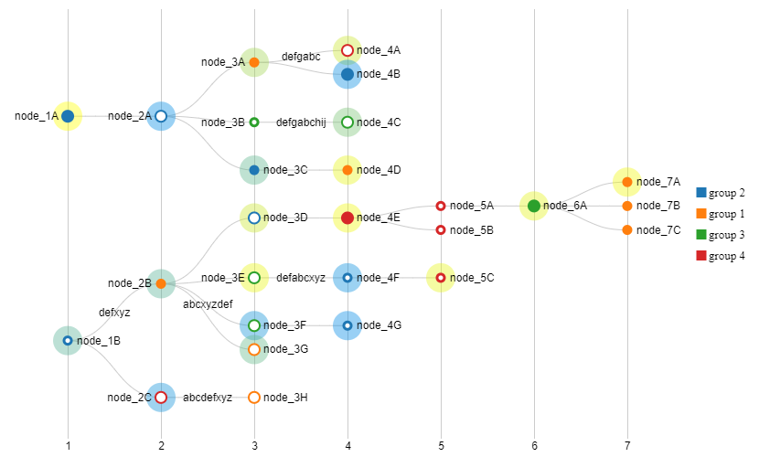

# Pedigree and Lineage Service
The Pedigree And Lineage (P&L) service is a common component that stores a record of an objects cradle to grave ancestry.

The P&L service consists of the following components:

- The P&L service datastore
- The P&L service API
- The P&L service SDK
- The P&L service UI

# Components

## Datastore
A P&L service holds the complete lineage of an object but does not store the actual metadata. Metrics can be generated through
MySQL events as needed.

The datastore will be hosted on AWS Aurora MySQL:

- No need for capacity planning. Scales as needed. P&L will likely store billions of rows in a single table.
    - The maximum table size for a table in an Aurora database is 64 TiB
- Write heavy workflow against single table.
    - **"Our tests with SysBench on r3.8xlarge instances show that Amazon Aurora delivers over 500,000 SELECTs/sec and 100,000 UPDATEs/sec, five times higher than MySQL running the same benchmark on the same hardware."**
    - https://d1.awsstatic.com/product-marketing/Aurora/RDS_Aurora_Performance_Assessment_Benchmarking_v1-2.pdf

The following information will be stored.

```json5
{
  uuid: "Internal database unique key",
  guide: "guide The objects GUIDE.",
  clonedFromGuide: "Only used when event is OBJECT_CLONED. Links to the old objects GUIDE.",
  eventDateTime: "yyyy-MM-ddTHH:mm:ss The dateTime the event took place.",
  eventType: "A valid eventType from internal list defined in P&L.",
  eventNote: "A short description of what happened in the event. ex: Object added to RMM/Object cloned to system X/Object Deleted",
  eventCN: "The CN of the user/system that should be associated with the event.",
  eventSystemGuide: "The GUIDE of the system where the event took place.",
  locationSystemGuide: "The physical/digital location of the object.",
  cn: "CN grabbed from the API/SDK request.",
  dateTime: "yyyy-MM-ddTHH:mm:ss Datetime the API/SDK sent the request"
}
```

Valid Event Types
```
OBJECT_CREATE - new object created.
OBJECT_DELETE - object deleted/dispositioned.
OBJECT_UPDATE - object was replaced by new version. (eg PDF update)
OBJECT_CLONE - object copied into new system. Object now exists in N+1 systems (eg IDL to IMAP)
OBJECT_METADATA - metadata was associated with the object has been updated/deleted
```

## API
The P&L Service will be kept simple as possible to handle the large quantity of objects and api calls coming from 
various system integrated with it.

The P&L web service will be written in Java and hosted inside a EC2 Apache Tomcat instance. 
The endpoints below will be open to use by systems that have registered their system certificates with P&L and have been approved.


### Add Event
```
ngimws/pl/events
RequestType = POST
RequestBody = P&L POJO
```
* Create new P&L entry for an object.
* Performs the following steps:
    * Validate requesters CN
        * Make sure they are an authorized system/user
* **??Checks GUIDE for existence of object??**
* Validates eventType
    * **OBJECT_CREATE**
        * Verify no OBJECT_CREATE exists in P&L already
    * **OBJECT_DELETE**
        * Verify OBJECT_CREATE exists and verify OBJECT_DELETE not exists
    * **OBJECT_UPDATE**
        * Verify OBJECT_CREATE exists and verify OBJECT_DELETE no exists
    * **OBJECT_CLONE**
      * Verify the clonedFromGuide exists in P&L. This puts the work on the calling system/SDK to first create a OBJECT_CREATE event in the system prior to OBJECT_CLONE event.
    * **METADATA_UPDATE**
        * Any metadata associated with the object is created/update/deleted. eventNote would be used to say what happened, but no actual metadata stored in P&L.
* Verify POJO fields
* Add row to datastore
* Return code

### Get Single Event
```
ngimws/pl/event/{uuid}
RequestType = GET
PathParamter = {uuid}
```
* Get a specific event from database

### Get All Events For GUIDE
```
ngimws/pl/events
RequestType = GET
RequestParms = {guide} {dateTimeStart:optional} {dateTimeEnd:optional}
```
* Get all events for a specific object by GUIDE in an optional dateTime range.

### Get Event Graph For GUIDE
```
ngimws/pl/events/graph
RequestType = GET
RequestParms = {guide}
```
* Get events in graph format.

### Get Events For GUIDE By System(s)
```
ngimws/pl/events
RequestType = GET
RequestParms = {guide} {systemGuide(s)} {dateTimeStart:optional} {dateTimeEnd:optional}
```
* Get all events in 1-N systems for a specific object by GUIDE in an optional dateTime range.

### Register System
```
ngimws/pl/systems
RequestType = POST
RequestParms = {systemGuide} {systemName} {systemCertificate(s)}
```
* Allows systems to register on the fly with the P&L service
* Systems must register before they can be reference in the **eventSystemGuide**

### Approve System
```
ngimws/pl/systems/approve
RequestType = POST
RequestParms = {systemGuide} {comment}
```
* Approves system integration with P&L

### Reject System
```
ngimws/pl/systems/reject
RequestType = POST
RequestParms = {systemGuide} {comment}
```
* Rejects system integration with P&L

### Get Systems
```
ngimws/pl/systems
RequestType = GET
```
* Return systems and their current operation status with P&L

### Get System
```
ngimws/pl/systems
RequestType = GET
RequestParms = {systemGuide}
```
* Return single systems and their current operation status with P&L

## SDK
If integrated systems do not want to write their own code to integrate with the P&L web service API, an SDK will be made available 
for download from Artifactory and the P&L UI.

A SDK will be available for the following languages:

- Java

The SDK will have the following software framework.

- Create local P&L object. 
```java
// Create a local P&L object that can be submitted to the P&L API.
Pedigree p = new PedigreeBuilder("guide://1234-1234-1234")
        .setClonedFromGuide("optional")
        .setEventDateTime("2020-01-22T01:01:01")
        .setEventType(PedigreeEventTypes.METADATA_UPDATE)
        .setEventNote("This is an example SDK use for creating a event in the P&L service.")
        .setEventCN("CN=kimmela.places.org")
        .setEventSystemGuide("guide://1111-1111-1111")
        .setLocationSystemGuide("guide://2222-2222-2222")
        .build();
```

- Validate P&L object.
```java
// Returns all errors with the local Pedigree object. The validate method can return an empty list.
ArrayList<PedigreeError> errors = p.validate();
for(PedigreError error: errors){
    System.out.println(error.getErrorMessage());
}
```

- Create Service connector.
```java
PedigreeServiceConnector connector = new PandLServiceConnector("/path/to/jks", "aRealp4ss", "/path/to/trustjks", "anotherR34lP4ss");
```

- Send local P&L object to P&L service.
```java
PedigreeServiceResult psr = connector.sendEvent(p);
```

- Other SDK uses.
```java
// Get all events for a given GUIDE.
ArrayList<Pedigree> events = connector.getGuideEvents("guide://1234-1234-1234");

// Get single event.
Pedigree event = connector.getEvent("1111-1111-1111");

// Register System with P&L
ArrayList<String> systemCertCns = new ArrayList<String>();
systemCertCns.add("CN=dev.systems.place");
systemCertCns.add("CN=test.systems.place");
PedigreeServiceResult psr = connector.registerSystem("guide://4444-4444-4444", "System Name", systemCertCns);
```

## UI
Source draw.io here: [Draw.io Source](https://app.diagrams.net/#HRMSLowside%2Frmslow%2Fmaster%2FDrawings%2FPandL%2FP%26L.drawio)

View Only draw.io here: [Draw.io export](https://viewer.diagrams.net/?highlight=0000ff&edit=_blank&layers=1&nav=1&title=P%26L.drawio#R%3Cmxfile%20pages%3D%223%22%3E%3Cdiagram%20id%3D%22zN0O8GpO3P3C1JhYR0OU%22%20name%3D%22Info%22%3EtZRRj5swDIB%2FDY%2BdINyh7fGuvbYPPalaJ023t5S4JLsQsxAOul8%2Fp4QC66Rp0u2J%2BLOxHcd2lC7LbmN5JZ9RgI5YLLooXUWMsThj9PHk3JMkYYEUVonARnBQPyHAONBGCahnhg5RO1XNYY7GQO5mjFuL7dzshHoeteIF3IBDzvUt%2FaqEkz39eB%2BPfAuqkEPkJA6akg%2FGAdSSC2wnKH2K0qVFdP2p7JagffWGumySl%2B%2Fpyyeb790%2Bqb5tmTZ80Ttb%2F8sv1ytYMO59Xae96zeum1CviGWagjxKipoV%2FjSQE1J0KoM7h9pmPxocFIv68vIPZECZdqNy8LJRbtscSb1T5vVimPGyIoU51tUkCicTaeE0iyCd8%2B3y4G%2FH1oVysjl%2ByLEk4fPzYUdNQk1Ggi1rTU%2FE1s6Cl0teO7B0WFneKlPUdNxzI3a3%2Bf2PELoPsOaTUv7x0mTTV3deccLTZ2Cz6jMHXZ94qQkkdKydxVdYokZLxKAB%2FzpK699QXfGcUiVwP0pfkDJaLai108dWKgcH4j5US5uBGL6BPenLAEglBBhiFhsjwDdYfM3wr20a2pnc0Q0mQxradgNYgrNnMunmqySsoLsgtpNxTgOTk1Ee7HjYIMXV8Tgl%2FgH7QRnEcZ4vuslaTJ9%2BAQ%3D%3D%3C%2Fdiagram%3E%3Cdiagram%20id%3D%22gw-nH7AqX0yCH5nJFknN%22%20name%3D%22P%26amp%3BL%20Object%20Graph%20v1%22%3E7Vxre6I4FP41%2FagPd%2FCj9TKzu21ndtuddvbLPhGiZgqEhVB1fv0mISiXqNiC41y0KoQkJOfy5pyTQ6%2F0UbB%2BF4NoeYs96F9pire%2B0sdXmqYplkZ%2FWMkmK1FVTZQsYuSJsl3BPfoKRaEiSlPkwaRUkWDsExSVC10chtAlpTIQx3hVrjbHfvmuEVjAWsG9C%2Fx66SPyyDKfhqLsLryHaLEUt3ZMcSEAeWVRkCyBh1eFIn1ypY9ijEl2FKxH0GfUy%2BmStZvuubodWAxD0qSBnaYbl4y8p8f1%2FZzYy8nT5q5nZL28AD8VExaDJZucAjFOQw%2ByTpQr%2FXq1RATeR8BlV1eU6bRsSQKfnqn0cI58f4R9HPO2%2BtSZDqZDWl4frBj%2FC4wJXBeKxODfQRxAEm9oFSE6jmix2rHBUcX4lwUOGAPBfcH5xbanHXHogaDPCbRSW6ZVQmL8DAvUUvjr7FTcCXORjLbVAh2hmn5KUfDJUf7Ed%2Fjd30%2FXX6Y9rVuZ8wB05q6MvpbrwNl8eyXXZ%2FWNlF2XGmyBTqkRWhsogzqhNUPpiNB15R6lMZ%2BhpnyYfeFwOcwxlh9O6Z%2Bq6UZv%2B1VjDaUGOSLHM8c0TIkczx0XuowzwEeLkJb5cM76YjRGFHKHojhAnsduJ2V8WTTOqRFaV8BidqsQ7DWdtkMsrS7VcmJZakfEsiTEsnwmRnPMJXtHNeu%2FFOcXegk3LZi4q0a03l2kRwv2O51MxtfD0R95b3RwWYfZ5QMcUU9fFqdOBvQ11dleYfculbNXO0A1sJUSVGl236xzVZMwtQ2kkjLVPq4B1HyK2CEKuMVWpG4VPwiOCqU3YAb9jzhBBGF2dYYJwQGt4LML18B9XnBeFoGKv2gVfrNhEmWWJeMLyE%2FmaM24fy3GM14SwkxSAaKuF%2Bp9RI3SOaJSEvddekdt6gEC6A8rT%2Bhvgl0E%2FF4APQR6lOKUC1PboV90XD5FX6cfhYvDUrJHrrqUHq0iPY5EenS7Ljx5WevC4xwXnmOWmJCtYL1gbkx%2FBhLk9rFLwAKHWmHBcindYHxoyeKuj6plnWb2Plf0Z0jcpThh3BGejibhlqOw96tQow0zpsJeS8Je05Jgg9YRewc19n6kCrOIIbxiomiBgHEz%2B6YlNyiETCNPtVtCHMIKzUVRc%2BYft1deLRRbFeb1xLQkPuDJ%2FLatEr8Nidkq87K0rpaCXP4OqbME%2B%2FeifI17DWBfvqCUvYaainsgWRb5XEIUhBObrwdJP034MF7H%2FCoitIfrtlNWfN2U4brEKNA7k4S6w%2F07Xoa0ZIy%2Fa%2F1WB90u0duwyFanJawcnFOpDZmBJ5CbW9sjHyQJmlOqc%2F3VlPcwhtsqxyzwJsGWRoyRrvUSpdP1N3LquLPZVVCgrlTwhU5gDAh8QIFwkdi7p6j074HZFcP8S%2FhGszh3i3jbh00k2n24%2Fn0yevh39Ndk%2BDDZU%2FsOk7x2FoPQlDTyMWCsZMFd%2BjX5xC6vcPyccIZSn03TDXNPh6O7rLtnFATQBxxgk37k85bVFi5l7RDRGi%2FIhdtae3yNKMa0UnJcumbb5eRDSnwUwqvWwkpaSZVVq74%2B67ZEfgZdyY9ek5%2F7TUJgkPFg8gLqNBcVNOXd37%2BNJ8IJV9We%2BDSA8mogyWTvVgNJ9WAhf0mDhRXozl7txFekYUPzrKuuJouw%2FHDxWd1sGp9Vne5I3SDu8f2T2tQvgdT1KEERt34b3zTDLTr0nvj8wq19q5RUuc6MYvWwQZHff93eNuM3pVBPfH7x%2ByQNPy%2B%2F9XrYoIFdq55m195OHobj4cPwqGX7WDBd6QRBFvhVgE89Cmbmfm927P6t6k7WD8MoxyKkVu%2BgI6t3j3w12P2HoTdkKSfMeeT%2BrFumLlwj8lQ4%2Fsx0um%2BKs%2FFaqDg%2F2eQnIR3%2BU%2FGk0Iqd7prxs7zdXi4kOI3dfMAHHEQC4gUkTVQOeqUUmoPOrgwU8rKYCj1BL7A0XBknxR0%2BYsQ3%2FPYEsAyzIgzZzEWrnTzUOnL0SkdKpaOMNLWOuGBtp%2F0WWdNehWXmaT76zYe7E1x0DjDMQaeTxrnBpNz8cwTLagj1U%2BGYbeh55C23jAbfHsnqHvyrkWyHXp8LV44hWd%2BwB2U0U1T1CJ7xs48wpuLPo3LNQe4weDWAOe2iYM6qbNDp6ithzrLKHWnWuWGu7eTDc2l3njjUOBmmQ7O3njvUZKkYnLRUjCc3k8bhXL5IRCkVHXYwj1niQxbQ%2FbVQ7HenqsbLJVi8DeKAXVi85wF186JAfZs1noN6FTGagvpAqYB6NaLWOag3CGnu25Yr7aA335Wt7rVnaf9a9su65ZLVZzESnp1jsO5DvNsBPLeyK5UUKkcSPskfnCiFR7vT9QY5VJfAtbmPovdiEN%2BUg0f5J9uTa4N%2Fn29GYwfFnx71RAnjR388CR5le3JujH0%2F2e6gh7NE5EctcYy%2B4pAA399kY9GUEEJPFpb6B%2FPVG4V0VDglfIZ0gpoS4DRhsa3VErIHfqrt6iW3YDNjDbJmZInYbX00iwGb%2Fr72LGa2jOGczylP2C0nWq5Wq34YBV8SkWJJV%2Fpnnv41BSE1ATh1q6m%2Br%2BghTwkG%2B6d4wqBnCCdpQgAK%2BwtK0HTWR7h0v%2BmxQTfqocGgcfymiYh7i%2BxWXXwdHvqeNu1SuHSTBPsLGOIAuQm%2FWy8SCYQ9wrMITxjv0a4k06jgaJsPULSRstQGHqqVlHJb4hptg7olSGzDNZJiYt25bOIYOc0co3wj4N%2FheHxCDC3zSrI8lyXlwoJhaYQiyDyPPj0evgDkg5kPBerK9yXLjpPnH3SZylV%2BFH9JrWYrSuJqhixbsQ1%2FSSpv38hb6nR%2F4HBArOhlHVLBC%2FGxdgGuPK5f9Y2aOlm7mNumImnte1lSwtZ9rPaDPo33OrfwtqC8YZjFlmcPJVGejE3P6MB%2BxX9Oif%2BYtiT5uqv4j1TG6h6hVMbst%2BSJnhRYLEvV0V30n3Jd3MV7vsV%2Bk1SO6nk43%2F%2B6eGi1O7oqOhe1Kqp2JfRo2K9cFalJVumpmsPe8aooeXKoCWSpHS%2BL%2FCHQOOBW%2F0kA9lOviKz%2FC1sRJc8j%2FaBQZjeEslzjLgTLaoFZq%2FrAemMLv%2BormFWp6hrLTkvSEE%2BybUPx6tXBtNQ8jLQ%2F8PQlDSLxUJTFBcsrnJUV3jgkahcjGRV%2BOtWcruaSUQl1tZY1QU93%2Fwwqq777n1r65H8%3D%3C%2Fdiagram%3E%3Cdiagram%20id%3D%220S-s5jfW5r994tFWpWN-%22%20name%3D%22P%26amp%3BL%20Object%20Graph%20v2%22%3E7Vrbcps6FP0aP9rDHfyIMW7akyad1qed6UtHBhmUCEQBx06%2FvpIQtglKwGmIczrHSTBsCQnttfZNZKR7ye5dDrL4IwkhHmlKuBvp85GmaYql0S8mua8kqqoJSZSjUMgOgi%2FoFxRCRUg3KIRFo2NJCC5R1hQGJE1hUDZkIM%2FJttltTXBz1gxEsCX4EgDcln5DYRnXy1CUQ8MFRFEspnZM0ZCAurMQFDEIyfZIpPsj3csJKauzZOdBzLRX6wU6y%2BsL9bOFla%2FfL%2Fwsnxbv5%2BNqsMUpt%2ByXkMO0fPbQyQ0YW%2BbO8Tztx8zZ3N%2F8zH1xi3IH8EboS6y1vK8VmJNNGkI2iDLSZ9sYlfBLBgLWuqWcobK4TDC9UunpGmHsEUxyfq%2B%2BcBbThUvlPVcgVnoH8xLujvATK3oHSQLL%2FJ52EXR0xB3bA7SOalSy%2BAhVYyoYJdgU7Uc6aIyeCKWdoED1hRVYlDm5hUcqVPjnbaj2YDXHurWtoZSrtZTrbXK%2BTk25Xt1wd%2BHWPoafLuivqunGeH9owUGXX3bofOWYhinR%2BdoJYBBQOcAoSqkMwzUbiykVUZfjCnGCwpBNJwW7SYezo6cNBZ4%2BrGthn8ViQA3Wbr9Tg5Y6kAYNiQYtzAi3JtwGDqq0fm5I3TAueBBmhqEa2e7QSM8i9r3w%2FfnM9f6pR6MPVw1YNT8Bk3p6BFg4lftqGdm%2Bhc3dkLPPEMCK1qktQKyBtidmG2pNgrShDIS02W0rNPvI2ClKeMJzrPKH7qck2ZH0Eqwg%2FkQKVCLCWlekLElCO2DWMAPBbcQBPvZz%2FEO78MncIqsSMwYWqC%2FWaMcoMRPPM4%2FLkmV0wgcHYapPEM3p1ohSJ58EdEZtEYIS0C8mL%2Bh3QQIE8DiBIQJjqnGqhYXt0AN9LkydtzPJ0uhp6jxCtlenlPaAUo6EUrrdZlQte3FGWd2M6spEBOGSXcRKg8kKFCiYkKAEEUm1oyAYUGXC%2FKkwyMsJVasGrXJo7hJuYRnE4oJBJqoHTQKho7CfZ%2FmXoUBXH2BuSTA3LYkX0QbC3G5h%2FomaVpRDOGL8tEDCIK6OVHKJUshs99QEKSUpfACEEPVnRHdi9Gym7I2d9xPL6ltCnUwC22qQwGgnDZqsHtGGiiROt91LIsejMaKFaI%2BgIQ9HFYfqErzlC0JQxMfYN1wPIoXNo0kx2RT8MZ5HiIeuY%2BCoYDtND6GbsqggyTP0odgxbbHjA4lTKpmT%2F7QfUKdnCPr7jYa97Uvgnb6m8auy7Rzh9nmm72FQFGhNoeCGrikXMIf7Ll3Zf5%2Fti15oSbMHiXXq%2BhDwdZfEL4CPa86%2BzzYXjnp586%2Bz0K9%2BfcZb6WZRVYIVGUjr%2Bgve0ZXOQQmXKBF1HPsZKyr9XbKUxq0PhwLueIBavMofSlrTLO8zMcX17IPvLX94n3136f%2F5wFekrAeuNmo0ZZNhAhiT2A4wPfhfWfOW5LcF5xMtVzXdMP98bu%2BqmvkWJQnEgMeMYpJhPskfDB5QvrqIDnaHAtg14AtudawUqENLluMqkGbFzoA%2BTlfNho9T9XaCY9iyTcGhbKid4PSwF7VpLweY5Ubw0V%2B6c3fpPtL%2FwO1vR%2BSlywNVgasATF0aI7r09h70PNwh59zfSa59RXU2crXzoz7kMk8il3d5feV3MmvvNTnizGeilHvN9%2FNLVrt97yDXI27qFYkVKgGEmoxYpmWqNnxNYk3PTSxJZtaHWU4%2FZtX%2B6oc7n5%2FArJxQ5IsqIMcU6ihmUpRBjFI4oefuHUC04MOQ068m39O8C%2FGTjGt2%2BTvppttnp1s70%2BxDt%2BkwUXLPuAjRBrZe%2BheiIqs3HOgVfbA379HWILRBIKPYyrBMxXhFihnm2SmmvQLF5v6lv%2BwbLLkjyzZ5xE%2FWOXvlUBUZb5xXbygFM8%2Be36vt98ZSXtlPFcQvyqums%2BpM6%2F%2BPgOyV%2BNlp1H553odG6sARkL8RzRPuoU4i1dmd1BsKftaA6Ty9PPxHH287%2BsdI3f8N%3C%2Fdiagram%3E%3Cdiagram%20id%3D%222lyWVLpCCU7zWDWEiOsj%22%20name%3D%22P%26amp%3BL%20Search%22%3E7F1Xm5vI0v4153L9kMMlGQRICJAE3HwPEjlKZPj1Hz3BYUb2zu56vPY5Hu9qNAgBXfGt6uqu%2F6BcOUmNf030OgiL%2FyBQMP0H5f%2BDIAhEIOsvcGR%2BPALDyNORuEmDp2OfDljpEj4dhJ6O9mkQtl%2Bc2NV10aXXLw9e6qoKL90Xx%2FymqccvT4vq4su7Xv04fHXAuvjF66OnNOiS52FA0KcP5DCNk6dbU%2FjTB6X%2FfPLTgTbxg3r87BAq%2FAflmrruHt%2BVExcWgHrPdPGCijvhl4X8v%2BSSTfDhxEuHPx4vJv6Vr3wcQhNW3fe9NPl07cEv%2BieCPQ22m58p2NR9FYTgKtB%2FUHZM0i60rv4FfDquQrMeS7qyWP%2BC17dt19R5yNVF3Tx8G4UeftZPorQoPjsuUiItMuvxa9ikZdiFDbhoWsXrxzi40Me%2FqPWvp6cMmy6cXvD1T4gCf%2BTUKuNhvd6pmdfvPYkz9XSZ8Z5oJJ%2BJBQnTTzL5JI%2Fxx2t9ovn65onsf4UFyHdmwdcI%2Fd1p%2BGwkyCd6zc9GA39FVITEXtMUp%2FH3oin6vWlaV92TbUPA6X6RxtX6RxFG3WuSgx9RfEexhZ9J%2Fqdyi0HvRWLsVxXbv6r61LtpPv6%2BJHx3MUTeKoUE%2FF4kJO6QkCi6J5X9gpbEra%2BfP%2FijfVBmZj0Bxq7Tpw%2FXdzH4LQoCzzKc%2Bny19ekeL%2Fj48Tf4BP91URepRxf5ynl%2B%2FATc%2B4vj4OcdbTr9wqaj0IfXRh1GfqjBIf9cW1aIdgVv0%2FIBFX5Oc0CjdIWFzJPl7urrZ0c1%2FxwWRt2mXVqDT89119XlekIBPmD9Sx4%2FcPgzHkQPP%2BspDzdj2usjen3wDs9%2FROkEZIJ9eh4%2B6ToAexlACUS8BBX6IV2Bb5SustN8uKx3RMTA7%2Fz1Fzjerr%2Fb%2BpL6xR9lGKT%2BHyvJVzaIJLW%2BrM9V%2FAEj1IcrQEnfkp2vSNsPlynkhUwhryQKJV8L1POx7y9Q1J8L1J%2Bh3Sd5K6cYhE8fzn6bXj7Ul86P6wr5DCdcVsKFzR0xLNMgADdjH0IuGHm86GOc8WAS8rC7JE9%2FvEQhLzhIQeDf37Iv78Vz%2BAU0JO6YEZy4Y0WQ92I6%2FYrpxqpacROG4HZVsL5qaRUCfX0pDCttum9FO1VdhS%2Bo%2F3To7WJwT%2BC%2BxAB%2FWzw%2BKvjDeU%2FDgt%2BL88%2Beef7SLXweEyB3YgLkvdwHBf25tt9xF191DK9Y%2BgZPcd8HPQrRc3LilQUI%2FDb5nPlfGJy0bskHF9J%2B6NuHx%2Fh7EvHSYLyzKyCf1fDZFeB37AJ6B12g7yYerxMhmzqp1iN8%2FUtbApj%2BF1w9BaMvtP8Of%2Bkfqv5vyLJ86di%2FooFfC1PvC8BnfCBe8wGm1n%2F063TCp9wXjL9n4ob4Ugvpe1qIE%2BhrNhHvxqbXiRsr9JtVsP8Ws17hs7ruVkb51w9N84DQ2eaJPfgLbmGvuUVwJEHy92AUJ%2FAYz7wWjo%2BG%2F%2Bv8%2FWfg61GqXzP4M%2F5h5DeCtCYs%2FC4dvkyV32Pq0y2MOn0Iqu%2BjO%2FiFVNRR1IbdK5n4%2BJz%2FQEzekHxaL5Ne269Z0m9F4%2F%2FYOH6NLU%2BXwVD4AwXjOIrSFIRTCP4lRn4dFsHQBxpFIJSiUIzGYeweYn5J%2FO%2Bnkm%2FIUoVVwIC5mk%2BW7zP6Pp4dBq%2Fmaf65cON3ZBv%2FPrKNYcgHEiNxEnlgFfYlXnkRnrR131zCpyt8ovc%2Fu2jnN3HYvbroSmh%2F%2Fuy0Kzih%2FcZAcPQDQdIEDBM4hFE4eheYf5KQx%2Bt%2FX3W9l6V7Cama1K%2FiryKfz%2BSpqTv%2FCY3Tdzzyxwmn99NfAvvwkZwYSlBf6u%2BdRNm%2Fqr9vyJu9gzP97JL3%2BPk1o%2FvC567kgnDyns%2FlRfDvPdER9SJ3gdCvGPsRCH1hgND3ynZT9zJWj%2Fnp83NmWgLz7Q8pxo%2BJ6%2FOnrDUErzQF4ifCCE4FCN5SEYJEH6%2FSfDr1xXWFIXxIf78%2Bzy8BQ6tze328xZ1D9nx9yrbfe6wduxE4%2B%2F84U2Bs4Q2P8rZ7WnPbheXX7yocme92LzstvzE%2BBEKgPyDkDwSzoVUfmOeX73V3bvv1e%2BdpWYbFh2uxat%2BHLgGo83vddlt33xj04VrUPohVESioL335ID1QVwMFqpu8fTAHdx7l%2B1qmrr6yfdcBZ%2FGFdfpYdPAJsdyNt0MwT%2FScmoH%2FFMnfT%2FD8dZv2DpCU%2FFMwddeYfZzj%2Bbtw6rsGAyFNxaZ3RE88yhSMaqLWnvjjXmLvv8Yo6oLN8Iz9%2FUzVT2wWkf8Bs6iHnf84wwddkhXwPhjIM9DEh%2Fztb%2FP3Y83fc%2BYCgT9A0BoqERSMUjCNvxHqwQjyAYVQhEBoHF9jARj758jvro27V6b3X2PjOG23%2FZ%2FAfT%2FQwKWrNRnSS9j%2BCzZud85APLiqZQ9eUzCLovDa%2Bqp5vy3cv2PhEAxdLRVOwjRJ0ASJPhf%2B%2FjQW7t78zK9v4Z7h2%2F8xPP%2FDLNyDrv2LFg75bnf%2FpoUL%2Fg389tG2%2BYOfFv65CL%2BwcL%2BN279h3FAC%2F0BAFE0hJILjCPkvore7j0%2B%2FnkJ5lKP2dRr8H1cWPPH2H9QVFC9qXl7VKrwsivl47Xvz3Z8qjX58HQL5RQYXfs7o%2FplgvFsVAn23XPnRAj2YGq7w2zaNViI%2FkBaB5LAJP57yZ6XH0FfY%2BzUz9NWakbuli3fUGkXfg3l%2FWk7%2Bfvz5d%2BZKXptSQUAE4j9%2FdRblY73BCz2DIAoXuf%2B8rnB4L71DnydhnzSPJF6bZJi6U%2ByLvNeKIPr11InRhENa969t8JfsSKtkdbfdC2p%2FOroyOEjDT%2FT%2B9Mk%2FlBRgyP%2B5%2B%2F%2B4tvGO%2Ff1Y0fL95IL%2B8zzzvYKUZ76%2FOcv8z4ThdREw%2FG5S8DnN%2F6Js%2FDNG%2FzCG3ivU%2FMsMvV%2B8QL6w9O9XUvTR0XwmFH%2FT%2BP8Dtr0sZXiy218tLvya8f9v4P1HjvwI5r9OsKK%2FLcJPKRUvS8DfUypeJ6W2ID77CQXjG4ATsOAdcMT7CtOXl%2FlMtO7Ga99HtP54Wdb8nqL1utBZ9IeHvNN3zwj8uLUG0H9%2BfIyPPNvub0T52I8MImHoDdXJv9xKVeRPV6o%2BrKv2x7Bd6Qiy8CSNPKxfbdajxTXx%2F%2FDby2cLVr9cMf1RvuCX8vXmHUUwZEVL2AuJvJP1fCGgNMlDJPmOAgrj2AsBRV8JKIy%2FFlD4vWJhGHpDSfcvJ6DYnwpoWrd%2FjOH5D1Bp8UcKbGK0Wrw%2Fyr7o0j8uaXMpwj%2Bi1YP8MdTFH2CdNQ4DSvNhu1rQIK3i%2F1slbv3W0y9wAGxl9H9RX1Vh8X8Pkv5vyPerbM%2FT91%2FI%2FbvJ94vFfD%2BBfL%2Bh3vzlXhkEi5LC15zrl7z0m8szioK%2Bydo%2FYdRH1%2FiDGIWgLw0R8sZllzDxbqz6C7s6fFrR86cI6JNR%2Bfu0fJSiP4OmT7S8vz%2FGHUoi3weqwl8uGvrjBYPeE7m%2BYduEvxWy%2BN3D5Idffbgk4SW%2FZxrfjaff4OKdtRrfJ9z4Uhn%2FQH8cB1%2BnP19xEPjo61cJ%2FbRZ38P09yPhvouB%2BpIiHx3EF%2FuI3VtwQb0blIdfJwVfkapIq0826fPZ9n8wSfs0M28DZMX%2FAX86oj18kUc%2FHTGfCIH%2B52lp1BNX7s3kNo%2Fnsk9rxtbHx9n%2F4PzDkWZ1TRVIGaQPHAz9tluxfPfSpwUpmMB6vFxb92Cw%2F8RhPcriN5YoIx9Wj7SKAoWQKEq9CPU%2BEDiCrd7p4%2BsrgSE%2FkARNUhhMIgRxd8oJJ6kPKFiTRz29vpssvWGvxTspmW%2FazLgMig%2BfLZ17i2MkHn6%2BwspXePsdeYuv8GMFjxROwDAOQ%2BSXs%2FUIhX34nLXIa8v8gYBogiKeXuE73hZdL0GjJPr0ivxlP4u82H3oHc3yMzT4Yu178Vht9FSi9lht9lJovkSnL6fpYRF5iBruisaLLQ4%2F%2Bx5OEyR1J4p4WSbwpV2Cv50rej9hgukPGIJhBIShq7RgxIvtZ0jiA4WSBEQ8vb42FCvw%2FbDaF4TGaAKDEIq8NzuNfSApAkWw59f32poKht%2BwgeWzLfhM%2Fe9p9At5%2BMjXb8vD32fUoxh%2FZ9hMfBfE9ceLHch%2BIOaCX%2BcEXyn3U13nb%2FX%2By%2BoN9g9aoSGBP7%2F%2B9Pr9FzJwP5t%2BY7%2F1%2Bw5VXqecXuk3t%2F2t239dt2GY%2BgBj1Kf%2F7kSFP5du%2F4WU1s%2Bm2%2B%2BR8vr1dft1xuuVbvN%2BB1YCmGBJ528t%2FxtajlMfPtdO4qf34G9Iov2sWk791vLXVEFfp2fEh3m%2BV2x9j63n%2FkHh35f7un6f6u4%2FU2YC%2FoB8npf7gmk4un6KozgBP72%2BEiCK%2BlNNRtEPEEZhKPr0%2Bm6Thc%2Fbbn3Gd86vLqAPzg%2FnO8GR%2BJ0tBn8avpPAvH7MpUL4X2Q7QX74lO2jYfTO1MqPY%2Fu9DMsXnQMuH0n9qTnAc%2FL0s0Nv6DBAXKeHU181GXiyL29rMfBUCPbW6q%2F73UvuLsv66jTEWzc5frrle0OJz%2FP6dyXxCyhAfMBQisSIp9fvsLgv12sunLfHXowtWYUce1el39h%2B5q0dKHDoXgeK56ukzwc%2B7VP%2B1ZXKj6%2BvT%2Fi4o%2FlHSUtf3uaN0vetVk%2FEhQrP0WurFvghFV3uidM%2FKEj8B%2BL1TRNHEF8iEBQjXtkx9F49IfocJvwTCYv%2FTxgZ41QvdYiR6xX49nK6K2FfjTDesgbw1%2BrRRT8jsx%2FTpOsuC753m7R%2Fu0cXDOE%2FsknXXZq%2Bxl3%2FkKY%2FWY8u6M3tkb5Hz5y7JP7ubdB%2BcI%2But6v%2B92jSdZeE79zm7N3FkHpzq7jv0aTrLgnvzXX87tH13Xt0UdQPbdJ1l9VvKLz95QrL%2F5d7dFHPfTN%2BQJOuuwL1hrmU3z26vmuPLor8kU267jL9zl4Nv3t0vX%2BPLor%2BgU267jL%2BDXMqv3t0%2FSBX8LJHF0X9yCZd96Pw15mQ3026%2FjaDXzbpWtX%2FB3bpus%2FgN%2BRZ%2Fue7dGE%2FtE3XfT69zt38btP1Z2L9zfmMX71N1%2F1xvyH%2F9GPadP0ltvzsbbruD%2BYtLdH%2BYZuuvyvcv9t0%2FWxtuu5z8g1Fyf9Sm66%2Fpb8%2Fa5uu%2B4N5Q%2Brsd5uuP2%2FTBSpLXnH2%2Ffp03eflvazVr7%2BZ%2Be8%2BXf%2BFDWl%2B9%2Bn6z7%2B00%2Fk33MA30dQv0Kfr%2FtD%2Bq7sX%2Fm7U9d9lF%2F8XG3W9qQj95X7iP8b%2B%2FYSNuu4%2F%2F70pjP8aI%2Fe7U9fvTl2%2Fton7iSHeT9ip637d5tcr3n9lE%2Fe7VdfvVl2%2Frdt7W7efqFXXfeP2egb6d6uuf6FVF%2FRcRPIjenXdlwTknpv73avrfpU5%2Fppd79e76z6%2F3jDZ%2FLt311%2Fv3QUT8Gsj%2FW7Nu%2B6z9vXc9u%2FmXf%2Bsedc3VOibyecf2rzr%2FkO%2BnqX%2B3bzr7zP0V2vedX%2BcryfP%2F6bx%2FxV7d%2F2ErH%2Bf3l33B%2Fp6sv13666fUyjepXXX%2FYG%2Bnmv83bnrx8jSf0%2FnrvvDfj3B87tx1%2Fdp3HUv5n%2Bvzl33l8u%2FYaeNX2756u%2FGXX9XQF817oLQH9fZ6L6AvmF9zC8noL8bd738%2Fr%2FVuOvfl%2B97OdcX8v27cRdg1I%2Fs3HWfVX%2BhQ8G7Ne76hhD9GTD9L%2B7bdZ8qb1gf9BO07fpLHP0v7dp1nwZvWJzzEzTtgiHiR3btuk%2BqNyyl%2Bd206x%2BoI%2F5tb%2FVL9uy6P9I3bD%2Fzi7bs%2Bluc%2FZ%2Ft2HWfWm%2FoC%2FC%2F0LDr74jSL9uv6%2F5gf4VmAN%2BQ4e8Mln%2BhXgD393x8nQf8H23W9Q6q%2FRP36rovDH8h5%2FZz6fajGP%2FW7S%2BJ8jrF9D%2FYqOsd9Pon7tN1XxB%2BhRab3xDh33r9JVHe0GDzf6lJ13to%2BM%2Fbo%2Bu%2BSPwKTTa%2FIcy%2FNfxLorxO6%2F0vNOj6W4r8S%2Fbnus%2F11ym4%2F4X2XH%2BH679kd677TP%2F6ViG%2Fm3P9sOZcf0kG%2F%2B3eXMuQ49D%2FuTJsIRFqHnWZrKW3dE56WS7zhkqWPy2Y%2BdYe0neX9nzFuXzNojyX0jyUyaDM45%2BICMpXEC49sjtzhFQprpn1Z2sdEuEQr%2B8WbH2RIY5x1988tVm%2FEWfr25gRCmF%2FNDGnn2gWTS5T5NDIEYXRbsm1Khx5O4EwnNmPxhhzriVIknrxEu0%2FCFt7vSUIN923pERS5uu4z3eSpMfXem8lI4ZMtn3WQyad4dPsGacePp9BdQ9OY1Q3HIuqIul25QeLntEliobOqoYKrapq4We6xkvcXc828IjHR3e%2Fd5mDzwgnRpAYUYpZMWbZmDVTbiOcuYkSijQYKuuLz2rGdBnwPW995UQevQifjn1xLSWMzfVmLLenJ2dmV7JkIxOPTD0yCsUoOqPqDGcwYx2R4DfHM9zLczY8xGnybFWlul5oL9x5VnDvncxH7t1niNmNEjIPj2EdqPUx7j8Dp%2FEjZpN3n0FnNpv1gFYR62NwD49x7xkeb8JkSHxZDe1qDNhxidbXzkdZFfVs1uUWpW2vhiO6RxLCLEcrq9JMztZ60k6fNaOZ8pOtD%2B2VP4lYgEPuxTmBmsFs1DdyK0TjntUFq1E8ala8iy6O6%2FXiw0bblmy0iZlecmFMiL1NOzWTwhbjKBt6yrHWmT2cmMSl4wkwg93E6cHjjdK0tThevyRCUrxZv6ThCrteUx6YmNsEpR56gt5LDIbnh73Kexl22uWrxogso2NqGDonD9Sa7cZtqHqhLXFVVcClGS0t76Slk0%2FxFccDL3cokoGxa4HrrhKuBpE9eDIlAPIw263AZRuvnTVPZ9ZbC0Ocs5ttuQ03zHprBceFvam2SbUoyToch9fTmd2fdXcx8jPBMBSkrNdJvSMe4PqePis44YmzUZfH0AltwTjNu7A0LxmxKZwCzScebrPqmjvgW8nkeOQkrIpobJnXVNuYub6e5Yl6z3GYFzt7n8nL9QnzWFifI6Q4RhO9bMlcYm9QArO8Hu2baJSQDm7m0bjKHgNBe1UvykXp8pFZb2I96I6QIytfc2bG3KzKTVa4zVKkp5LDs5dVahSRbacMPKs51Ay%2F7O%2BO9g00ksWgGgSTZHQKYix2Haw0CPF6G%2BayyptSSPtllYQZU7SkZAO25qzzwxNajHnRJ3JUmPZYGrttdgVViOOe371BIu7RSO6iQjKBoBktw9smU8%2Bns54iNrMOeNKwDWPZXuake15L0l1oCq91QlokfcGl9elixthyb5OI1zS6HJGQMuWWWZY9q0jrgH3KYtbbsMuivEGLppNLYchvrfmtNb%2B15r9Vaybf7xG65Qrywp5LqjG2%2BA44dJ7LEohcEfPF47O2P6SLOGuBU7tQCIst06jOjZVjylTgQPXW4eF6Ygc3nJo0eMtO5p6hsNlw1%2BHF3F4pEHfC8%2F0qzHxWmiZXl5sBh3ZIb2pBs11WTM%2FCsQx20wMxVZgFUgZEYaDRUmhM%2BUz4klVl%2FmU9xtniINi9nq2wp6Bid7rsuNDNZeIqZnoKFEI%2FqRrEpCPFyq1s3%2BNhcuB1mED5wcSj2pcLGrVUwKxEoW%2BkxhbKHNBco1lT64%2FHcFJZRgi1Wannc5A4vZlpiWqGpsimJ5hTLjxnkuywWgP7tZYyk24YuCFlw3p909wtJKGgrbKRyeN8LXWByna7REfLdJca%2FEnlGcAkB9kxLtgnXNQtYjQzFwLV6%2BkB2an%2BTZwATItbIJx30BRz3g4a3nd8vX4n2Q5nbWduTCPd14tJ6utrhhlBkaJ5gSH6%2BuzZZCbA4nXH0mknDr4mEd4e3OhWhCV2Mlyg1XFsua8tATODB3HG9V5ZxMyHSeCQdLwFBqCklaiGcW63lWUGyOJ4e4WS042QpfZtldxNrF%2BuzlBuDk3cb24cw7TR6H7VFrL56KNb8FYNK%2FN6kY2LKsvShZjXhwq9uZekuZXHlUfrresphyU%2B9CS2HTB3vdL6vUXLpP3%2BGd%2ByCV6%2F1p39zWr0HkY9qM%2FO1%2BYGO%2BvZIseghn2dhTKq%2BfZ0nFaR10NtJ7qrGuZOeUq1CdmEkyamMyYorcGsonC4a0mPrFk6V8rOAmRgBv7WJMiWYuRW1VfusrLjna89jjmCoDMmNrhZtunKTehxei%2FWNC5cdpvGVR6RtPQVJC1KbnCukZrq4eM5LSn8sCVEZI0IMTpzeIRONyRYAMHmy2ZWFl7fAZvkm%2FmCbfqwsJMQ9Q4sxRnifXS%2FuEhCsWJGcIaryGXK7vMWcUWqZFZXmTmxxaat2rZRV0DqZFx3GnHmLsTjig5lRjdHeH%2BAAgy7xOQIMidAw2%2BocgXbM%2B1Jnb4GVZRNljVgq6quNDjsN9Ulc8rpZDE1ahuDsN%2Bs7soWJH5V1NgMVWbDpI6XyaW5OoV4t%2FNEgUsDr0FA4HtK4CjhpmMPyIvQIkI5mqj1%2FV61Moo6gDjI8OFhunkVhQd1GOIeLS9wF22Wcb%2BaQHGve1MeReNK1jBbbXurpNPRNaQpP%2BuV3TpbGscU5LyruOKi4XainaNLXU1guI0lRgUdOC4qptMl2y3tBHbVEpeQly%2FGYZpGbXaZW5dcqVlz94mNxIImQzIR%2Bl8ZU4LQEi13TTyB7UbZAFr1mz3KwOBJ1%2FPBmdANnfgKuz9wg4NWilYWF4q9RPt9sqeHkUMWzRqjxrCnVB%2BwhU%2FENgCsVadzN2JVJTPcuSFxLwNmo0Wd5pg740EsR5cRSturc5THGinaYK2pnFl64AaeGeDcYk7IQXgMHeM%2Bm%2Fgj80mDlZ0A%2Bh0mBBQeb0ln2Pw1RKWFiCT8dCy8GHNtzSKDSrns9tmGhBS%2Bwy5nPG3xK45ixipug2MDSclIQpxntqlk2Q3MR4lKyNO2pYFZreEdeGpK0EpnOZwRDYlgBPb6hpKCjoC5%2FUHYFSlNOlFF%2B4ALQUYDFxdi1XwyDyltVBwHrG1bIeiV7PETq8dZtswrcUWZdJoCpfUFyw%2F9WS%2Fd3VZagpTuF%2B%2B0aj17uGrWvE33sXZbL9n3w3H9NUv8GqqK%2FQZdnTF8W39qaWE8MZAwkyEJ4%2BRaSiy5o7Zyf2vK8TEp2Fg5GYp8pZhp%2F0mzBQSjO9zv%2BKKBdsde6jjF3VZ82%2B3Ug5d42TDqVHi0qHNL%2BJB7QlYHKtpU3ctYREarb8dWC5NXqGkhTHcFwXzbkdpQuzdzK2FSikcglQJInFFeh9G9nLFllG0qscTWkzGyOoiDHddR72AQDZTKrZneZ9mJZLLVjIiqlHGJ1rWNYQCzT19K%2F%2Bj1qNttckBgUotaGzjteaup3U2NGc5sb0ShoEKRa%2BJMCuD%2B1XI4eqdrnWYg3WwfEv3kwsFQ017mATBHZ8yw2jdYCNmTdJCYxKXisBp5kfmEd5gN0oeZiRznfDFUUe01e1O6GLVCSkfhaLo1FmmDZkLSkxUWbXEsMvBiEzlgTMyyvhzmAtCuQxkBczYViqjhjPcnaUC2g5f6aLRLNMXKI48dBzrRafg4o%2FwqUgZgdLzBj0AEMdOlemDtaEMGVOVmlqWovQ3e2wbV8S2Prcp06U8quPGCt7BND1bdgieA9Mkh7Cta1EEZlQhBcIfe0WKoOeopMEfcKgdMgqLOyamAGTejPCBDCtzXssJA3Bi0qakkB2RA%2FuQ3tpsucVYaDROuNPKYh3t7%2BuT%2FcGYToiR01GyYVEb3uAM2odRlXWD7QM%2F6uBH3kzIa9uo96qGggHiLqEqiEYsZIh%2BFtBER7IXeXttt0LQBLWCDOlgLhs1FvA3l%2BUj3qzlJOKaP1kGyBlvku4qp3POckZ014Yx5RG9Be6FFgsM2BnXGIr2XmwbAJX8KB7MZgI7T63fBb9Y090s3kBUE5QNZkK7IAfgC1gUG0mkcMZJXu1Ozv%2BEadCFraEsGo2pLOKfswNcpYI9giu0x1rqCoQJHdJn8RRP%2FzJ61l1FGx%2FrmZQp5vWBR6NxUyBRsPC%2FxbRiXIp5Q0o4CeKm%2B3EgLcCzO3T5lh1vfcAtEG5dGI5z9LU4vmTLuvNKr1BC%2B%2BlKn2RB%2BckbgqOoIoeFh9M%2BLuUPqC0B%2BAxOG0QFyH8Hxssyb2nKKDIk0SNyhQHKUJZEKlceuVptxIIWLUgFPL9CFxohdsDE37KlpK0vqDKz30xWq%2BDkv7eh4E1zavJjzyarTA44Z%2FWqXgF88Uztq1oPLhtMWpVYsBDM5YJ%2Fc7Qs0uMO2TleNUTBP%2Bq2%2FZWMd3SAaCYBex4vaJOCBU0L0mBBtzVX%2Ft5thvAJpp%2BfTeqdsuJISJKvDyARk2eRJfNhyV3K3rGgSp7W%2BXQmX47t9TZKmYE0HUhkkP6QJZo1YfLixMziJTLAYtLYLY0nxKZsnIGZS56MkBRZ9mp0xRzPfkOrODi6S566af4GA0iaj5RjJFs1q6kCiLBa16Y4yWf1y0HeQvpA3Krt2kXOS%2FMBvT25dWzeboxexadsTpYOph5OpsGdvv3%2FARIQhbA%2FsU9QK5iUYGD3SV2s%2FQaIBcYB1c7mGR6KwBU9IEV56OqzyQ7AWcUvTFY%2BIKTHIsgyHpzCQ5q2pEKs2cQm13w5%2Bl24moBP%2BFUXQwakvbhD5fQZcTux2l4k%2B3OoZi8Zqtpe88PUMAX1wRHnI2%2BFAYk1kbFCLp%2FNQzFZ1bI4enBDo2BRhbi19cjiIO17XKfpAd3DtoUyqOboGl1xHMQV8zSkobmtFJqUbcJPhdOIE77Q8xCfIMmWbA4qnx5Ol%2BqX8GJ00n0UniNJjEkJv%2FQwMQLiigoZyyajtIyAdPo3soBvQmoKWWZq4lVV9Q7olBM5KhG6wrZzmzC%2B8GSBR8bDs9s2xXMxrzvol3JFHkKu%2BOmi8mR5xAchYA%2BOqS44qygsEHS7xYzpbS91soShdx3DPtFtZK%2BaB2D5%2BdtPzpEaRWKf71bQTu4xW1nAF3T%2FqXHrBZRQ%2Bt2wBI6rbVEt9ylqRx5HA8NPer6pco6NDf6hAlAKeAIZX%2FycCtD2YkeUVqCC0nX5TutsUOxgI6HmilBfd23qxI1lZk1ESReih7k%2BT8KBp0hea1h6oUSqihSJOnc8u4WCdfMUyRpzY6fvD4p7DVcbixRGHw2l%2F7G7lab5Cet8dK9bSVxRoyOLcn4mDv5VUq%2FTg05QjXS6UuYRRFEa2zoJfysMJp69NQx1gGJ55%2FWRImAKhaMtJvNmNy4Kirt6ftENzw9MwisSN5yVOvV%2FgzMys88lPGtq4EdCKrm4JEwQb16jCMivaacJwy1gSaKUHW9GyByDdXrKx9GrbZLBNOsRSyzHz2X2xOetHwRb3STTo%2Fp5EDLOWPGAXw7MYKXOWXjjKVHQfhgXT3QlrMBdgNZM%2F5vttwaBUP6xW5hhDum%2B4wNrqqrzebhPk2eF4DTqKD7N9cQGTMYDzmd7tfWNx%2BpjWt6d5t8ay4%2Bp%2BQyTlDaa8UMNmJrcIeVzyKMltq5MqO9%2BEzpWcagfDVoQHV5zn9%2BXFWsHocdluL4eTGgEIaIkrzNtoPAqsE6oQ4XWhOSAQ3cNk17TGYDeBlHeGGV0nAbP8YifUJiKXl4OKnNV9xJwJg7gEuhmjpbk%2Fqw9%2BeXyMcLGploXTQxR0%2FhQF5RPIOHFBcxoSejjXXMmv91QXFyjOw6aqrJHfCnn0wtPNB2HRiPtsetsMBHHLtntytYt6HUkxXjbnPa%2BjnocDbbpKQGAJYl4KZc8XOzvu158Dtt95xzFrD9bCI1fVi66hdt4fstK3mXXQLMJ5TroLaw2CTShcPTk07EKjCHbbZTkuQRIdMN00J0j1drfz0RrACLOzRboGNJ3Mxt3bmJG6enE0%2BdXT3FBdY0s2SG7beOQYpY0Yi2T3FPSQoSUOqYZbSIF79u2sO9CB69ETUHtgCc4tE5Rw303bfocbR2LTRyunAU4DzlOx2mZQ2ImWrTjYQrZqLLMdcud4sa7OCZGr2pIAGI64HNZzVF%2FmQd%2BZJYyVZ5WCeT7KAMB1jse5IwOrvqlXs%2FCBRWlufrERLHrV3oWld5VdmHl4DJP6MO%2FRLW9jS3gTwL4Gwibwk%2BrIXo5XUT1fFuRStVml7o%2Bn7OSWWqevJuHkmVR4I8Kx4hj1GrK0ligkM4ipvVk1o2zG3Lp1D%2FmNeJ72T7nCW6WksJwIeCZqYla2GIUONQ7qdlgUSKFBNClFSoghZPtFPcOdpGB%2B6yj%2BDt%2Fd0u0Niesb4CQh%2BCRXH1S6XpJG1G%2FzZmw8NrleW18ozpsgipoCBKVcuJm4o1ak2fUKtG4paWDFRkXg%2B52qqrhN7y6XKCLn%2BTxHF%2FnB%2FnPE%2FmhcrSSLXPFwFKtISg1%2BPuq1eoRqW93nIUeRmqYVmuvuToNEAMfAXs9nMEV8nYnLVmmi3YzYrFlV%2B5nUDp0j8%2BdTAjE3tI0gxdxHgB9uYTSJnLY3yhRUZXgAWw95p4hkn%2FNO6cXX%2Bti6tRqzR%2FIp9a%2FuANk226PnjgB5iim1TVLASstlh76YCZI%2F4EYCb2CSIOneSH0K2hGqs555XagMpDN9gNXpBWi%2Bi5aEmSASkVCBwymnJkc9%2F3Bwc4fOr5K7BlDsBtsxawQlC3VnW%2BXh5vFxfTqinRTK0BoFreHAPltQpDTUoKwTxohoUbSJW6huiotl6fCNjhpqPNwO%2BT7lI1XSghqyFAB6I9s%2BaVfo5mmXWCeKOrK3BTOxzn4j60fwwGOUnSJP8rkGCVcATcDYEdqb9iHw%2FWzyyl1WYGTYrIH11jm5JxtXdmYRitKBuKh7R4xcCNdVHbmk4yyUJwW%2BWETj2GebPKnNOJ0nN0eqcvJu1Ea4NScjVvT28JTl9zdT3d4OZSrtLyjIahzhoLmMPrld%2FTxc9NcLrGyrBbvsnKQ6ufuj1o0stL2RYZqciL2wDNk%2BBnbxCFOknD1gfPZyKJJzVsGA%2FPGcgCxg4qtWHMt929c3PdKuBpYK4xlfzvkR3NazlC7GSTatVYAIyIVyYkqRRV7Db3gdQShRtzsWgjUQNwCrvsXCvjoSkEcFCud4%2B2sC8Efrkw29m1ig2bptkBe4MsvabysObVw9lAH4SygF2dp%2BctWsHKXXwAER871F3dLquq%2F6Php8KqbmJN%2FlZ7Fvq1YbYy513GhFwFZpBo3eItRps3NMKT9yE81eq6csu7WYIVNciMTCbMws%2BUMs3NxAyK%2Bs15Wz5yDuSO5HcTShtpxWk3%2B1TkXtFfulX2qLNOu4OUxNGzlKojU4UpE7GMd0rLoEM5pRnO6OWICtZmCcW5fekVFyTFebfqtuGxgBa8zZzib1KGVI6gqikGvk8Z0lnTbl4B%2BrK7ajvZOZ%2ByJ17afb6plYDGWwZFubS5qMQer78eJut5BaMURYsQlCV4SKCHRyqDDDX%2Bp5L8eqmNHe6EvYcAUsv40de1EAFs8saU%2FM1QlJdCQzLd4kS8N0yjCFT9uw0XOXQjZbJ1GLozVR7GYl2AO2Wgm204uLWHrHIW2dBvZPvl9wV3pfXgQu2QOHrQXCaQDvmtjpJZ85g9S6YdAF6QENrwPgJY1DYcBeeWrM1Nvajr%2FwvUqKi%2Bd4WyM5HpNpPBipORPSaUE8E%2B1ppI%2FUs6NsezTf%2BGt4tqSQ0gtZekXgB9pVh9XFAZtz6Ho1Kwt4DOGB3ycbkLoSeXErt0mWQlFM7CQ6gZF5jcaYukBkfMdbw5w9RCgTPrMuh8cOCJBVS1XhFLMMRWSe%2FOZ88EHFjiTYCKviIueN%2B5XCqH9S2QYDZoFdvBblfD8MrunCPqLhsrgisgWLUrw52XDggrVaIkZU1LZtllbCUn93LE3fdyw5ORxXS%2BGegXqhYoQoLG24YnezB9xNHe1EpOkynLFB52qUNQjWc29dZ6LBOT9zltNlIC4AOK010%2FDYQpLuL0vRkWHBH7HC90GOsKYDmwcOejij9Mll8iJiZ8SQ9hibylvnNh1uVqKOUJllHGRn3KVMTZeEQjxLXW%2FodnDh3Dbi0k3EovSAk5xPBo9RTPwcxWy8ehAse0gF4HR2Gepe7HNNGYgn7Osh2Fs0ssKY%2BtriKch374gBJNagJujJC2dfIQqjAdRgrgXIN4CpJsTaZuMEoYZSZxneqzJOLiARx0qkj%2FdHfiTkxUOT3ZRuk%2F6mDTFp8DlPj7kYXHPdHHFJnMaotSKzevCiGGSkmYjl2C4Rmbqcm1tFRrtkOZd4b8rAs%2FgGL5EJ2fo9ZBvB6vgdhyNPJctO6BhqAA0efIfZrwFiTO1CZozmfOfWcasjwoaaklOOhbalyVNFK53cu4sytgdFXyMTVWOm9oFRqX3ErOsRCK7lYbVQgvn0diX6xlvGQxTBN2Fw9uVBqmnapjNedYSzh2mmhx4spz9VjSAd8mIX6yWYWFrDsy4FDNk0OMHRHelHixeGkakPTVXzAYg%2FiWkUN3wNFDIai4KcKWNGl4xyDDPY2t6%2BgbItCu0BZBNIZevlJploN6JP9qYJ9OhAgLk1FgRrcSL4e1UJ5JyHBXTaWaoM70lqBWHWnKowFG64ZXF7hIrMGnP5c9vRPBY3ly1vdVsQe67Ra0Iz6tZNQRDIskpndKs48zJAaf7XUVo7aYHC25dGBtCmagrTUm%2BNOunhMdBSVB%2BIpke4rAX5Kyc%2BWhlObG4xzZmrJt%2FUQpNbLm22UorX2iqPrjKI%2FCpUwkEI5IRUD1lrgSi2bbQZ6zZrSJmwSQ4hnZxO3apJlUlCTr%2FjRwcjb3GbcQNIXhwtYgw8Mw7pbNdylq%2FfwJTM2ZyzNRYJ3DNfM085sivCsXj9WMW1ieJYGgxmvEH97na7oXwYhkEyb5hkDSHrXNsYm4bDhi3qwmZDZJskPthGcyu4kbbhHC4uV4uiW2UOsyhQWpqZvVrtnIzDMH51hhQelnnEJIr%2FWICwmGf2slGMI4i48bI9lvEA89tzT8shQTtBJ6WCjRISSMWyQaFCeRWyKR9vqDXylo%2FENizNMOM2V7tC84mlgwN1aTgTZ69ymT5VYJACA8Dj9XZYAzcLkviJaNMNroBI6wDL5rAnTvWeJ7gp27lsSTTVdXOMQ4PQb5Im1Ym6AcqHaKYq3OIykTTWvbYYglzgLa3R54Fe6GWDLwZy8xBym0WZ6u7KvrpNaprEC9ufeEkq%2Br0GjKBTu2bpGnnSht48HpZza2L84NLnll8DQ%2BDfWC05mgkbY9ZOkTuKYd3HmW%2BT8ambn282clMzDum2krja45QLwwLa%2BmqJYYPCuBvX5Doq6Q9B0izQ%2FiiLW1W3NLdrzgjtOKmlqOoRiaoHBJ7NO0q1Is8Lqq6y0sYLLEI5DOcjRIcGuqjVTF8XosY8cw1geTVj6gMumDtX5PbuZWtscICguCm6llcNDsGciLf18PqIt5bLoVydgYpG4WAZZ4x74gXOMRDuAbU%2F96g%2FtGcrHzQoSOqIWFboip7zjUyOctAIbhbJmj3DXBiQ2UpDpYE0BQsOvmJ0xgw8HtB6JVoN9lUdyxgznBt6y6psk53gINw1nX3KOn5Dd83CoAK4JUlW1kHsTYGWC8K019iP2hvpHqLk%2BZrGTCwFIjMUZjcMrOyPaHT0b%2BrGcGdkxBYiYqmFgZ3MuOYOtoYVmCvi%2Bt44woa8ARl5%2F7OMfBwbIdSpabohU6xUdYkXUr%2FwLlW52u6IUpzr%2BgQgeqHHNihbZHsYbVlpuejUMGoBzW5y3WF2neSpThpydNai1EXh3F5D34gkRDpx0PksIG7CslFWqIdA6Hh4xeK3nZT6IWYhpzGPghY9L4sdkZxJWXvP9nKlRnCnT71wAUlHOBPI5OIwD3GV1rAyv1oIU7EU%2FqLED3PU8vBpjnpR9pSBkvQ8eEjuG3KCHjWQUoinEXfklXMgCKacFr2JC85f9rC01w%2BTw3OtD6ZpFXbr6JfUYomVgXKYsM4BqWwcSaqkTJEE8ejxehjUYR1O5ACokY%2B1DEn10ZF8ksKwMFV3kkwBBEdfAzABKFt78pJtCIohFxINKOdYXUBONvUHg7B75nhtKQVefPqIkEFacBubBwFEv4Kh1Tdu%2FRNtJJs9DFogiEOkNmtoIicTMLOxX6VNAKDpvjltSGQVa6XD3eNqNfYcOscxp21vhnXBGIZjGOtgskd5FKBQP9fc43x6sYaAEK0gYcflYGqDmlzKjTULZB6Tczj46VC01HA%2BhJit1%2BGsqm3ubcismsf4FKrEPuyEhjqwLh4WgsUG9XDVcO5yjmYCwqG%2B1QYSriY4PbeNhOxquTkAfaZtA9nJYmn0VmCQ%2BxW5UQ%2Fp%2BQiTvYGMLxM%2BTuxMPWY3kwCCdw%2FZ5ekREQIbJ%2ByQm1P4W%2BcIH1Mq5GVOPltN57bQDtohonk43tTb7dDdKiesT7vdlt8Oa8ixWhyZ1EuX%2BrYFoxlxp48tCQA3LhyOkkkV9KRD1zOJkofAwa64eAXCwiyb0lU5WzZ8lbb3O7YxbZajCWEsTplWXZqKAMFevqRgHlkdhGigVVW%2FAHPUdbGOAFiwIMM1JCooo21g6COQOlOqi9Zc5tw0rox9uOVwGSa3fucHw2zGRyHDDRQVtkuDInY8BvooHaVlVR%2BQFxkmaVjRzI3D67yqCl7InKbW6seZwDggq8Xrq8Xg1sisH11FnsFMYHb1s8JbkXgd9Whl2%2FYxJYLVrK7BHRf0Jgr5G7Hf9T34RrUcG3gwHdjeaaIQ%2BTF2BhAKz47SrmjAEAxuEGObORFH4akOJk2nJWCe6xv38nZpF83WUS23dof4kG21jGy3fICeoR3cc2Zb5gO%2FsdJWWKKVrnjIclumFS5onO%2B5lMLOtWkD%2BWiDA5CRGi%2FpwASkvk20EflgtkefL9tB2RrLYD7MOe8PTQiAciT2OHs60kwZRQA%2FCyBaoS9pd2pAKtWg6QdFExfilqoyvcWDMCyrB4TtMZhjcJwVYc4pzT3GPIBZbplLPKCD0QKmW285x11u9cmjbiziOI7rFenk1V1cHXqZLHnHcwvCFZE2HVVoVVEGVGIAB8G49QOChe0qic7zQW1u7cmQ45bw8uPRr6Jhj2q6rJW0A224JHlIkyrTIJb%2Bdl%2FyhXUsdrbaklm5DHFWsT1xRhoDMmUwZxvjxmjuncKVmiwje43nANbdOWDEmyOzgNpOpMhT4bhRZn329PFy3iIkpM8hGwSiKCJyj2orGq9bvRM2mu3EsdBe1O2tABQgdY6lVk%2BkTW4%2BfTXzcl2YNjDz%2BjwggJ57wqSF8mxCfXkzsbCRO6T31lCBpfXWx45GmUHa7lSJs966mThqVSBmYuoBWatgxJ8CvwqlI8hwPJZPSSuij9BEas6Kr0tYONp8nDcRDybm6FMJTIwCUk8hOkNlsMYjkbCGPBuO6BRUuEzYlF%2BEzdnfbPYqiISNS1FkmYQk0SKUnXCg2ghkP4aqfMp%2BTMfQF7a4BHfnFXWci%2BnCd4JuNoaMj2oBAPSZyw7IedvLI2FvmTqNttoAZjxtqlrl9obBaAS7cnjeITMlR%2F25NTZddKywZRj6rTKej8kGSLI0he3YGEbj5xEo0zT6at85IMNXHyiKGhcWMeGUtHUtiEUza0Cqk721zrlHDBKBt%2BImFbjkSCL6FOv4QaRm7RatsZ834alZE02ekA6KQLvNpJmMuYZSJ0HlMOl2ibXUIxG68nV5eZj5ulZnNy9idVAskOafwPqO4HpAsQE816wPLjrgNYG6B%2FHQwKrNq9gZFA1RgYQm24XWGN0GJlxQClc5bmDJEHGISc%2BbSi5NVrN3uj5rdsu7KPNY%2ByV%2FrP2CrcyL1Dm%2FFvkybGl9PzvOaXXZLeyU6taZHyZ%2FDxgge3MAT6MRt5EHk4CnoT0OnduHZ52lJao%2F%2Bz6qAgm5hP7mRCZNb8g5utlXUmkQ%2FvG2jLoaqGN4TBo7Zj146g2xbPffqJ%2FZeOogciFa1%2FHUFvqNWxxiuhzq3EHsmRpU%2Fdyt4TW%2FiKuHN4HaLjg1SIfolPVB1ELtoqOC7m3lNZ7eKJjlG8uqX2BO0pgnf%2FYsg%2BYMFnuYk%2FcyttHTcT7QlyB2BjObssNOaUFVKIM%2BV4We%2FGa89DzDHBlpCzehWQfBqUFyDkRbE6ZKt8lFUHqwa65AbVhZIUZCHraLGY9dbKogl2MWozxeRdG7camKuhLWJ7eIaV3KuU0bffimhScOnIZbqz%2FYnGw8HsdIWQyroW%2BX9bBK9sBgk8dbuXpSJQOhRhk3ZnaN1CCGi%2FCCX%2BRaBCDYd2c7NMTFMLMAQ6lJoYPyfPJEUjf5CI%2FOxiiElvscD%2BZXyDl1N8SjqNCM7BzfmYqZRcRFr0CZiWgrk%2BqVKxJzNGR0QGaly45GetlaguwF5YQGrS1NljWNK7uRbp7P46jRnhCLXcEywslYfSi1h%2FePUXSlczPcIWSHarO3q5SUGvhlM7O1VlAzJQl6GTRgNdK5MhPnDDLe6BVW0MEBDn81rlWdX69rRIgaGsomckydlP1%2Bs7vpM1Uyp2GvRdtU0JlDQ5GAs%2FxHzp61Geoqj7s08bay6wMzenq%2Bn2%2FteXWX7TBdpU3jXgZ%2BsNOWbhTCR483%2BSYsZCh5PaeMHoAIu8bX2SiSMOggzcP1MXtHrBL4MP0XO9o8lXyiUHHHL%2BZDFf7G0gftetFOZNBPZzYZYdY%2FpbUHBalgQV7o1lud1FCqoQkR%2BJtQW6JZ4a50lpTHFFmDP8LN6dM8UZ4k%2BOmSUDLWimkjo%2BN5EeRuu5rXDETD3XM0DK5qGfuDmLi3dkE2p6tqinO3tA%2FVN%2FFIN5WUwGGrIzqujeplhjAym21lUQI4wy%2FXXX%2B2p7AR8itFqdSJ1dnzdQXAYoZxqiZvIfZxXGY7HNefuZXyGvK3eQ3qLfVCAmSazMuFOgP34dCnzRKPa6wP6rb2iioJNnbmk1tREF48JZsQKS%2FBztcpyulVNuwtdxG6PNttEjA%2BkK9y8vRSgRFqH0c4eyHdo2eWiOzUkbMpLyQ9Oid5XTqIus2aPDRgLFLFmEa6czkNlA4CAzGMua2iVotF8hdjltnEzpXzZO4xjOS9RaLO4X7WGIw6%2BZW7%2FTIa%2BBL9W4kXBGtwm1yJQF4dfdnNAPESPZtjh%2BMcLG7haIadjkQlknDoGka5rKONrGbWe6he8oWKVvjryuI493rB3xgtkcyQFTg1HqtFiKN9Psc58Jr6R685eqFU3PxY29L1GOwmQF82Ki3B3lcOr41ujM1U5KiDvgdqA%2FNmaUYroqiVk7Y9GiLRzoc%2B7ZSbmM2s%2FbyupuhTqtNC1KV75OzFkH%2FUuNXH2ll%2FFXDoOK90OGXV6mOaU79ffYzWpLlk6wN040%2Bim%2BDQ%2FuBI4%2BUxmhSeo8mNpwxb4OPQvI7pQcmtremIYyvZxbKa4IfY3k0FUPsyrPxeLc%2FFk5EhXcjVdmClyGjR6XH22Dax8SI9ZcFv2kQYJl5dVSu%2FWpeYt1LDrNSUMrVbb4KZuTA8C2X8HKWoi6cmq4vt98Xh2IgghlfNpxg%2B7w5OdW4RRdYXYV7jd5HTy808putdUG2fHqkDngKUhyirTmqPNm3c3DoMJArvZ1DzxFYxOjojalJd8uaQK8BvbObaQfpr7Pikpj%2FWr9lMeUNT6vS1uY5tseAYfdGKi%2BWIJxAZUPIJ3VQZJGEm2w76OcsTmWcfZpZ7XwSjZrrxpoxgPYUoZMhD9vJhnG3upEkROAG6XeFpyTHeJqoSYfWxgF6ZoM3aIgDTA%2BaQTUqEWysMT2IoxBR7boSPms%2BP86P2TWbol9fbXi0baxXUcZSK%2FJTsRBFLnUM4Rw8x%2Bjo08zlPBJfjMZuChroqdXPSgH08fLSPe2XozifYl%2FB%2BGrIJw6WwSjGvjlb7OJohttrHSNWBxIiyaMAm9JarnjwEjG64Ep12gtWgOqtKd74lVkPhys1gzHDzmAkPfbDihz2LZZy4LXxYvfSysQgVSusVp4jPq62m0jtiO5lPmb6pCc8pzsfCP3mSnUoU%2BaBxZZRIHkymKXDAQBJXLw9inJU3h7xltRT%2BGC9nFKiMKJDLfBtAVjwIV0C121ce1EmegyWkfgOjFeVNg3WuCK4JIjZXbO9d0dQPw8lltnvGZ857%2FqKqq424rEG8y8zrUa5k3JhXMkTeBtU%2BhmgnnQZ6p00pZiAFHNLyjZHt%2FqZLTrrbWQUCc5Z3CUeDH9Q2gQjjEp0i4zGhACBh8lAuYRPNllYBybfI2egOjTZOGrlqUAOqgMpN5GJJ3pypSWs260EQw5ebs4ddrzUqZsBwZTK1cbmeSWKZdo01djZjOqxshsRaFuKkw2GUBRoRyNIeejx2nS474VCQZWKoFju936WX43Wn7SF%2BT5C2VUOFphI1seUFG7nmbRxLOk8lUHHrJn03NaOyot5jvmJlrglGfeeJEne7Ju2sHbXU1pJYkzHHIvfM0yg9ZLNk8uieDD8fyC2GCRchswKPxZyOQzxQS8KCQnJYTKjWaZMqCfVi1yKylMv7yyGtqxy%2BHo%2FmkTIAvJayBDkLadmAeaUDmHdo9cOCC%2FYuOy9jM7nCKDZd3cjco1TuLex4cPfuTuKDkW1TLEnCnZQdE4rHhD1z83a0Om%2FGg5nuF7lAm8k4lzRk%2Btgw6s15H58eELBgSSO%2BeBVOhHK%2F%2BN2%2BxXd27m5P18PE%2B9Uah4K579WCeOGzBfFacQWqeHvyOZlrMo7bj61asRQgChPsVcyK5niLVjfGZm57Rk2Mec5tikNPWOQAF3uMyVsfXwY%2FLoVizrtrlyBVpuNclHvtdKA1a%2Bxr%2FrCqUnvaK4edu5TUHmMuko%2B64pea%2Fei7LmqvKxsuHetLeBuobS1g7o4WZJIn5M6I1nCYHVlLw3tHV1mW50FCANsdAtSOY1VulMTEQ9WoWCnczTl7ykogoH6Z1NCWN%2BNlE08ql8S13xcFS7mZMoK1EGz94KG8xKf2C4UoghEZt8dyUfc0CPoDl1ge6UtC4%2FAZYopz4wJntmPQMMBYhbeDy1EJQh0NHnDHrTtl3OivnnDRAVLgoPZy3sGyQFRBunhgXnTOsHCF4cdZqLd7zxCiTYEGaziRdfRle6Uumww82Nb2WgRzM95L%2BZWXORTit%2BslKPEdo1BOa015WW0GPRFOy3iiZnUnHtudyTFicqEdZnu%2BkXFHrMQjmYLn4qkkXOKYJhZ1dqI07osIvR4ifoZlXq94rN7FltzZDozpczdC520%2BeWjrFjtGo5IZpBMMf4dfp7xbUh%2BiSbep80uHrBEdloJqK2WixdI61Mtt4%2FkpOe1rXrbIeQ9WXbAO8DGNkjMdVStMmpeRODJVoe3wQDzXVcWQdTfJNUsNoWjNV3KHwSV%2B3fd0t%2FW2HlZKIt5ud3IwZ5WGZEh2JforFzgnOG%2BO3aTEppUqvHYTTIwJwfIEw9r1N4yAZaenJ51Err4gpVQe1%2Becb3d7ebtiNZCMKldv%2F4g7Fd0rwX4S4oht8HQf3WZTXybXNnCQaMwb080o9bDdOQnpz%2F6N6AwTQ1eVbHJ%2BA5H1aBdyUOf4QR13rM3aCYreSgf3Eawd%2BCtTi1YXkdmNmQdk60tLswcGZRGhrcotIphRKo80l7TlpkBuLLQqTKsQm%2BmMUINfdg0ULJfM0OYVeflbLkllG6wBZMH%2FNiqSeyJsmGpwaWKXFgwe8AUEXLyqZ9qsh%2FWDe1FsP%2BTLplIAX9JVkenLMXEGO9lcej%2F0JDGQNcmy5QSs%2BpJNUOApytMadYGptqMCcoPHfRDx2QlZFFg0kIXt5lBd2MUcfRBsMDrfEAcdrAhg1UarLPyhxgkhJbge0Ye3LphHZ4wAOYk7Oymm2DzwSk%2BduSg4t4bBUzB7M7ZbK2IuO5lhAucIW42LnLqmvBhM0pmCvCwXUIWrBBuRq7IgRgM6yLxT6uTqRhsPHqJr%2FsScbF%2BLOHHvIryAzQdJ2TRxXOXTatXcfsXebsymXNOPicFez9IioFqxrF55u0W00pZ26wDXgKM9brerU7oeeqduLOgobLvticBxa3M4kkFMhWqkZC3Zq4k3zC2PL%2FQpKUh0lI57WkpBKWOIZNR0nYibdBCzzlq9PuCYkEjFAOCX2MztibzsNvg07gHZ4OaIkDDgVxaZUOjIWmef0h7BKHwgKZ7wKhZkIFdT2HGqeKL7w8b3bZPwM3RnyPUhMxP3mkhzf25PN8AxL4VI%2FLS5YPgqo%2BK0Ewshkim0j9sjaxMpXu2WnNwbV6K8pq6%2BxlZueDrm5gbz0iRup%2F2C8bh%2BGfuW8Empis6rNxVXCRlx%2BWHDFykXl3CaXb2JxVWoKGnkd5M6bFOlAWss9YFt%2BeyWxzfssEs9irjsLreSmg7NcYg3FQGfK8pIp%2BjSFBztXniltB%2FUohhgMgDOk82q24R4pfXgKsMVje1MuzSX6%2BzROmiqUB0xbFTlhzJAkFp2HIw8n8%2FFDlNYEZpn0PmQlVeh2TbbcAdClHA6xvYVRznX35U2w2xYZbWPAMPKOdqh0f9T9h6LrmLbluDXZF94aOK9NwJ6AuG9N1%2BfLJ2IG%2FHeq6zKiujtfbYEa00zxrR1rH8MkMkDVrpj7PDCwFh44QD%2BLiQaZ%2FsWESjMWPjz4gvNeun36NqGgt5yaexrMNjm7h0ZR87qNdohAIgMD7aBCRgHWS9Y7t%2BJeW62EM5cK9ynj1skKxHVopzqL9Eh8CQfRlCBHjzozz3j6VuEgE88bHX2VLYQpXIg8UNgojc6CpLUSp9hh%2Fd9j%2F6cQvnNMpZ%2FaxCuE%2Ba5fKUvEpEiy%2FgDcEY1%2FM1BsQuIsKgFG2%2BWWMfFnz4ymnespah683S%2Bef18hLBJ44iRmW6ad7T4EK1M%2FtQGAZfU51nr4iYAlxw56Htvq4EFSq7ta2aqL2qsIFaKR4D%2BZn3b%2Fbc5k6pK1R3D4uMs1PjjS14karTe%2Fqcubw8TegSGJF9AkfCeQ7gykB8fNUAU%2FAud0UciMGDXAjSGFypuXkkBU5Z4Wm67OGY9kZJ%2B7MnrS2T1plXRBmoQHhXQUttDi5RHy40nKa0kSDGs%2F2BcDnLyqa8IMtxTTUpmq34Zyvg45bsttCzkbBe5%2F4pzaf%2BKc8liBHpHmE%2Bc9F3XbT72nl8Sgqh547MlieJDRmaZSTMAcdgnjx9oagWHa0Ibcd83FbaN6UTP22WJli91tkp217lsGPl16r7tJbwXCfh%2FPytn9rB%2BXSPAwnY4QbiX324JvuV7jJDzcUSYLkuM8caqgkczlPySQmNj7PgOoB2dfUoBUe4ZHaUJSCIrvL7rtl3XRTDN5Sh6VzsKn4CL2zMblySk0zAmD%2BS5J0B0mJcgGOe1VlDCPyOeTEMjOMRml6zjFi5%2BHVpPcsWeIb%2BIe3dRTpn2MlghJIATap9nuiydaNNBgokvHVuWd2Xza7h0RJzxvB%2FwR264WKXSqI2L%2BqBflj7Q9zRpSiteZbt%2BccDLhccjv0bISrBhWDE7UUkOdCP%2Fn%2BpgiriQQf4T4TQdJi1L4nn0oQW%2BWOdV4gwVBr3neOlchcQWOAFFkjfiiwC94WI6wVtgg%2BGYjJjeHYdQydpdTFC9cPpsE5JcV%2BJim9djdZXmBkVGDdY9plrnHAhe3jjrvfrXTSVJynbiNTnxn04XwQQfP1oMRSOUPGcFHSJe7r6%2BIrNz18nx%2BytVyWxs2%2FgdNX8u3OQBt9RXcJqDdqJkXqNg4J5wTmMwIRxBJN%2F6QKPHtn3iGPMs0MF79V8E6btebupt25bN%2BRzZdy1Lt912YLhQHHun03MRwwBsXDWqNo%2BB7zGBSSDo8M934wHsixomD0TWj354fFPyAC%2BbE%2FKJBFrbWQ%2Bqo%2BjswcjQ%2Frxuc5BpmYge0KxP%2FdDncG9Sy0URa95PQfG6cqV2UJSYoLpF4AH2pt6A%2BOJE5bS4Mym95r4MMxA2xhApHqswLJNiVjKiIDVl3A%2FZiz0JwK%2BUaicPx5dBs%2FVGJb2LRNB8Bi1qiX2T%2BF%2FqXa8Tar7I2HTe3fu7U3UspF51ZaWu6cNSCYkj%2B3SNZUPEPezi8Vfm4jjMm8mGQTVUBOZs%2FuLr%2BxMXz9POAk6J2587BAFqUDVO1nHQGidJkjBKGQqgD1gGM4%2FUEO8Y%2FVQpVRoGZ5Iv96GgTAkA5krdwI7ljJw9KNcAtJA6DklFJnuThtRQjiaX2h%2Bqo0BDV16q14vkVxNed6v4tTMoyD1EwQnaD9HyffMu%2Fu1nekS%2FiPrY5CCabPmNDc5gbAJwdSQpqxcGJ0ZXh89TGlabkk0uOEk3gggQ81q2zfeYXvlwrxxPl8dugQyAOLIVC0nB4x51gaIoWPp1KH3kKmAlx0YeokCNggAhPkJGYYgcTgBBUAuCZxAonFYSDBzRBH4A0kw70QH7xRF5WE3YatkvTMT0c%2BLB%2BimBc3FLQIy%2BHsJavMUanWRVxAZhWLNHoGHgiZOH2KgK%2B11cgxrhrQ7xPg9SoWWn4c1x2EKCRHTHqga0%2FQJwlMChTdbkGkBAEXEB%2FnFA%2FpoRLx0nB0nePAe4JT1C0y9orVRE3ns1%2BVxFxcGCpzmMbAoyT1QHroc65wHf%2FCuY8Ujt4bLPNfd2pElhGVBb8huNEkgyHOuvdCDKITERSVHc9QQLIkED%2FHrp1p4d3%2FKB%2FXfyxku4NWOMNBpjdcSPmz%2B%2FpQRCjZKFRkT59M%2FU0C4g24axSNXj7eQdFIPgVh9GpvNCsSBfkfg1uECc%2BqPNdxZMfxZgV%2BLu66q%2Bw8dEePJMv%2FVliKVPBWHYFfSV5%2BRFXMttnC%2Fw4Kbf2F3lf6HJ2Y11FCI5FcOHWRoVUFIggSSJVC7v2oFj5TFPj4AIv7yeeFAX0QBJef16KdxYkaZRf22TysoJD6DYY7z1MqogEDj57CLILjIq5O7otrUzqM8W%2FOZjWqfZ1h6ZPXLIKSp7kmocr91q1aea4JyvrRnyoP35BAYpwaoO3JlTk03bYKH1xiZ4sOCEBMNPGSs83nndBa8NejCzLkk2iuOKoxGMVDBEH0XnoD1QXNMEVv9VjXdK%2FonGUZF8NLC2XxzBoLf6Lj4CCKYa3Hf3aCmuWs1xlMMhgKXEEvP2g%2FGTfN052ZPS9rV%2BEZd3pp%2FgIAggCkidkb1cttMreEOf7gTWcK7EB%2BTj6f7xtaEBrLOw1J5Sx%2Fto0rdmjjryoaLFeuTWVmtN2vJsKw5KDCHtI9xmMt04Trwj3TRQSTLEX38Urv4asGdGzRMDlsjH79fBbnXl8D5%2FBio%2BlizrUmlsff1XBGUR4W6z1z2BGBUjTceeq28sdOTOOemoaVv7HOVhCVxmdJxcUN6i38XduPOFzCS49mXUGs6jwZkKXp7GvSsDvyIrHUf1RFocTnyuD97v3LMWQxvXs0ur1nnD9Q4iMPwbiRUKlf9Y0Ky13EYOjK%2Bo9hP3ya%2Fn9yum5PP7hiMROOM5qL%2BgqzEktKIxoemDz0K%2Ff%2BQp28O5bz%2B%2FaRs%2FrbbTQZvruTHTK%2FpKIMTVZFT4DpKaQqktwOiqrzk0xl6%2FG75kfThGMXpVZibN89tyvORjyuY1vRzIXousv3rk0SH7gUFDEcYFz%2BUje9N0y3QL%2B9%2F6i330bW0TJYXJ8NamNbF9nrnr%2B%2FbE0Po5wdIz3dI9VhqlQUj1ABWvb%2BSQji%2Fo8xqr0s9RtOmt5aMKuUU05%2BlLTc1decp7iP5lN6fXupt%2BvfVaetu4uDCLfN%2FjXK6%2F7GhdOelWU4U8VGmQJAQMcm7mzAN1eWVvbAc%2BI6D%2BnLk%2BTPmDvNz2Pn7WGVHuBn0Zk7ITyFW9FUBTkFZC6Uxq7VxAydfK3L9MhIcTPUY9dxSZLLibMnmfpTij1C1%2F3m0ZvYxHR%2FX7sSTj6r6jfTu%2BilZzCVPsU4xsrSA3TWAvAt8AnAUMC1NwcfAnBvaOLOTPVS796avnhD8cT%2BzVJnCfvwHPJGPEPr%2Fm%2BWFiHFGn7XEQ9gMW6T5x4KE27YlMOqkXFyNiR2pAN2qAI7zrd%2FDsH6N%2F7zSEzNYPAu%2F4CQMMW3aqxLSEQYXWcmqPCTrJDgJBazLj0Z1Tbnq43JnZVJXBs5gLo%2FwhCTM0HUP6rj7rA%2FChBs9wjptTC5qqIxg7KSTodujgjL07xznmLk706nW9GvC67ygTPVNhFmAgGPg0QSEAxaN%2FIMWu5vQAf%2BMZ6Cg5iu8591t9r9f1Xg8ka6kS%2Foga4fofZGgGzCPzbvPYP3%2B74iiEEtkCE2REAA41w%2Bqv0me3e%2FTMhdq3FGN4zKRUZ4DgiQXy0T7S1YtSrStKCX1B5eyS2Z%2BudaAUbgrLK14Gl05aPEgDaWhpCERXz0%2Fx69QgjfFJ4wcRZln67SXblcJCiwPyo0RuYTe7pGo9n5IkVSKWZTkpZHhvFB2GOTXO87zafoHO47DDaJea26sRKOBuCBJ0BsC6TEww560oRouKEos6qv7VBjzN1Il%2FCdqiliQwJQ7SGo0gwjdY9iOAIBWah9%2F5AuGWEeukFZhH3Njq0gxiIXeqLkcJ%2B5tk0Op2tyl4fmD1ry5y4a4N3A5R8ttllAXaXx7Wv6E2butzU46Algh8BmMsBOzBPAc%2FrmsYYzaLQhrJnBTJK24VYnBQiYmIIaQhvsRx1p%2FvjIFhLsIwwC%2F6ehFJQ14hCv%2Bvv9vgy7HnYhgARkg2YwXJd1gGv0VyPyJ37V6sScGw4LggCpO4Hy97U3GvnjVbVe%2BsRKM8%2BNzFELlmOHlo6k7aOUPHQV1Oyb%2FGm7ijAt%2Bc%2BXVpr8jxTARnXYOkS4pfNQco4LFEXYPhurBsp%2FWhktMrkPo7ZME8kNMW90GN0gRvnAtj0a7TO5Vb75aDFmz283FehX0hwyQEmCSF1tp0EUuFbYUFIvylBICFfEgl6SkALlw3FQUAS6yGAru1Lin1r%2B4hQSEjD1GSZWiyVq6AN08ZDmhOdeP%2BzvceUc3g%2FQBXyJXm8nGHTQsm2zhNK9p%2BU49gjk0%2Bj2ceBGsywd7Lp4wX4LebBdG2QWnmZ5fBaTsniE9Ye13QL%2F%2F1oo12sNgSdhy1UIVvNDmg6mqbTcAwRQnYShz4Z6mUcVeIqBwK8p7781ba%2B7HWCxf%2BBhBtcNhpXjnn4EsqTjWEMxATdaTIVx3YcSNPkECs8%2BM4UJdhRvHjQSz%2BHbqlkX3zZiD31bkTp6VrcPpbwZ1%2BT9liCk%2FaZ1KaDU%2BO04jwj8jHr%2Bm7918g5iz6I4Ql0OPpC6zmftMTlZqRJgqpn1f38jE6ZoFQ0j3F5oshkfFa%2BTLyrK%2BTZ4XUhD2wft494kYcASmth%2BTD1PdJKpZbXz9kwoJeaQAXJkv%2BdMycfwCNVr8%2Fet%2FIC0KTj%2Bn4TcGrbt9BhSi2XaYsAYx2qvuMWjgmP2bUp3t7OBco%2FN4rNEyQ68vFZAcGarwX1kMe6yR%2BTakF%2FeXAOuPScNKsE5j1YyBKF8ngzeLr8cNdFMLaiTivZZcn6i6u%2FcvIuyg4XuMBqV4pCuTWPo4m1lBuRGEjZ8s6DOCvJXlBX9C0TDOKwwu%2BXDkDd9KKrBoaSss5LKrOl1WAKe6%2F%2BPVAT%2Fb9upgOYZl91HVofZgNDOmVeeVWeymxnmt5V78%2F0W%2Bm0nX8hKWubypzA8gUBQ426zcnJb%2FZMACaYbNxEf4stuP7eo08lEgrgeoMEZEyd00%2F%2FgG4Xm9KjoBpr9%2FpU%2BNSZiOy%2FuZBLwWwEmQEvihglGD6SxCJ%2FhePPF4IotKyHY%2FtEF0sCBEQd48F7SqnadoALYsfbhnMhgZmRgZtv7lc5Vaqm6%2B%2Bn%2BD4tu%2Bt0iVNbTcal26h2ct1pJxomudtpdiIFAwLEBhyKWoy0sEX8KwykFEr4qNGD68Mn8NwoD7922fWc%2BFWK5a8N9AIBLUTFNXNLoRPN14JVkjUZO8vPJq%2FCwXMBO75PYpIIWUlNb5Wy5mt55BYZ8NDGEHVPoh%2BpYU6palPMZCw8Adw0MLIdHhxm7iIovT3V%2BKEMrHwrzrhhlXZmORogbDLONcAnT4nlzegO0RTHfGPZbW4nkrvF9evxIenrPZk5YALsTTQ2hBWlJerAcK4Cukrs9K23mRHnxoFfZspDEF1pkhA2AV58LOd78mGrqrR%2B7wY9vm0jtgD73Z3yoA%2B1rd6cfLe7XxJ%2BpyGm%2FVnSqEw7LuW3Ggs8rVcKkhIyou7TamCTEGeBXsDDZGsL4dICZuEhK1Z48HHREKN97Wh28MB7xtUM0x96%2BSMHpTqFxvOIWgmvnNfwEPCj1QS7DX6c5r3bXst42ulUPQAkvkYB4oqyz%2BQS9dzdAWzRQIMw%2BBeo%2F1mI%2FZHKjZsnD6dsgU93yMvHQOe9pttK7i4BMTKrfee4wg%2FTMEk8JmxIQjx3XxyNv52c8L%2BVcN4HEE4O4n26hICsRC9CFJ2PEVX3nF6D6631RWT7wYIV94G%2BPEFLoZMRO10HB7H0iWPVdOAzJlbd8kerlVfH%2BAUTziMcLfi3038flc20Abo%2BtrTp9SQzy%2Bo8B58ocxx1qGA5fScw8Ni%2BDtAfc47IrcukROxQg3x%2FP3prV2puA8%2Bot4v9wW62Jyj%2FX5zPbmjvj%2BYAjT8MpPZRkOArPt8GnG3BCC8QDikoDidnOz195O3Y5qdYoWJ8UMRXumkHxBeQaFbi3syf197%2Bh3Hx2ZFeBltOtV35fJCCezNifa%2BW7uw9dzUzeRfwC5L19Ai4MPpCjAPjkEkThcl7DBe0faFavS4Ig7Xj0btesgBCcqB317YB28SIoMfB0f4NfkBf%2BhxRgm33esQOuwA1zFgJMN13zdafMsRxVgDmYJNPDCSG%2FNQcD649dd0SJaIkIT8fhUKF%2BC3xSpQEC%2FwYsw9gXyaY%2BgHENaSVhiJOdEnhf5GmBn0%2BTN8P4zE%2BYoX04KcS1CGU0axEX4rxdmUkHWyX%2FGVVEbLqxZZxs31nEXYnUqhpWqly6PKHUOEAHHFtRWdx5%2FkAlvpxXuXH8fPQ1Pp1%2FOrKoK%2FUkm9gZ9ZxfK157UyZmEtf43xoHRnxfBMDGn5zXX7rwmJZivLNX3ax6zFVz9phnAGiRwfiyK8NfU0rWMeC6WhVpCRW9RmUp4DZAkQ2ridxSo5E7A6FhMHvdQCQ2E5LwxzaMqP3jC0QM6EPmaL12pJocps4EviEZQfjozRl23CeLsl2Uhevjj2cqQZrnVDM8Csgn2QFARM%2Fn6p9QF%2FtVeQk7Gl8nTWWUiHlNPjR3Tptr%2FqC3sEOZE28Cjm%2BUlwL69jzDIOcqv30gEtNwl%2B%2FkkQCxRKWuKRIbduTh9aLD%2FRXY9%2BUKcQ7Wu6OS48MK0XrdlSo%2FLyoUEirUy8Sl4yg7G22UQaW1LVQufspbUzZHU0Nx7cgVxbocK0KrZfJLOYqc3qbPJwmrKU6xpB12pjg9IU%2BV0PGsgzLkiyhu93BGWzh%2FpNND%2FWvMePmUzueSVxHiCNNwcAm8ICke5fhycOBHhJKYEA4tH6D0S985S9yJp8PmAY8m8kdFDFpfM7aNt4yg5h%2BGgGPkWdXBTAsrzkqiZUHAkfRhIA7JY%2F2JjG9c522fzHpJWcIyjKsNS8PCA2Ej%2BQC%2FlVjwY69Pant6ZN1gPZCVRaY4SQSQU9CJCiHT6f2qlbuh0VNeaK68e%2BX1k%2FnigxJHbajNduqWm2g87pX1SJIxKfiF8hsoR5u2MGnpvV%2BwtVX%2F9gDJ9oJGCVT4dLHTQ2toOmrlfFh%2BxSkazON0hUYo2NYX4R6H4mcJKgirJFUbQpRlCe0Za9063qTaomb%2BUop74mc6%2BPKrVQU%2Bs1i2Eih39WPkKze9CFAoTN0M81vd43xb7eScKyNfQQDYDyAeQQ8AWZsY%2FpOJ4WewIRDXGA0y%2BYmrV6tbmv71vugELYpPU04eNvgjF0TH9PJRTM3nreeKa9snA7Vi4dcjA4%2BhcqLV%2Bawgm5vosEwZNYaBWHM3vtYM71edHuoP6JETFe3Gmnwjid0n3hq63v6ZvmFlmPjn%2BZVq5XDJxRflyEe1Sdu%2FNhBAZAOUY3Mvo3JlbYXHn3tYWO147fqiLQhNdVitw41UxfRxayIr0jkwQ5ywgfEC7BfVKTkz0hCsUHN7G%2Br2hA5MpUSgcxaAsAhVbGf8f2x%2FP0LPH20QKOWG2b8TfLJQQ1iBZ%2BIq%2Fvu9sxyjckEWoNq88hB4RXQieD2KtvKycx3ndOasbUtVSigt%2FRjyTxeL98fnKvSX3yKm2Sp%2B6maXqVn1NwfrGD6f3zDh%2BLY8qXc%2Fk3WGYtSNP4yNunl4V8pG8xA2N59f8yp7ehTqoqljyaU45Ww41LMB18IMAaZKHDlnekDE6jV7Lpvb7OIEAUVgM2ZoQ4aDkcK4qADim1nVjcDNcALIsH6IgsfK2yi71PZlRHFH2ufeh5t7BBfGsxGqnZAylf7RfEr5LI3CgcL%2FNOuV3Gl4eXwQl7dVw9%2BP5r69l9Ge5zM9Gwc5hYPew7edkoJz0sg2Cs%2F9FH8RCW9dh%2F0%2B1pPrxJ4OoKgeBpBi%2FMUiPJpV2Lekmkx86hv74ShgnoISziFr4FyOdmUcBDYW2EcjfEWAvtjMWQ3W%2BxTKvgTbCtk0aNB8PTzDjuk0Fyaxvrgp7CWbl1HDfkXLzg%2BhS2shJhPRj5K7wxefzvdeTiIKRWwdu24rOFfWuENBeW1XHeTQstWc7wnTckpRNCQtvmV%2BrOiYQBinJemWE9GNqSYC0yvCwQoisR6o%2BKctExuzrnhUn%2F8Yp9BFNLgNKqvIEq3mW2vmbdbHQhJwUd0vIpQBjNPeHlAcqdK1uBGOiPkTSuAeSAiKs9mmbRiV9t7WNp%2FvsMRfR5koVHBdvU6ntZVJ3G%2BPdy2EknU9xIDoIbMfrukC8UERgcbyukLQhEsUSvHT%2B%2F%2FTpGMhuL4wEfRx7in5pLpvVXk%2BIi%2B4%2B2p7xL4aVPjUHZTFVfWwOYCxL0VyY3pkEYs%2B5SnXxeX3DNUWuuFxqU5K9OPztky%2BDBvP817pzUtQ5ckq9QqLEAa76n4NkwMmbtvFoZzKa5LSP3pR%2FDsUXu7R8T9yFZ%2B0QXhuSv5ZqviFVRBiIv7fF2qProzOvPNghfTVo42DLh5Kk9ucjOw9BFwArUIXRcQ0RRgZNSDQM0ThfY58azceUpp4ebvUE52ofVlnUvFtF5Y23nXmguVJ73r2rkY0KP4uAAJfz3hNMqpTXpc8Xd878Pdpox%2FMCHV4AEkMQQcP8p52nZoseIop7exMdDh6NLweXFiIaUrrE8ipxW80DmwxD1HiRtOiWMo3GSe9A3NoPGgMNRl7apSFODskaqlDtFBNKUOCzTfelmQc026UvirtbG3SX%2B1zy5Fl%2FmWGGOo0p7y87bzDXsXm8AUE6hWk3Kn0YwF%2B9k2klcMup6SdV3Th2W1%2Fm2QClx%2F09N%2BLC3JmycNPlN%2BRFktVyHcB0na0ZROjdUNCQbGVQIQS0ViXS1l1Xdjr9tq%2BpwlyhBig78865fdGBQTNl1V%2FwY6Jujn6emqeytXiQjNU2RfWSBdW9HVQRqnhfAWUY3aN%2BS3LCi28Ryoo0C2jzgfBeLbX6tSs7Tt83jFo%2BA0D2H9rvr6J38NR02nsvBtkU8j19ZBNJkvINaQnVHBPP%2FPrO2SiNNChUVnbLXyrkjd7eG8Xztl9rQ8m1kaBFTsM7p%2F6kNXmB3yDQqaZRA%2BJypIjVs87zKb%2FOG5gj4p8O2oIByqS7hWZMg7RxVeWftmkOl8ASdpnD4N75%2BJ8zbEuD9aqpqjTa%2Bvhj7L%2B1ZWrWi1uSNRMtbl5QG%2FpTKlUp6N3QOuflhc0pYjzodk6ED4IGTWf9fPmMsoB%2BxHO03tM0V8JgvynxEH5Pkna%2B3o9W4R7td1In%2BD5XbA8zJMs2C2gMmWfj%2FzCe7wfCV37a%2F3UFW3KycR8AbkH5llXvYMFz3LAAFdBcEmG7OecfZg%2B5nueOMYBfQxX2I6Rc0yOCsZwl%2F68FFakp%2FnxhqMVh7g7TR1YpeoQQd%2BhJQCXSaBGPzp2r6ufAAdE%2FprTbMrgpmYPt%2F7ydRomUX2E8U78ajDb%2BupZdyHleqamZW8%2Fe1%2F9WHkaWJ1K3FrT1ailYSrXmf3%2B4FO%2FfQwud%2FUnOl8iM1jPr5YJrbTC46XHlsCkLap7Dl3HdUz7xvB0U4qeydO%2Bot7yPPp0EhdQpbfzaKfv2s5fYfa7m0%2FEWZ42kkK0wIl8LXfnCmGtMrsBxrSotV1eskd4%2FfyRTghEDy%2Fq%2Bk6NcR5uMil6wdpC6DBbCRdCsfPdpCTTv5em3QbVOyqAFhsup8ABiodgHdZwoTsYjwz5QR6Sz%2BdC0NF2lwPjQkEy6WeufxzDsY48YRdU8rn0e1X6AXigWdGTlC0GsFuN5N73fTFnIqboasc6xz0lTe0fbf%2FYF%2B%2Bw2ZU6EViXBfq9yAHQ3PE15Ref2Gm45FuKmPL6WK9wlcMqhXd93nDLVA%2FG07QIvMumkZzPkEBza8bckayV0GeTfUfaRNkfKzk%2BMHhclqTF6p7pJncatdPVZhp8uxDufPj67C41sJ3M4ny%2F7sUdOMBkN%2FPZCSiIV0F2L1HGexlN5vHfRnKWJsn9%2F0%2BTjGMzuuBd8gxv7xBd9Qelbb%2Fz7OTf%2Fu%2BvQHMey9FVGnonsVYv%2BnxxTNGuRRvtdZ1FrjYc9DNXrCy89D8WdZE4ODVV7XqNnbBpKNeP%2BR7Gn%2FlQNaMX4bOCXWCsunodYGaGXjIBVuBNVzdlKe1DK4hah58bPRTH%2BhJDZw3kvIOhg9%2FtPjF2QfnbTisKtTBF%2FC9rHS%2BHoP71cONG59LuP%2FW%2BNidZcqKgTdD%2F7yaxALWyxWHahMtzasnfKR6DnuAE435Vyt5%2F%2FSjfF8MubGz6PltBPLwz%2F91E5mnYcJwnNuM6gaC2wC30Bh9ZukgNfAfjk2%2FJ2cLHn0pKq%2FC046NPjBOxYgq%2FTC%2BXchavb5%2B359TA%2FX72CBwILptdhbQklTdHkn1Vp0IiuW98Jr75SEQMHKHiMX%2BvCRmpNXH7%2By%2FMuv0Kj%2B54ZHP%2Bz2piR9S0OajyE%2BX%2FPNqeNOUXO1nNewWEHt4Ah74buIuUrSaEImum3s0vvDHIV32KsVupAMBxRY7EsKwDTuNGxt%2BEHI%2FnmzcVIKXaZT8331y7oIB6xeVCLIWbSLWqvOyJIXpVZ%2B4syRODeJAvKSEzJz1ZN8fAJP%2FuMTAmJIDXOaqjlKuNgPBEd2EiJEXzHkXBb8vT%2BMVWRvJFkRjixpMD1BkA%2BKS6PhltXDoLBSIRgJPGsylxSIM3BwsKiSVAlZopds17%2FIV3d5UWK0J4E5BMdX9NSCflrZKw%2BjU1K0KMnOsP6fJ6QBJBYJsiKVX24KUuSxEZRhxDCzZzcEr2vC%2FIbKCTUTgH8qVsZ5RuaRVezx%2BSBG7LObdiVormyMyRpNmRKvDZbk768OIQ6KhXQhskd0vrb1D%2B39LYlb6%2FA8mAcxLCli83%2FtsUJgGqKS9zAD0i51lljzwi8Fho6a5eChUbuBDHegRALYVF2RkOecKbITIooOxhmLKqgqTis6zPzXeSAgNsW5a1MKJfP9zdKKS%2BtA4ffrQSLPr0%2BqZjhQtwhVeiFfp%2FjD3efAiReD3PzzQ5%2ByDdCxiv7dsRqdmGmXaIqYd%2FM4X9CTAeaL%2BfwVP4icIAEnxMOshKljxoSwp5UmezFwOeFu3cTP0auXUDwclNy7CLVAUJctybJq1UklO4WzavmrkMqmonj3Dk5JORRSonSlYx0w8959cfMDmkicfhu3dfzptS%2F%2FjEH7a4YToNnSjm8z29cQ0SimN5zny90BmqmZT3%2BivsEgn%2BoXNPK%2FVYgX%2FMvUT2Q0ReUoXZXd5KJGLQM6tpaSAjzvzNp5%2BIQMdYTm4AklGOWyZaoRLdvAmxzxFtyjC3Al8%2FgvOhWszlLOkX6CvRF%2FmzNBEcQ%2FmzMVry4UCcXNhxGTb%2BOFf3eRvlem%2B%2B4vgUN%2BMcTj8SrJQ9KEi7%2B9YXPQGd5j1LU8H%2B%2BmT9gSyzpJcjpelXpECf7KaAK2%2FulYT35zJfVLy5cLPZs%2FkkYV0d96WYeNzCGr55caRFC4Cib9TySCwSv0aA%2FysiDKrn71U1EgZ64UcC594Q7%2FoRumIvZxqURQiEsqytbjaGNlTCX9mez2P7e9UatP6jfo9G7%2FNdmNBfwQu7aE2ZEbe32RrN61I3UeC3EUN5QJNzqJH23RkLeuDFLyG0Fya6xy8YRWs2M3tW41vl9UX2bVtp5DlrZXrz66nRn%2F%2F6fMidT48QXDe%2FCFfutnrBc2ZgaC1Vyv5ZfLpGYfqWhfXuQZppOFnA%2Fbq9CvJHhGoM4d2ZNc27qrDLQe9po3%2BgsY%2BUXb49%2Bc%2BYXn59a2H5zLssnoLJf21StPrcC0G%2F5fe4d65zfxnqGPzIeM7EXA%2BYHqknzbQFrT%2BGU6EBSSd5iGv6pYWvClXi23r2qWgyNKnnOpVSXhfJlEiZfokoTKEvch5rkagaqcQossQSE%2FfGtIuEPAAWsVIg56l0vCe2dr9kcLgp5vNmg%2B6ap1vj5wfR5G4QOodvCdysB6eQk4HtHKzvNGDPuG2cj%2FC7nv%2F0Huie4iLt0c7DThKwc6a5ciGzYDhPWTUOC%2B5wJCIMzx%2Fs54DQ1tIBFOAf%2Fqbn%2BPVZddXN27JHRcqYc0Y6hOp8hJXwF6qw1RSGyI1qFkGiV6aHWeycOfAwokeH%2FPulCWJywGn%2FUdfdXGzV8dTn3W42j63vjVO2GGZU093wovcl%2BhI1tRj%2Bv2PEDfugGh9P7etO%2FLFrIGZDoAA7K392ObEDThlAqPokXU1g5GEEnVyMo6ZzPQPmBc%2FXcCp4TSA9clERkiOie44DXhRxBFYyiLvDvt038EsQd2df6XXdXtCFV8ZviIFQ0kqeVd%2F3njgR6EPIGxcvS%2Ft62afxb1MQjaEOFUcee5pz2nTH%2ByObhU3ELrKB97h0XsjEtfbzS5Hc6KjBiDo%2Fy%2BD12XXBld%2FrWJhPNfe5Swd64RBIr26OlYW%2Fsg9qgQujtumtAiHvUEHglOSos9Z%2Fw5ttZCgN%2Fgu%2Fl9mxQDgptTeNTlsGM%2FumiVfEx1Jp%2BID10%2BR12IUQRBrvvP9pxqhdc38a3u8cAyk2UefG7%2B0i3UA%2FQT1wuacPJYzbn0zBHFqnioof7b9Jf8a9OfK5LcGMUYzzMwi%2Fc06ovWXHKLcY144Zrhryl0ffzjTVbgWWmsqEr%2B7cebFJovWtyojYjKNA0t9DdGXrrJjHw%2FhC2z9tx%2BYYB20m0bMLyDTJ6%2BCQKEy2e0hPK9EO9X%2FwaxssZPMzqHM67DAgnVAnAz7H%2B2VAGxkbvnnw7I4zW3zXVdhPM871tCaunYvm%2BeH25vL%2ByRmqJ%2Bf0KJPCfSmgUqgDoLsQWCSPDDy3VTisSMxdFvpBnUoyPpd7dula3lcwZNPvsHAvyLin8z2kRiwXH3LvYzzREIutazPMhcajX0ZaVNsFL%2FSd8CYJtXqibgYIoqw2GdwAs3Xus7trHTie8WdBSPL%2BVuw5aGQv8FjE8oCJyfFhfz8BCOqOpEhIt0A50WntKdHtgqh%2FvNBFK%2F%2F%2BzUOhXiMPsHDH3hxHeI4MrTZE6rfKuCfnzcoXzoo%2FpuKTunthVULJ62gMsgabXN%2FVXrYpRPD4qkEr7GNW1GRQwiUBe7yeFBAvePYtuB8bWCP8t6mLm8eHXHwTD84%2BFg0UA3DkWqftxl8%2FTZfAacg2VZUM7zLnR39YktIPR2Gfjry7ofZxiRc%2Fh2xwVmzfPbW7MEQDirpHr4faLt6U2zcq6Y20MpNX3EoiyhVcVXVa7aozvL91jJGd%2Bz4lkrujzLUqqgg7CPUMy6l%2BxL3bDcTdMbAU%2BYu5SCoT46q9VgC0GAIDJFBCpymG%2BDdNTGeQwFcJmlw%2BjweBNXVMBrM58YCmqTBA7HN%2F6m0uvgzogsr2R2bBNG6igJ9GqDM619nDdgUeAG%2F9neFRVE8WcjAaf%2B9A84Lmm4Lg4gUGQNAtyXRnAoII%2Bggi7bMNulXUNmQiz543qw5rKReRMhMcjeXuEGhTsiG1ICCol0BMIRWreketHCEL5ZGAD59fgYiJaKnRfvB6FZVrRJbOkP720P5z8Dvf5qwxD3PM8qZN82O%2B97STfrmsA%2Flvei2MICjYP2vcZBF%2F3K%2FIHgCy0cYA%2FXCbfdMkxEev6zLVj%2FilCjlB4IVYK4I5NrbWZxv0SV6AGLdDSJhKyUHeLskqrnR6QCVxVK9fv%2BSLPXr%2FrQGXSW1hQlIP38w94uPeHePXhzZj0Qu%2BnRUAoFnqgJpO8iXeIjaz8LEwKyuNkEAsLi2SXXbp6ZKoiOtU0QuMX2JmL97cpoQqFk%2FOlis1olC7Ic7WF4gls2DoKGWjDx4ERwvELfFq8ai8AuYN6dSWmzQvu%2F5SJQEklAOl9hBEp4WP46x8k%2B0ZSqjGJFXx5HTm%2F156cpZnugqUr%2FwaOnc9MIBRPir%2BRDtUGzjqh4Z%2B0Qsmuz1DrxXw0h3trXleGvfunSNuWYynUtRCzZXIJYPctaEA6OU5fZxOgOMftzISC%2FSD5YGTJnq7fy0z1tcktVawH2Ns3yuK%2B2bRuA7zJbK4eULhpQkmzAMP%2FHW2U18ehnuzjxlmUZjuUZHuvdR5bFeIBeTDxZFzKz1zVZpxI8QNoKUDu0wkKC1vzNnvaA2nRJ%2B80dX4%2BJA6LPJsCRRW4KZ06WI5OgI4P38vNHBtnfBAv%2FsvnwFway2qPvzbifLgwCpw9eqcfNxtApEHJQz2z%2FjrsZN1M0VJwLJJtaf%2Ftuog93vNyPNIgc0zTlIL4kiM137FfsNC8wwjTlwt97wRMPPaQXmnX6I18OWrHjmd71uj6z731s0JcBmAp26GN64C2LeA%2BCzz8c%2B24qs3tzLf9nHx%2F03zQax8GBFs1StPlbDL8wSmEBPvhxamiL7gAdt8jE%2BNWMl2m%2BrJDKFtuxxdZOcvMEyoCYF%2Bg%2FY6Q91Is%2Bgu2pLO3o9kFF0TXPBIrjDJp%2FAYVUkiT%2FKv3b8ohv3yaaaAXK%2BcgAfZtpht%2B6ZpQm0LkYuZUzp4EL6Y9LV%2FozysCTUHg4WmKFfLY2cQ5llpdtq8pB%2BY3NQk9zBE6UQ7KSK%2FaLwl%2FynEHDF944aD%2Bibye7KZgikcIezX%2FyZD%2B6yOtgkE3HRDYif9LO%2Fjdpt%2FA9KfIk0yqpBxWh%2BM00yAr3RpvIHLjbF3QVoIjvCGNufWwtOAnbE9BhP8guN%2F5YG%2BGv6rU6%2F7URty%2BPKMp1r20kakrD1pOU31xuuW1%2Fe9GzxZfpPI0bivCFPDpNRPVjXlJRQ0mivW%2B2CK%2BgfOB9wjuonGU%2Bt0aQMhLnuTkx0MMHyb4lTjZO0g0aPhoqGlXt1QfUf6PVU2AeWF96vxHHj3tcTrTtSoZwxOyX%2FxY8UCuFitH5YkhoIM%2B20ddSL5niFwJDy634ZUziIkwPLn%2FNtrXGUMVR9awS%2B4Eq89GlAEuliDzGDfrJhHJ6EAlwuQMI7p6ZDoolfURBqs8H%2BsDFQDN933fdMn95E9Ltj9cFVUsUm%2FcwdWC3%2BX4z67H1fweJ2GG%2FURLJrYjL%2B0aH3CNZomguHuv82yHiaNvkpyobU4H6w7h%2FrAtGudWww0Nymh7GrprhcIz0SAl5MpzJq0SO7D%2FX%2BOlt4VUZ5KVJXFCIQEe%2FGx7NzElWGg3mR70JlGGLv1H49%2BDrV5M3nsZAC7GEylenJkBLACO%2Br7R7ocQVO3EBKYAcPnY6enOvLxYO3ZG7Q7z1cIBbAamCeHj8G8C0%2F5YqouoKOtUF%2BB6zL02lo4XGxLZXmMV0Joox3WMUboeomEQtisNKzw8S8dgSpGF9Z3XOoaoiMvukgMgmW1cngi4SBwIuhBLiw6xAS8X93sdN%2Fuv7rFTGrd8gx0NtI%2Ff6eCXRRoj94IQrIR5o7OPzgqe9%2BtJyHrXqS03LQ%2BKveP4sjhwdXAxfr3gXP3vUb9t4Dy7crQNR4k2eBDHBhdCHXXcbwtAr5%2FK0cgr2U%2FdRhfSam9NDSc6jKWuU32Vh7aSUzyU5KO2OC%2BDDF3i4NTgqXQQlXuZWas%2B7uPevlorBvmKE5zRXRVcAjHKs4g732y4uNA0IBtJ%2FR31u2khv5MFLQsxTaKqIyumV%2FEMZsRHx%2Fb6AszZmUWqPISfkq9fOrWsUc4%2BDeO5woFcf3beI5stTF4Xns6wvkb%2FkVhvwrtSgPAXgmGEu%2BMBl5QrfLvubgKg0j%2B21%2F94Mn0UsQiFJvRCzOtEK8M9oPlY6H6j6kW5MOkxN1Hzc9z4fPNWvWbXN4y9u8b9%2BPdTCss7qEPVqe9H1I0fH5eziEQnEc4FIn5JWG9r9Q6w3ek4aZx3ij6RW%2B4mzY0kaoa%2B6u9WrDlGXUnC%2BYK9Gf1GfdBn%2BiS8C18fuM4wxq%2F%2Btk4lzLJO23At5zlAtt%2B1X%2B5jVr%2FzIkGTedxdQWb69vYgRI6z%2BpnnFbrJMSpAusVvcPm9tvksiD4Ijo0jv26GETyNSd1EZ0DzapWm6oPmWtwOPC7fuD%2BkwRuIypSM3KRBRlefnvtwOfudcUi6dxC3HhX%2BP803qNh623OsqbLJNpmkDnTPA1IpQuUlE6v920FVMmNP0%2B8%2FGb6XQNiPvDzyDYEpqv9ugjlbKmPey0hT5sYvc5LzTDoQczLEANCU4j%2BwXdIaorMPRGSI7FRFczsvrcTFaNJyPdejT%2BJ8Y5OKng9kV%2Fs%2FFWjAYpc8gUZWnb84GUYuDJFey9IPjJl7RvmqMPUAQrOZcFC9lzK%2BiMwRWpDJFeV2eqWrc9mmWt8bQZsLGFdL89pifSrwXf8fqlkPajTAu7Zc0bYznLbKvIkO%2B0GQeynwVbnLHPH4leC6C9oq%2FyB3SlYJ6TvuILq7kpe6QGjMvsTP%2FXgT%2FYCxAiOMFoO0juaID3YFwnAq5V1EJ%2FBtgn2CeuzBDZZIgtbJY1EKRxmJ08Op8EMQ62Ac03GTylRAIxI0BDsyoDOGqmQ7VmJJqvk9WePCThDjPx5woC5xbXL%2BKochyvy11uv%2FbSgjaRxPfb4NgTL3n%2B9FfDnPJ%2FP%2FMZRfujjaQxxqGVi3tJRltinQfFgxpmqPqy9ZIeuk6iYBS8MNRSOKYFL9l0iTRqyM%2FUpBhQ4vGJq9PS1qIDvaBFFX0uqbwewQDVI%2Fu8v5zbnzXWtY5K57VZ99UCkgauT305I4u3zJg%2F6tr%2BnkV8MYUwdVpvq3apPbjISHIXtawLCbrMhsHA3tzGGOiPSwmpCax5E19XUzKEPma8OsMAjisGdRr56jvN6%2BpddsOuB0%2FAQuRvyMthd9sOTGnSr74a98yYHBH0GV9OsfWeu9oUxir%2B7KzhdO%2FeFy65qj0WXG6uCUFwze%2F6fAeKrNUyuc8yJErTQY1YYwFGYS1KIziZ2tgU08%2B7C%2BL%2Fnl5Sv%2Foc19lrDkB9DVLHRVugdDfVhaips5RqP0ZvF9%2FIaoS2G9Hw%2FtUgFe60Kjw38i9hPyVGqed5on%2B9TwE1%2F%2F4bIIyXrX94d%2FyVjgrnCitzPP3j%2F1EsWS%2BVu7eGqKb%2BDLyFQ0ScRx3oyVMhtfQ0orxXTmrqruheWsCJ%2Fz6QAEg%2BN0dc34ZrPCdLyhPyUiwwHZdZBaN2%2BkYbB9jDpqesr5gmZqj8RzORjyjh0nNRJ4TUvrzOEyJ8w9eoK9J9F%2B2zjA6W3Q2r7DY2JJQGf%2BcOIZvbYkRMfv1vawfu2nE%2B57qQODFnUHYDokhiFpzKEg5hngcVjSYdKOhqSlPj0CnNtMuSl%2BcQs99EDjvK98sOB%2FlxjfNEdqlh5pn3YNOHfsOifImZu%2FR88HWzXNCW%2BAEOXTxp9XP1NXLsYw877TpH0DF5%2FqVK8WYy2SgfMMI%2FnTl6AdgSlSZsFioYhyOREtQLANvuorp%2FZFA7n3lO%2BxMp7hVaM5B2XPriyqN82h0N69yztr15a%2BxGObwFXi1I7OEahaq82EolO%2F7OuhM%2FG5nRFE2DCio5O0E9TACELlBkrUG0%2FLtbw7sLGMoygNiamduXxmBwu1mVifmiXZfHq9O2mjhorv30WWcEOmMFfSPlyxvwgVMoXyr4X7mAPyUNGV83psDOyz2ibvzE1YssGWjy26sv5JsS1hfbNyx56iGNUqMVxmEqouw%2FC21OFqjzxfwPT2J0DRfpMT4gZCeiT1SQRC8j%2FcEye5jPz7dMOmz%2Bj7Ez71slIypVa5In9f1wOuMAhb0ndYBa2aAMaFcSoa2iea6NzZUws%2BadCLbJLZ5TZtRS7ZASNFrPej%2BhcTLEWFN49o2hr6%2BQa%2BgtqVARHWkttLqoFAs4%2Bg8m%2BrpQ73yKR%2B28Wq5ZfKz99In2crNzGi2O9VK45JguPjJ304CIJWRRKY3SpEwhiCiw1w0iILNZcDYaCpqpeREI%2F05XB4qF8JlS2tUiuHAPOgBm4e9Y41Lz5DfJM2ouZDg%2BoXsWq6zvVbLg33JA5Ggokg%2FegfQ2ULNU4dNbCldqyvR3kNiawoA9PeBEv20eN1DyOlPJo0U1HEESMBFzJzzVTMZeGGLK3nJON9wM6Q5zMeQ%2FdW6ydygzqOgdv3h8giU6q9Ip2kOWn6pBzvgDgV0TVlswfA02XEVA7gMKcoHyovTgPSx14Ti1oczqWb3XchrU%2BYKR9fyal0h%2BVVvjGpoTYyHVqw51%2Fb4PL3SFtWK0yN3RWLVahgPdLEVo3qt6rVoD5YJY%2FT7xqxiOlzQfM0EjSKprXG%2Fcwp9r78eu%2BNA6bDaH2N9Gci4b584p7t8Pb%2FLObtjcvPnWe5BnWIrbrDl96PipI%2FdJAGiCiVp20pGDkk%2F8K3XEvXcJkr0SMT9SwYtxT8ykWWLt3MsG3tMPMhhcUj9zBPHUXT%2BAcomfjTwE73MyoE%2FdePvW6jcKdWVTlXXo%2F99G8tvcgN5zty2TXFCg7YHotr2t8uQlDrjhw2xgnvcnkwLU0N9KYTVLd7mdVVqIOMEeTubvx56f0Q7U0jGW0HqktHH4rkE7YiYO6i%2BKGp7asRZzAMtC8zwR409m%2F54fQyRdm69unl4dH36kvDD%2BMKfhxTAUrzThNtE%2BjDjJZ3tq9loO1SOajDgWyqYK0SzMoEF82zmylbTpT%2FIS2ajl0CaIv%2F%2BHo%2BS8RfMP49Vc0Vv%2BEpY%2F0s2lDtgAxQtPC0CNTxyRprZ41QWY18987JxVSgYRZC9vhljMygeGvrYt3maIe6iFE5SsN5dRZ%2FQRST%2BTpi3b1vlzfU8DFi67sKiyM9tIbuS01ZTPj4jHtSw0%2BlsFTTGhVgZdClkcqMQPD8LycGXbtExSy%2Bzhz%2FKjyeTSuLjKzrvvWLRWbxzvEFvx2pEfcu4E6kJSdmwrjh83fh7d1WYlzYs0Q6KptXfnf%2FOmwPoWOjYynZq9ihzWS6%2FlobE2sGkjez593Mfr7ukoA1D%2BfCIGpS%2FjWZ6BSSvEYJY6J4JNmzABoorUvQxYDTVgXiaO2Lc17KUKrJCPTIMx5JWIBGRTsS2bTJl38cD2AbVDqT7wxmxu1lSDWe5j39NKIE3T99qnsPTgAhQXeLZ%2BEG6qB4UB9c9wnse%2F1h8GptOk0xppV2EriJfclKeKJYOttLPYGpQUl5p%2F8CGqJP4wR8d28zsTjPVpsd%2F3TB8rZQrhDKKKYm3xS%2B5du0scBjJYU7YdynfLAP2g2oU0CpgwXsdJPeYDjBB16Krn1%2FY4qXNij3eGKFslh%2FNDIRGCS5VrRkwo%2FyV9LeYPNzmjEbg1iCitWsFDenjCK0XLghNDGe1G%2BudH%2FfmOZjBsB%2B%2F7vcDqvE%2BcQB7OJZgEW1M%2FeCfofajm%2BM91A%2F63Z8EYVMN70De%2B3sWJUIygcP4rjARPwa%2FfiQzI5LvAxe6%2BQ%2Boyq1%2BQPId6W71DZoUmDyuKWSGCNj9rBCEEVoUGeLxyV4PEsk5giA4E8Gur18P3oH6jmkpxU83PIupdJNNIbvNTPl%2F6lM1qLF%2Fo%2FRIHJo2f3bOhJCvOwfSm0tgGXTwGM1KvNU3qWp2tzWBe9CPB5G8x3BH%2BGXoHsgruO5KPn4RhAK%2FHIewJ%2FzBaOYzamEeV%2B8omnbOydpU5qkRDb7QPkn%2FSViVxJy41YTkWntR%2FY6U2%2FGpv5vi%2FW%2FKvmPLcWXL7ms0hzdDeEt4PwMI7x1h%2BPVCsOq%2B193q1pIGuSpzVSYJRhyz97Gf9POcuUHT1AtkMavPYx7GcuyS1GpJguBAnYUigto4ftoGJToxzHlZakdUPB97jyV7mVIOV3VuTsyJPCY15vl6zGMl8hamSc3E5TerRiqeoNU3x2fc7rdWvIYlJ1WFjvvjKfM4NTBDMXdI9qpoy%2B1mjTWE13HXCWIj48FqjIbUtfVS5W5Xqz5srbFO2Bvau%2BqxuQ86w6XWGHjL0naJzIexT1INNg6UpEOFY6OHTH1i326SFNQH3OjdOKk6kfmNDR5OvHAcJ%2Flj%2FAWxTyzN6MjysG9C4V1KLZwXmi3o3kTfE9JVEMoVMt%2Bk7P%2BjPiqBkj0I9DthuACzoHfylcRaHn8o42O6xhRmwjlx%2Fa7K7aS8RJ7FwsEYdvf5SxA6T4sqTgmeCjUH2ZhltGG1edyBuRoNTtD5ZE%2BlBtALaeEiYhHqxDl0oMv90Qhbk1nZhmQtio6P4xuWKm5cAbCvPNBZ%2FDUKzJ%2FHd%2Brz%2B5kEHb8Y6ff4Qvx%2BkctPu9%2B2EDGrscJyct7R7V4xY2y71yHuQzbC4SjzeauXwEpdi7Nz7C20dEdZinh2c1RigYbYogQ4pOd9L2wX78kQzQoKl8xPUp4VJUgJrEkW6rU8lVgUIqDoxLieKC0M6sF%2F0yUkl6GmXN81pPbFYe%2FidcZU%2FDLGyEBhGx3aWY4WKwMpGDEnnaEh0RUiWOE%2BAHMQlFHu7n8xB0nmzQc%2FHf%2FdZ6%2FDPsTLM9U%2FPpPfA3VOb20Xx1TZo3Qkjy1lW7dSuWGjhcLiHIzgue9jVB9cprqMECXsGcqKe8iMW2333Rerziq8K1xn%2FkqFehK1rz6XFf3basqeU%2BRj6brCcP9JYraDUpYnm0kJOwbqs%2Bf11ihXiG%2BYviSB2wh%2FfvNe0D7I5uG4%2BoO5NLrCPa%2FQ9Yf3Oshrl7nfAL2sYQpP%2FW%2Fv8f84AU6Mg19OpxbMIi4%2BwmEr8r3G2QfRxNeePCBHqXnxgRNTvfi75u73Y28W2HmIuI%2BH9cRedrrXQ9%2FCxMhAFRp4%2Bwsx2vO3UCqli8%2F19n8tXyD0tJbRY1XNOfkIkkgwXEWgc%2BOmoX3U59Rs%2Fx9P%2FVgUP1%2Fk9BPMaLaiXH3PyoZD8gKJ3mPisrbXBGNfZAdXOrR4J9nVCyUGlCSmpznt3SxvDYf8%2BtiUORKn0rbPv7DfQUxsZZlhgla185oqChIeWMZ%2F%2ByHHFN%2FTFMv4lbM4rHGL3KeQfdXR0CR8ZOzsYKEgrPKrgLA29tv0uaO3vj%2FIAmbc4tvhn2yx1hz7Nvxvhpz3mBd8uFbL4kF2et2liBw%2BuhRCxJRventiw5uQmv9HyWVDjJ6Un5dccwrbazvCsIL5yFxFVo8rf8%2FfcOUjwgCxEblte%2BPz2pWtTCU010QEJ%2BVNbzCJd6pZoFyTdBWLh2gzzYmmJLk35SsSSimcKfNFiCjtFv9fcfXywi%2BCZZDsOI3DxXAjKQoF3x5%2F6VbnKsRcs3BhTS06JUERntWgxBeEFOFTzFEtXq%2FjndZMBldT%2FpCQNlmkknRphqiu3g%2Fg4mszAQSpUy60OxRydxiLnQewXAmqp%2FMWQ%2B70DYX0ic1Ea%2BrmpDScwN8FFW888z%2Fif%2BzF0nDxuAS%2F9YkCkDTlZWH8ZULpxITPyd06ebutixfo5UtEb74IOYdo3wCKF4SuZX0BqrydNAEyoARpPD6Y6cTeGmvOXErncdCSsGJO24JbUuWYEPW%2ByuZAKdm5W5VhakdcAmj1r134qnAKZsOJ4s7s8iQEg7czN4TcfB7Cn%2BXQb0h4WVN4RGv33QLR8SdB4tnPV7mZ6vPRaqe2trb9fjlkKYzP4iMIc1MsE1kIxTqcC5KjTA8ShWLPJqG1%2F9ZbJcxKy89jGLBIvEebbOkr%2BzwYwvf%2B7K4b8kUKnVHUBvx7e3cQKzJEIFfMPda24b%2B2ffx3%2BkMuLyKABYd%2BFIKHQeyEng%2Fr2r0Vsk3AbL8vud%2B%2Br4W3EVQR3kY8c%2FCLyAwAx45Fk1l5CofZt8mjezdcb0%2Bx4WLlJPJorUAEhpQHhu91XCSEJYQmTSTFN5nr5P35tPg0RJk%2B%2BM011qPfVtdbr3OEpAljQP4WPnhlnrOv5%2FDaSmyvN5uc0DTznAanW2w0XspO36Q6By9Zu2untsOscBW33yybvHnni%2FymVG9Agklmsd5siC%2BfeBwMhRbLXQ5mmrxr8u5%2FixrjvlYz3mVsB%2BNRK9EV75wKL%2FPECmP%2BsL6G%2BrX%2FEaOpPSxYc%2FJHI33%2FYycPgoFF%2BMbHU1rV6oW4fPrxk5iQ1L5bUy6HHHcQptlml5ccrsHhzO9P0mnOyxUfJ8QA64a3q6ooB0EUWGmeRB%2Bh5LxuZfjhBT%2BMs3U2C7ncquJVecYIyps%2BXn%2F4rtAmSN5jeBJEiEmtAYFDBUI8X8n0QHLP4WJXUV0ZFAmz3wSjyU0LaIVCSAfLUHbKCj7w0ZfmHSDMh6ZXsWhOOt96HOhWrZ3EWIC8XqyPJdxJrD118%2FilVOu37ZY5v2zUdOTFU58AQsFbSCYZv088k8X7hZsXfeK7Qww4yKcbp%2BLzf6u6oh6n935U3tsdktYXe3Q53qXGycDE1932RY5xLpoWzaIsv5hOEzsBRzWmxNisY91YQrqn69%2FpU2eFVImbRYZRC%2BKwlJVicr3CHXIQjdF995owHsaW0PBcTM0QQi8YoS5dugBrexwQazS5zc6b%2BhgcKRJfOZfACwySYtO7JphVbs2pLMx6cB2ikQO40mZ4T88QV1Zmlh2eG7V31vhjwJ0iNrtkL9EGSKq7PSOoaygFJmC39ZrDmruuqN46nxtPJo88VCBxZhwYGWFA2Ayjb7NxHBpIKg4cEM5pQ26OfTUzhJS6BpMHOZR7U5LZtQKEEMyySOuAoAvPbEAA4qHH5E5zWToQ%2Fx5jgr9ecjRDW9S2nnUYXLvn3LxMYkKldlntDPBJ2OaqA6%2F2XP%2FJ4tFd3vqps7nP%2Fsrs5f78nNjP4Eb%2Bw7wIhR7%2FzJ4WUxCxrym6%2FG1R0T4FllS4HI3Yp5sBjNLt01NfZfm7fevhZlcFp7VbPARMzc3WZjIXV7CwOJ47%2F3zZ8Vuf4Rg%2BXE%2Ft4x3B81D%2F2oq6nOoufmkaRjcymWdySRon%2F2wWkFeevBANBPLxP%2FM16hp%2BIaDwwXfGnnRHSB0R5hDLlhHElBVY%2FleDbhHCg5If9vMyavPR6BNjtPzddOso9jb%2Bm8W6WyITP1BidRG3y9mgeLy3F5z3w3WIe2vBjqLLNelqs95tKVhSqIYfdhcTobhc8AJValpBud7vrjBqoK9kyuATn4OCJgMQ719Un8RX2uT4m51xt%2FGcHBBwpOARMP%2BckZ7bj7g%2FS0q%2FaPJST4oDB1aC2BmOq5Zyb3Nz0HKJm2HtXapWlgeSlPu1vPSHsXPnAdAERdlpFnZRD50sjazOTMr0PrW8BnZSkccXuuaFEkXPGqOyuG2QzdmRS8Fy81dhQBDU9%2FQDL0%2FbDwckm%2BqMcFdXfxs%2FW5OLmxiUOjeJ%2FquUqTTt788kJ2mFf%2F1ibNFupa5s678basmx970xecdoS6xTw0SUCKTI3g7IkYX6GeY0hT%2FvjZKbOz7npR28JGilKAxCkYrw5OWmaRhf7X3Hn%2B4IEuUtCuT3JegW7YVwbvydUZ2ACrRrVDjiTRBxZrLyYq6NQV0TlNVX901all1Yv6AZlTFh2BtjBflt%2F33TiwoKF6bDc3zTgn%2Fl47dwsOTR6gVaU%2BvN173xG3SC%2Fa7YEVXQePKPVJn%2FRap2bA7BtIMva1PWTQKFcIZIGYi9I6Rx47hgyVwae4G4q%2BpButVib%2F9hkMiKZ26VuKHH2J1ARwwxBowVzjtb0q9R9mwlAPo3Z9%2FV58QvlEbHGAVtUeI0C8L1rfkOW%2BiL0sQp1xAy2m%2FQONL39AxTaBbY67pqGFqkU5uQ9HAi2wtV71Asqon6G4l4GOlv20XfwBm7TiU6lmXp17qLWB7ybpG2PT6naFjWOxw%2BVrQhzsvXijtJcJIFszvJW6RjhOqSSTghe0SPj5k5O0JnbQGvm3caNEm4z30nSYKA3mVx60BGhWFOGhsMMRWIufQKsmKcM%2Bre8BBf7eolSqfc0ZfC%2BCQd7Gg90I%2BewaJCBc31m6YKkyxVv45P9H6fKZVEhdze4rtV3XeZ%2Fp6K%2BU0oCzGc%2FNULaKDai%2BMzrb3s%2FXKNMgH9t8Or%2Bc3CyDIpygfc9y1E7rLkoSt5BwIQ%2Bthxpp4j6SKlhxKqwVFt0fqND4fQWH1e3IvAQazxsxRcUW0lNSeLgFAn01PNnT9wlIBjCDOjzQx4m6lKa%2F7GDBZ8SE5LuFNmG1SkeiPcHCL65gSmFXYWByJDh9%2B9mw%2Bv0foXKLz0M0aNKKsnNYO78CJaLjeBq%2F2BM%2Fb78gsciqGPlrBeHzzgc4MWEBnv3g%2Bl16OOJOUUqB7Bn2drTzMGCsOCikobbZKb8x5cPzoOxeQ62kpeG7k3dHocRQa8IvhqnUVsvsBHbcBGKFIXFEp%2BMxFRH5stCFrBtQFf3fRM4U5Zr%2B8C0K0bvztUaLO%2BrQJ2ugKAng0c6o3Ep4IAhTbLtrhXRsL0tdBHuyHoynhfGhdyjJj7tUvC%2FJ%2BxXygmo%2BKB%2FEK4v9U2%2Fm9Kz1dUoHyeJloypO%2F7bun5uWFUmiueoO7vhL%2BjbCJAfMXDBBc26xrpImgrXJFHTsYiMRC1M38Vp4exRlVuyshvdM9HXbl5O7DC0l%2BULVc63zg%2BA7B1dzFc9g%2B2viq2CNdXGIDUv%2BgTDRVSD4HRHk%2BbxcgC7JKL4JXnZmw6WspyK%2BtR%2Bjk1plMBvIlD%2F7oUHeW15auneCLvp%2FTUCVKZq9xYt2dPW2nU7mD%2BZ1nrIcux7%2BBaGIbUya89ejB6MW0Xje9cFAIJK09REwkKseDsgv01Lo1UvKyJj9LK8MjUFSUWPhpbthEMTjvq2EivoLitDVTx9EzIx4TpQGPG2629Fc7gC3RnWWXrux5%2FvBd5ZSSafUav3y1upmryTTLnrxqYtPCEDx%2FudtgZlLK1OuKPfsCgEEOsEh3CS95Ue9BfV1gkjtM9BDChJkH5NA5zivzmFU5f5YQSDyrv%2FSj0unaWVg5OD2iut08Uo%2B4KqXj6dUanKX4wJrFiMwthk%2FlVrbBLGeJ1TIMaez%2FYBVMqQfxQtOb5Xtyopqr%2BlfH2Vpf8Q%2Bvsf9vtX5vS%2Bd7yIeAbrsa8YO88i1GPe843UqFAw4vWzS79opYfUDi18Ki7tpzMWqIPsdoTSlmuLH9Y%2FIk%2FmvmoKMs%2BonSnN0aPdvemE0NoL3kmDHc2rUxbHsqQtt7At3bxIlLTc%2FlfVrrkJDo04IoxZG%2FxnSRzf60J3guB5dZrhq9v8ia0Fn5%2BYUArCOcCWo5QmkQ%2F3KQnT3K7ZPSB7SDFjAvIl%2B0RfcMX5J0cpNBiOkovD8qwimQvYh3GH2v2qkA5ckG3xKL9ypd3xgGVUiXffiGDSeWAilnk0xoHJ0ijx2X6KZhnYYHWJjbmZJCmeaFcaMcUxyATbw6NF5aLbv1ZRvvL%2FcAyvm8sm4cWmC0sfpIZUz%2BgjlZZcOy3JIRNSC94%2FveaiwDg9PI%2F4vRF0QsFWZlXFCyoE01jwXhO0M1l8ohniJPr4r5i87kqAwzP71Z0iUuuoaCbY9O5Lx5QMIfswRcLpInAq%2FIDGDfsnr%2BSizSfU90wazcxrniRj7p8G85jUCCsA6UzOBcYaBturSzrpxEP1npgcfQjVl85KgI026oSNNcYfDNl8QKKGthvqHfyHjAvl9Ads8YAflQQPSYE30KJscdeZKV4d8SrocTvA0lajZHBkDUVXXS2HcNzKq0WMUgH8h9dktjvnyg2038mJgoiSJzRi8vvsOZ1bu%2BPeerkVP1zDhZPu%2BLUXgStOU6RalT5QcMYXabXdlO7Hvq8480KoXKTEkutPGQ5q%2FPbgNDOIdnqsua7jQSBGqnkGEfbFLyrEzmuXRKZtFndomkogihF9HEoPfQ%2BxFV1G2EdE%2FibkMfxKaMbLZE8DylkmOcCMm3EostND9BxphfJFtR5UjLR9PN1mgTGVhVmavb6N58UFebNwt1DFrirYNAuy6yHVh%2BvF%2FJakGXtxLQE3gCgPjQAU5QqvxadUvW07KOjwqfUHbKTRn7DSn785XZHs1EZLx59Js24gGjYb7MTqQRb2Xd2tUGQUQKNTfriXL%2B%2FvIbOnMy8k8LpYeh5GODuXq3hfRaz%2BEavg91JoqMi87e3nf2NpQGNJKiTs6k%2FRaSvtyM0%2BqL6bpUsRxqujb7EVpQ3%2F1p2iF%2FucN0v2NkNW%2FS6rjCryoPwIVkycpIYnkoyoXygRPv4EQsrNtk0F0yD9geMOHtPnx9NF04SF5OK%2BIDqC2WMDETN6GUMwkUyjK1a24WXchn2Kk2Zu8i5Vr%2BrzOo7JNakf9e4Ra16wol5%2FQau2fPni424%2BnrhUC78zZcxrvXm9GVOH93rjL6%2BTEzxjyxqj4Sm%2BOfwyE%2F0HK1NdPMZr1zGanQuVePBE6yga0pECY7badySuPibv0oQsTCwLlpLYx5AvONW6yPPOW405NXe3PciooWSxO41zVUVQ8b%2BEdqyuwMB5I9EJX3%2Bgb2pI7T5ijaXJuXpVdR%2BvljpAu6AIJesZVGpIhnXlD1Eio4hh7SAHRdMegCEVVOQixRDLepaCib10PxbVYxJCWwkWpcP%2Bw4xECyaNpPZXra12oh3PWiyR60dyQypjrVR0EHPLNtCS2CO1abxC5kuNCwbHk6kICu5fYO1LFcoLmM%2FknR3FgaM3ucHFXzjF%2BNk0d0I7UmaCuIvZr90nXJtZqxFt6nN%2FSc5xUIV6DxnuZtafnXghHmGGQ8vMZlGD1RgpYZe0C7ZzP7DfdvnbdALybS5JiIbSZMqAu7343Yj0AtyD2T70%2Ft8hIvXhzdLw7A%2Frz0qKgZOSm1pt3i%2BWQYDsNawc5gWbllfdytwDsu5T%2Fr5bS%2BXNzzd6yw5k50NkBunatdHOGSKeA4LnWAvx87gatpbFgMrkVl7eIluOzNPF1ULUR9nPzZNwlrIjyhuHf218RVyWrkwWBYxWNrWy2wDhol3z5SFBRZzb5bDqBOXGMPKKfVrcB2QI32YgKuc3TuTFHWZkBoiaicaBmJGwyaYj9mpBZ1Ao41u%2B%2FRcrG3qctQwAJh7gd5PZpkVqi4Y%2Bwt7SnRBbxabfVp2lCnoHojrHIIdeqQPNR%2F1QSE3N3tHuQ0W7DUfYqdWFoKLokpJY2vvO%2BPpdzNSOzqBBiGxabmRXtWBRwi1bxxXz1E7zmhaYxHMvh8I9Pm1t61MZRtJz%2B17IZI7n%2FwmnhKOdCYTnF7p92G2eG8F5118%2BGAcz37M7U%2Fya0KQG%2FpNf4C1S07Hfn%2BgcFwZ7fCVdHuoNwG3iiq19WwOwPOMYMo7zU9d4X6md3H4tWQP141CDVs3oG4KriE7imcH%2Fm04F1RULRcwJI3YG%2Bl0%2BYEgzgks8RH9WuhYyBepmkns1%2BmwQkmL1x7b02NbawLsF5zQC6MKkibq7jYhhuEYxvUdNlC%2FNzobyh9GfvkjLn5xihTx1%2BCFaY0Y8Yla3hGQcGh9qTt54T1Gk9Ev3hQDSPbc9tB5QiA%2FsNjtXFimWDWxjMjVVCVzIlvvVVCNl2yRcEVZlzy%2BoCMFHuJaLyfcDesmWR%2FpSy3jIBh498UU0mj293Pw3wsSKBPxnW3VXeqdvXV6REeUojnsoY4G3J4COHLoRR44p41XsaZgLKMIWdn4ht8ovpsivgN70xeq7KIHOx8nCntJHuJSizqeeFPZBZBHrd3vhq%2BWBLiFg%2Bll%2Bag6whwKVNUExAuA1o36b4DhNm9ZT4enUIBK44tPpDI68Ss6EAFBUQwVi7fx4bYuGpoU7MqS%2FnbaggB8ZphW%2Bf41%2Bfo%2BqNGswdR5sqvXXczkgLRhbLCaSxk2tI7BVteiLhnVXaiTEnRGCWmxDT%2BG3n8hbqb9FP7Fek0Yhh1hjmGfgXLPAnl%2FpSllyRKCpcxWzX9TNBpWYqqfk7NAtvOBHs7QqNHl%2B4W3Du7yP1u5PgH81evf7gfUNQJaRLqWvXuUASPchWVIBR6CjPbFO%2FeSrkAKAp3eMggvi0xVoy9ZjjQCsjgczxzABziT8o2Lfj8EzCJnGmbPja2OowRGcDiN1xvT1Y3W1t8cf%2BTqut%2BEH9WgXhzLQKfC5ovth4eswRxXRF8wJUDR6DGeTA1j%2Bd%2FLaH6dgjSpYqJHfGhitkNGKheVfELACHTpA8Jdq83fxrWjKLol6wrKA3Qcp%2BKqM%2BXmy9NS9yskD0VjSDugztb%2F%2Bjv967o506qsdTDy%2FH2i6UTSz5VdOEUJEpJQI47%2FuEu%2BYIfG1SdH90wb%2BGWh7wicEN6DkYmFjSSpsqedD8WPmRjF5FjN6o8kC2Kz3jcAwUDRS0XHD7B34yj3mcrywGic%2Bp6a6EKNkk2Vlqth7AOVXvO3zZHuSXiDueTAUoNOZh2tR2J0OMrYY1WMSoP%2FnmMKy%2BX7I0vxK3xJCF1Hnhx5Z9o786K1UhxCxzgJgPutJ7YC%2Fxl0nU6oEPt1adyqEOj6lGR5whxwv1%2BGoj5WD0ftyhWh4hrimZdoQI66WghfKiejlxmC04BMud3QCzrp7DFBGYrICA1gXjxpotgVNgh5sL2VywaNTd1Iqf8KiSs5DXWqRm2aDaxw%2BevJpUELB23x5bb4mnuXRIuNIGz90R%2F%2F8asofw9hw22R02z9YS0LKPe50eJzAHuBE3g%2FVO%2BaJghOstIQAsO1%2B2J%2BB5xenxmL3iXDjZYE4oXEMbToeWPN8qnoosVSjF5iqjdt4jjIgR1qU0Ky%2BH1iCSEWZpYIRWtPNvAhEQl5zQUsXyu8i%2FIRGBiAP%2Fmfu6qB96cJmNo2htlzGcXxpEgITvysK0mkn8yZSrOjvQayv2iSRoWJX6GJLN0DWmEMTLl4RIDAjXChKpIMPmy7X%2FLXNNm4oDjP%2F6An4EiHeLAaermrDtdAJfkDCS0BceIIRAWsE3sb5ye4Xow8AtXArskmvUWwYJEl1ZpjKVffZ1I34NLNmJfU29kWMFnUTxknyKucq8SvvOzF31BmetFwuxQIDZi9215djqyW9%2F2Q59q%2FZK4mBmWZMhXVmgn9W%2B3D%2BUT165EH1oLTlP09H1o61AOkuO%2Bif%2BEHp%2Fpg0ShbuGWcWXZSF6yPvWULM7zg4D%2Bet9d9uPCy9WfvWl0MZYeToFsP0wZvTEw%2B2rPjIh7a8gY5p%2FyL6DiIBrDXYxaIjitYdsOgsXioE0yyZFaW7VKUZb2gqPyw18ObmGCyPcxqFN%2BUKjnhZ%2FwDG2O0wMr4y07bSZbpGVmc1KEaaQQUo7CSMQblC6wYzvnigqidaEbWgL26cUTcOimRALc3J5ycdxD92gmZgGvfRMY2%2BHJvk2FN4Y7vGlr1ck2hZZbQxU3egXp%2ByPz6ii2yF8DXGW1%2Fv%2FrHoM4l%2FdF4IHBic1TDEe%2FDnfi3D22mriyHg6n8qX4F4lchjzs8GZJ9oJFAChuLZWrRLmvV3JkW%2BEsMqQZzCoXNbyCoE6IX0M%2BAPyJbECsS6U4sNJ2tE7I%2BmPavf%2BtrEDMgfrLFsIN9ERUnMZMFyHx0y9%2Fuj6ahkQCKTOvgaeiRO5TKyAdkvgsQ7R0euiwKQWRD%2F4rsMOUZX35px5LX2FM6GwaIqDPR9xfrX95XO%2BfZ44VokVBhEGpxGd7tprXTypl8qP%2B8cKAqkXhY8WdJ0bsoP%2FJxS7Atf2kaRAGOqyhGkafHamjPg1inAk5gk8J4tfiyBC01j7nK80J4yCu4O6GZyCVvCidJY9j6eBdXpCrytSonqzQNdfPPGrDmPlMGlvWxQ5SrXV6XaeiU9fUJ%2FNFIEG4pS5J62CoIwHDJa9RDtqFVGEUHec2G1pKN2e%2FSRIBYGxr2BAF54mn4eZ3lfPChIcvty53lGYdSMoBm7NUXgyXC0Ji5avub2qyzTnfL1oOMjal00pFkJifFgSXFZo4Xi3rd%2BoG4UrlW8kARTFDkhpNxoVIcMLqz7qoFs3bfIkXWyXE8sBiZHfD7u%2B%2BWyIn20U5T80KuBUTiMzTWfS2alHq2aLQBnZ9m1fbiu4j%2FriAi3ESOqjktNCKXjowp7hFL19dvsciycQgGmthFjkP3PCIpqVOT7Zy0l67DF5rOfA3aoZrt6rbjqPOzjSnkI3DVQ%2BE655uDCz5sFPYfZ%2BwyVkun2cMhH3i0ciqeOKjz%2FaUauEcHmOZNX00P8jqwfZXX4%2F8IBZys1BcYlY4cn3qGNIUy74GOets4viWFY%2BxUCi3x8xoYgQAHxB7Ccz0hiT0Si1EUhELpHGh3%2BnI1xpR4hpF%2Fk4dfjmFVUXtZlbzLMl9TuSiuX8ZsFMbzxg4dX7%2FBSZINNB8lNXDK01xK9xmWatUH64OXuxFF6je2TJqild5dxuzUWEU3th8Hpy7yhvhqHCc6cxQwRnVu3np7UmNIaC1o3wCFTmqkMRChxzFVmK%2BCNp3pRbuvbUto7DfbeCAzJ3tvdyUOYYfo%2BtAC%2BqbTJBPwD7OSvv0inoeSWvIQMFdRRm2xDHTWgqQLyY1fcb32%2FfWWxpE9nxvuEm%2BdYlN%2BT5QtzhYDUlkGcmzDSuG5sQPDaHU4LoVOX0K8e%2BP57lBSLtNeyorrBKBct%2F%2BW1Z2J%2BPW1uD2RmJ8hGlMbp0x3hWg%2Bu5ydD8I1VmkWWsfoFLtfAUJsGolcZqBYHnUH1GGUmG8QgQa%2FU3mIKVTEJnKwaqVuAB7R1ZupVm16cyz6TT6Onn%2BOkHNenewhtTL3ietvPB%2FTmqqLPn9t9XASoIZOzTk%2FLW8wW4iV2UZvp1SFGWk4%2B%2BKsivfF4EaVsrN7gSTKkCpM4C3oRJxDYbktS9PWmRSZLrXZizG8tT3BCKh8Jtmax97Bu1ZHAhO8B1GZMvVtMMqgdbRn9T1Mvexz63zZr5iKp4yaNT4f8WqKmQVSyJdMqBuRpVU%2BuHbh96OhPreuNTucK3rweWRNTim2tYP2uS%2BiB5vgaGH0NL8ToATriOFdUW%2F4YTXjAyHQ18icPQPQt09CFSM6cfiqROGLsYonhZq6WOopbBDlH8g2RSeWnZwjlO2f3gtRJxTe%2BwU07Mk3QI7EBou6WIIHt%2FTC5hFiHTjIWQ4tsMoSD%2BBZeDlykgEh911fJ%2FiLJB7Ox7n2SqziXBMaKeAu73yAX1wfWRipClQTmcIzvJWs6qPVLLVPeH1YtW%2Bz%2BEDI6vOgGh4zkeru70nk8%2FuScJsmUT1eqH1SzSMidiH8hkHOuYd1IMFL3357lJhqKM42mWxMiVlT79f1%2BMRA%2F1lI3Ceh05curkhYOchQryN%2F9G71eh2i3kgsy9GcBspznd7kv9kU%2Bbx%2BCTO0mmSvi29N7oBlcB5U%2BKcfRFPKt7qm9kM1IU6NkI5z52nE3aZYjueZrQ0PzvQoEZ2v2GtbvAF1gAvRncJaiDd%2BY2XIV5BRL6qX6Pyoe2ln9M3Hzpi4XIW7wq4qsLD4KKeyMYyEebAYvPfjjCSg4CSWTlQatzxoJ0faxO3ASc3YWRGv36t276fc%2BxT%2FuvQlV9kTpLDf3aM%2FQ8KzSZEK89G4nKZpnVkdjKeSUWJG4qhDoAuyn%2FqaocbkP9ghB2R2KlCVXflxVj2ACRbXHZk%2BLgGuH9dQXjtBBIJcjZp8zKWTM3pOjZat0pT4wRCSMxyLiH0o%2FIK74IV%2BIhIVPbVww1r8exUihxcT%2FTbP3R5ER0lmJMNoAidTMdHzu0ckMPxwE5%2BDq3cZgvmhwqOwXzW%2BVoVeqJjOaZrcV4eRyFruetQAO57XMQjkPZochPDKSdmcCwaAijMTNS8dvb5TbwL%2Fcv22rhbEVXI1brD%2FjsnyHPut8SJs%2BZc8keiq9jf2SAlp92If0MxdjDD0WAMaxFdFEk%2BzrOyUJt8Vg1LVbAhAmy%2FmN6PqG%2BdSP%2F5ZbUMJ5Q0x72Eh0dhK5lwmnVUhntbSVxV%2B8l%2Bh%2FQhE7RePH%2Fy1qvFfnKH8XPd1uOfw8yN%2BdctireTEYjCGCJvWavCD4%2FoI1W%2BEOsyoxnaCaJBosCxUsJPstjuLeJOLpXB2KplYCeJByXM3iCt1F9V1wsxObK9PPQtGPHAV%2B4vfC7cm3cw%2F8XuOgbACFIrQiwgTdLIhk1bgKmdhvhfs6HK%2FjN1m9zZZbNOOB6T5EHj31biKYcgIJ2fLcpyCNBJdcR9mDSPX3bGr6FdCatOpSDhSm5oVF3m2uTrxbBsoiiEuKL0hxw2dXGtD%2F8AR%2F%2BsPdar6Jl8U92nI7R3XbjriOpqZCN1daZO%2F2UoEJ5HrUclPqrPsPBHy0eI6DKccvuiOI4e92fALb2R64XddEdp5hgzxNnKQnMIG6pd9CG7NiD5H%2FgspwYfvNbfKXRmQEeptW90%2F9jJ%2BsSpl8BnFJzuy8mzUNI%2FN6PjE87NcigKT4k3PHKRizc4cs0L4XWEGngYgRM%2F5ICpTERyJUAh303EiNwluSCXCTV1hTJAWF0vFNR46f72Elgol1uSRejv2UXBbnVW%2FOv9ay9DfWmM9hMn2zeQ30fEGjKXQsa0hufb9ohSMiDNM%2FtFxoW4F7KM2kCCSDCz6vhxpWtSnChkPhGlcJ0cfrIT%2FXb4rM07yak65zZVGdyLS7Zd6vxb0E0Ml%2FTAsQRYbOL1e%2Bi9Be2hQhI80q7Lzq2oV0M1GZP%2Bh87AsK9GcMBEh81VCkQ%2Ba7vZBklGKx%2FdrkY0PjuT%2B99Twx4%2Fyr94k34l98P5ZYXhCVRr%2BwZVc5hvIJ3gv05H86i%2F8VXs5VDO%2By%2FP8%2Bvi04XR2rCbTlKa5NDNAuMFwtBXHgPGlrKN2c1gwfkkvXZrO1IlM1bfawfoNSSK9CM0uUA4bVTi5IXEBpws55q%2BM7vOiiCN63hG0kcty%2BcIkvTJG8hz%2BESg0eEnsV7jtZzb2Qj4rbUv52qU4E98PGAYIMXhZPyT%2FiP3z06wR5PRgKJrV2EO7lpL4rUWMYLUnSpjismqOLFwa5YNveO9NpQzI7haVXgxIRArf8UKlEruVZe%2Bdn85ajf5vnSUXpsO9MqxtG7jzPFjg1Ilv52%2B2HXmrkWxSD%2BVBc6lugTRa9vyeBE9trAyeSpguWOXQSacEVRxo1iG3yjYalEzV4zkqmXbfhKadCOeyxAZBcuN6BFjgxsLsiWIHQ6WkITq0kWWa3D5MEmysFWOBhyINwS83P7zyF04J17QyIgOQl5vVtYP6DTKZBCIbPLZmxi3z1A%2Fhb5wL8kBbG1AKVJiXdiUbzf2ijOwLzBBiC9YT6neqwSG5I3q5oiRFCQICVQDLhZPS1atIVaSNppZlaX%2Fj5ap9JSCe22LU0Tm2BeMJdkyeKRx%2BS799rgzAg01AiiYU%2FkXqgbegaTdaHtNVRpMG0Zz0Qw0n%2FviLr6NCEZvbY7zDJSxkTnMO%2B4x7BEXWF%2FZl26v6DqQjqxLjCpQp%2F6eeU6zqMCu4HiD1VcWZdhdzVmZkHa3ZxuHOCA9TDQvY9zOF2c83QVnSgBiz%2BIl7LVR%2FO20r8jfPTo4YCnwjcTivHfwZLhHsYp%2F2mF8DD2ZcIi%2F1QycgJjp3jEY0Je09SNLcQW5VA96e9nAaAo1wPBmDDTSBoeNfmV1pCqeKwCFyq7LkaFzUMi%2B7tT0cSs8yovp2O%2FPqSZ%2FTWAVGfC0wl6QDvWWetYDa4LiQP3CW3Mu77M0RLTkqLUHM1CWQfOmMldPR314klujeF3bG4%2FjbsJdMYfFLBursz3A2x2IhIxJnCWGp3ymgWqelWINFV3MkGnqqMoSySnCxv0UytYkC6Qtc8k%2FwrjbGNUFfwRv9%2FEaqyxY5k6iqEa93GHcA%2FcSF8qjSn26IHjYf94cEDkPvzr50buly7KvWDHd6h7A8o%2BYQkT7Dk7yTWa2%2BzZTQXOXPfrLamZRkJy0LpnpqLxGG6xS6qEQId9Kp9e7fOBxWqyuBNiHROeRf%2BYjpeKRyAzUYzyRcv2e1lWCnY8sLwMouO4SZIIpyq6ZrymI%2FKnw%2BQ433GvnBq50sBJu3RbG58vaKp%2BBr7Txaz7Av%2BBkNak3p7JFNIbQ%2BHg25KX3aDWR%2FWhfMnhMfu8PNFbljZbrtY%2FPw1PFe50osrW2NGkl44CLyMRCQNaDc4G4tHrv04%2FQzVInQ78WGBE0H2a%2BKHT2mg91%2FHejo%2Bm8vMOfpKUaODWPFkciZvUQvNSiacCf09PNmTdNvWkSjahAdy4dp81PU7ML%2B4LXJDxNO9vMmKY9qwXoVsfsMtkUQF3zoGIx36YOFhVZw7TfzvM8U3Ufw%2BJoWvgIezX3oKEEWB7dIeMW4ZrLAsIffLSlO1fz5XgRewJXGrB%2B3SiRW%2BYILm2khLFVCn6ZtnM5xMCWNxf0WN4ttMHYNx45XmFWnOFffR1DblH2c32LlE1qykosa0u%2B0Mv%2Fz3alUvtbNw09MCMzBe87TfKkq5eIUvt1JdX%2BOQ1XEkZBJl3M5q2rrE%2B3FxnkO7x%2BeaiYGyFgwaI8XvoCqMRQ%2BlvsRMFfHEl0HnPibbCgQJM%2F7bK9mfhvD7WTFGFasTDhvJ%2B24mTUeGKtXvykI45jHedfbpS8rlfvWyPhrw%2BxFY8zLL8vRXcLpI3IOjYzCiSsEzm64sVaZt1Movq5WhD3sv50wBDRbGzw9OIKojccxcnWV9DGVvphoKFIR4YxuCpDwiHjjl2Zev0Fbpw9U71w9dODeOn6raoFoHxG1MKjvkVALtpSKFHBClvnN7Qm2UdqRoMB7mN8X3OcupMcrgn04H4k3DyrU2QGc6M7lIk2ESJZ%2Fbi07apUTKdMQPANif925LvpQIQ2DmoSUWmeX82jJon7xRqd4fF%2Ff62h1cZ%2BOob0mR6zPA92AnS%2FWwJqo7%2FcLmWt3ydnBQBxfOFNR70egF9vKnS%2FZWyCvt1F06D%2FICqu7PEAQrEFZnktj%2B2IZ%2BjIE6zHPxDpJ3rRUTBQx8i%2FTuRAtdfHVrxcIjMd3I%2FTeyQf6tRao3bZam4a9vYmfv6lvg3Kl5jUtjafiVvp47C18mwMcqJDLKo2hI%2BG8L8s%2BrCRc3pAOywe6wgkFxs2xD4LBKlK27%2BcuVxIKQa7TJlmSRyU8L%2FYw3ynNOMf6xIbqn3kqoad%2F7ekz7MBolu18v2Uz21%2BBoSU9%2BboUAw3B9I9BBhVmxo1%2FLcM7wpecws6CU6QiedibDwkC8m7Ds7SwsfBmqvYK%2FzMIOD%2BYLUTg9j2RDMEbLgDiF8%2BwzVSn2dQM9W%2BY255qtud7CE7zxc49IEt35Xofv%2Fi7ycJDK4%2FUg%2FNlKlJSIv6Y%2BzCzP%2FVzKqqQq78h%2Bt59MMohuI5dlY%2FH8lCGwf%2BZ6TD5jLQLOXfjaUHhkzFv7Ji%2Fx1dzjSdNv6UzPvDHuC7pyiKot7zzN4bPw%2FCmr33K3i9APbwsNbhym2%2BpOfDGVsJ3AC941sIgdEUMZnrNA35g9lLqjhf2HzTb0BAm2pXWv5GGi49M1Ockb5o0dUPTxHhRqp31J%2FPMYnO5r0caLh%2BjZ3QPs0l05MnTxV5KdHNK5N05KvA46KECe2FiP1wSS66%2F8WiEhhY893QrIeLFSvT%2BKl3BStTAvtg3mWg0%2B5vk3SmB1bt8sLNzhNYCQATNFG9jKQ9qijnONJJiRTBtLZxnDTrghXgxHskoGGbTuJ59R9J34cGjul1SxjTD0rs9F7QpPioVVZfbdHTut4UhyT0sh1UN3nUWXgGIyg8eTBqfx4fAWAhqJtjsUELL2BjVSaUWvYd5uO%2FVdlBfC7du6tKXZEpXEX6qJcQXNJ8BHnSkKb0Hgb9zYlqM6ye5mX7Z7btFliE%2Ft8wl93zw3qPUwD1OSUSEvcK3x%2FTFr6d1cF7ce3V0uga2JHorrkUjmbArlMklCVud6cX2vM2sWj2LiAzinr6ZZrAk3Mkr1mOIjYnhA4a4stHshnqPLm9QuoEwM3KsmODwnIq4myO8dSlbpqQ7h2ho5fScB1v9eFCT9g9oUi%2FlkxTgd79kLJSoOPKnGlV%2FpusccASyexoYYyRe10OuNTBd9lFKFNDmngE5N5TxvvhSvM3j7GEaK%2FnGEb2c%2BeVoum2IPrVkO%2FL7y%2BEEwaqK2oOyDI9fOvIU6oTy39tWKF26S0Kgy4%2BrIIkpcVLKYeA0p36J0BN3dj5LMWzjZMX9Hs8v20xTEvIrziukmTDfiANbc9mkAO02LFF6aT5X7KZ9BTXSAV3QRLUDxq55ZN53cZti1b4SXlt0MK4yss63SbDG0xlGv8fBjrIEyq2GdHowosbGkeqhLIOm7SfKYZSp9mY9%2FbqC1fh1sCeZV5fc1hcLE3iu%2BGMRwnH2m8jwHhnufvtzq3iH2mj8mLe%2FLmtORF9N%2FMLDpsQbryebOQh%2B0WLmVr2%2F0eLbJ%2FTLD8S8uRN786xinAk7bSV0hps3rhOvVjCWslKzDIRqiT2nOBV7uW8OH%2B6A%2BEkYzgVF2IRARr1%2Fyairf6em0oQv5H811pmgWFKuvcjj8eWirXLxKYpxIeCYzFHHEEn9RihwoLSo5mwdzHIBnEIUvPOMf3M3uNspUkHJWu%2FYg3ANqucpR%2Fx5yl9ThtkKa%2BX9XuQ%2Bedj9%2Fud5LiAMcvsfahcmUH8%2F%2FBMl3h7fVucZDAkySb%2Bd1u2dApsFPUs2Ebxs0vn%2FZQIK%2FrH76G9c0f8nrih2DdWrQRBHxvAtvqHVJZLTPZ94SYhac3qqqgR6d3%2B3cl05XZKPzTrjDRc8dlwgQFKeMz2oXFmAFRocJW%2F%2FdNo%2Bduedm2hcafe26ke2CvYL%2F23cxV7arl8W5qqNO9wcjr1s38idqf7HDkLpfP56jK4X%2FU%2BU5%2Fm8LV7wIE5jnPuCPtzi7GZp13cRa9yT2NzdoFiFJBkL6IlzqJXHRCbiHnYEKIji6gTkgu5WLZedf90L1%2B36O%2FxE2R4T5uL3rMt38bU9ty24iOs0ITxXcxljgHse%2BSbpwEZxavMNUpB0GlQzKqThV7PtKYN5%2FendVs9p2266IXL3uKlDtydB4CtYepVyqJ7d0XVx%2F8AHLUJM5aiVh805BcWJZMOdsoOMzG9C0yOBV2wywj1wX8eURIuHusfdQ4TEnNUuzXr%2FfHIbA588%2BJ8%2BedkT5je5xelrjO8hmCwpfkkTglfUhowTAuS089C%2FGeNuE6Jq0jlYtP0XN3yEwU14joPS7iNEjcq32qUH0Sn0B1WHJTtalQ4sIRX7TIlsnlO2NvIpL4zKW9psHcIoDvlLMVbzZ67Tv%2FXhWxTpMC%2BhVC%2F3ENslStA2LOnoGlzedkD%2Ba9gbX48GTT%2Buuhp%2Bm9wej%2F%2FoMmZjEr1PVVOCbSBT9L%2F%2BqXDpG%2Fy9%2BLZ1fKEaec9s9a0xp9hRSzZvishNXEqG9xjSjeM2Y14IU6eTWadE21ddTVakJNVkX99E20WQ0pN7lTVFYMOt%2BjqscRjoBsmS4%2FyxYk8miZ6Q2jq%2BGkP4aImIr4Uzy29zzDaJgae4nwfLerkA4XFNpI%2BV%2Bp6YGm4ojAsETNPeHlhbFbO8LoJ%2Bf%2Fr98I%2FxjBVR4oOl1z83uSNkTEuNEzTfpIJDsNjDig5kktBsn6tHrqZQh8mHHKLb9i5P6vWybApYY0B5cYo2yVy6H67%2F8GTroegA1xF08RUfhuqA7jgWgSU%2B2STDvdPCQMivM37r653vfQ9m2quYd2IpgA%2BlcDjQW5df7NRf3HaA%2BgREx2kTPqIOT0Ox%2BvN5D0txfZp5LeL3jCteUQK7LpiONRjzBqMMGH4QtEdaQGiDe5jJV%2FlAOpeYmXoyFYrKDC98TT99rQn2kvghY2dEZ%2BqUXVPqE%2BkI4CRLOJ8sc6YM1X7%2FYErTUr4UPZa4lR%2Fy%2BB2M%2F1oBq7S7ltboIgUKuQin60iawYN7PYRM8GUXal5CSnVy2yfvT6iHrTszA5k%2Bit%2F0j5Q89pT0OhVIyfbfSEmnBo%2FM07pyxVR8UrlJ5OFmQb7E1bfuLI0mOq%2BDqWwrTxFaWV93bl6Fp4Jrkt4UReMXAAjIhw7ak1K1a5LTOAzNBmtO3%2BAezJr6rM6BEa4i2oiN9kicI3FG4fLf2wYzKthlmbTRezxeWxVJ053y2F0cmjmZ8ni%2BZJ3qnkAemYNITftV2TCuFzm8Dh%2FnOdH58liZtGd4bufLZSgA5ZuIkBJl0V9hgs4rtaubhoikPzp2LOt1jh7Mj7eihKkj2qj3ccAmevb1s1KFafWEIbWm%2FOiBejT9Vs3oWKsJR0D4%2FVysW3pVXbLNt3NeUrH%2B6pxr%2FA58zH8VIz2AJSusVfyt7hK1zvPDFRH5s%2BuoY5nAcgRx6nAdDfgc%2FoLwrbqwQusM%2FL%2Bq8QYqGzJiycLlrSQUahVve3P8QpdU29Hdpngs%2Fqoh1lqsjyWNdYi2XAUbOOT8aKpIGrVIoQgnEk0TklNi74W9vT9D24k6Lf4C1u79a32gEMVvS6HBIH56GzlMEAT82h7hNJSansuQSplXneowH4JgkVMznRfyRMp0728EtZgvLkTODVPGzATGIXdt8TX%2BXZt%2B0VrH%2BboNa8c6%2BVW26d5DsmjS3By47PNxoH06LMbt4u1sq%2Bmx9Q8qe%2F1Xr0Q9tqc92OSDxru%2Bklg85v2j%2FUdC6QKgXjYIhdRZEB5zChEm2or8fgX%2F522KPVAmMgeT9VJjuOe3oFxpShSm0BufB7f02f8FtzzXjG2IVB%2FBXEEQ9qLWicgDUPtiu7u0%2F2pfWkwxIgnkyVn1%2BBXTWejaVE7%2BjXbZyZLosfkrVvfLc0qBf4u5ZjMMozCs6giij2ta5v2kOoouXg%2FQU2gA9xCtfmpjGln6T1VGGeYSCAyrcZ4pS4auKk4qkVyf757R%2FpVdTYpUrNjdU7UYp91u0c6iFaZ2SirGWuEF5r84PjIkL0y11HgNJSRMOHVOJN3ffqRjVRRqLmEwGZQ5rerDSVdIOFBRVp0pHGQEx46Z4c3JftBThbEmJC2P7xW6YPzre9vXV6ejAA6vHARZ4G1UkTzzmPvq7VEjwge6wacWF%2FXEcpq%2FYUCqPqZl0dzgObviKqUI1UxoKIGYVoPeg4XhuEb1s5JKEeWbj0%2FH3vrl1qUmx5OsXz3C2egaJlKUdWGWsZ%2FbnxzGKLQHt%2FnuR%2FXoThbirT8V1gmB9fUjrWJCfBNmHETjd710zVQt1rPCuGQEp6566vpYnTHh%2F9iLN2g1vEQWMoTfZLbv66a6YlS%2Fb7hnKsjRt1GJvbH7%2Fm%2ByvmPbTWDb9mtenxyaIokMIkOPKHLOX38pbZ8zxn3XDTdseRtRq%2Baac8XgV8fTE3n3ayvfRQK2Ffi7Bj7rdZUbP4eC9ZDZPnQAWV8RaeMIkb%2FbDMWirfbMj6rpU7Xr0srHWMvrx9VuEWG%2BvdfuBhvhzqqgVqhrVl9fu01g%2B9UroYfVEx97gZuG0FPAXXMr%2FMddUe36Phbf3AwnTHD8UDrpMVin4XVRweCUbcgXnDTJxfbRLEfIonV0GDajG6OH29r57KkHAHZxmtn6Uouv6z%2F3ptnFgNmNOIrfnrKF7JnLNpRZ0yZ8ikEAZlwjINZSKXBJo%2FH7VOwwGRdZZk2HabsiwXl8u6v1%2FGkF4XzwNPZ%2Fooi7QvURRWBa1dlZLYmQ2SZ24%2FBoRkAI0O4FDe2WzczJ1P7iCfLnPdt1%2BJIXpZFZRniDAhNfsanBcGWQXaEkQbZJCnT%2BM8ro%2BJA4WYfU%2FdonhlEYnwP7wvixLw6nEa%2Bd3NzXamNeozNk4Zif55PC0cONP9DCGY92wlWnQVmfhdVuPJV6b0yFS8cqfyfCFcfAu1es13%2Ff%2Fbnsj7rPLP8BQ%2BcB6U8k2TiB4DaNmb95Urrw%2BhSBrrUHZ3xcgB2eYCzCwk%2BPDMYvfjKI3fYMVV8TxvXHINUc1RSvz1psVow6EPcYxHRKVLKYzPurxGowvxF8ed4Zw9idzyIsvBqvzT%2Brdz1wUQ%2BiSWUPPRTTsimZiQsL1FvogPNX0vaP80cdtj1fJNWWb7nJ4ris6SfWHgt3YZuM96g1aePrmZ1dxCW0wLU4kNwmXjCKZUIKkI%2B1zCR%2FUy%2FkuuSs%2BZUdUJkTBr11pvdqEus1e653YvQusM0pOLOcMEodBJ4U3rCEsN2DMQA5qmzjHgmI9fJ8yo2MpYa8bECPMwIS36wb6rZ1%2BlOvOv6p%2BdXYuyQZ2A2S39KqpNUjNterQo%2FAueS%2BM8V6EuoTw2RhTuLSnnsZZj7zaw2KR80drOpZ2MM%2BhJp77OP6wMkBpZgiCMVdwW%2F6GIplgbUVrMoTgxCIRXxS397AAfeAEhzjrC7IudgITDWRYuTJ5%2Fviw5PlKJxIUu8OHhF1ro%2FOGG7G8ISZBxVAcP%2Br%2F6kGOYpdyONGvzjUt%2BK2H0K0MDh%2FPYpkgpEHdfYaiSMkLZXJygV4%2FazUUlkSwdF5V%2BoOPMaJZAUrT7oSoM380IqjEwxi2gKvdmeSlTVrsXtuOxbI9IKD0N%2Fq6OFiL1byA%2FWLLg90VEuMz%2BL0cOO4s3Ysc7jyxg44x4eH6Kyo%2FUZdmYzCxlU%2FDp%2FedHxJUTBvr9Y0L9tMHn07nsHX%2BDshSLoog9zUmlC%2BKJDxqJSxr8FtiSJx1DiVqE8mKLjRlFBmlB8s5%2FkbudLy9uaGhj9wZj%2FPSP9lVfMK1H2uxrYb3Q8oBM%2B%2Bc26oE%2BgzBO1%2B5ttf4kVFS0d5yfv0UCDaKKcefJhmJfXMrvHtuJAKL5O8s5OC0Jwz98jbem%2FT7hrO99O8KJpsv9r63Ke3hOGv1hv%2B8uCirYCpbJ7kaPSY%2BmG%2Flp%2BMg9n74LaQwJ2MJ3498NzrGBtXeIycO2jF7mQBSXwpppT3EAVjsJKQ9aY2BMr2ejt4yPPW0LxI3SLeD0U2Y3JEGT0DQMcIyazHSKUKaUvw86TyqhEnhReAJAwwPiYB%2Bq08Mr14vKBvLrnBwoP8m%2FP%2BVYjxHXzf%2Fc7mTXXhblB9l0KaW1TmJkHuWOliAS2l%2BLMafAFjXX9iM6N3VSwVpREcn8vwx%2FMS7pm0P9Pl5C%2FXvG%2FhhBKrwh3HREFC%2FOHrE24Uzy16DP30ICbzh7QiK6wDXr8dqT9FMLJCFE1e8z298aciVaNAN5NCOYfIs6ONsm47QruWu%2B7S3S9%2Ftt724CsiXN0EuUaLnXqOkV9b4HG7GVUoFmCxwXfksJCHmgWGk6ft0EALaKwwHepwPUUFJh9hm2n4yru1qP3rG4mbfdw2VqyenkDC3VGdIXenijrsGk1slUecsgCeX0uq7ZcYaaO3%2Fy3TGnIJagPzaHPLzTjLGDQJQtCZ4l%2BEKwTv4KhWatJYqn5fKVpVlKYyYK89SW8XA%2Fvjb9T8pi%2BR7RqKKBYc5xRfLEwLa%2F5n3K405euGJNYXTyvr78%2Beo%2BYYjHq%2FFl%2FlOa78wpHHgX1kDLbsijQnU%2BC8uxg6%2F7bkQXHnjGhJgWNd4ueA2hiJsCAqZk1Vb1t1zCkDKZYYINQpzhfQjRaqIfcFyq3B2LgOR3uMQHrm%2FCls6JsiFYmP6bT6c6rWQKYKm%2Flb4zHIILD%2FK9mmoQQms%2BuM11eVGWi%2BhfAYPRfkv5ETKdcSvmrSLgkDI2Gq4vTFKEblmdxMTFuLosnaNc7FSSAmzsoL%2BCP%2BnlTcWcf4RtZA4NmEExjJZ%2FG01mbVWnpOA%2B%2BwQ3C77mdmjy783vtZZBG73z8SSr3uFAFVVgAQqt%2FoDhXTU3dDrBNXkvqboEFoazvq1OqwUObm4JiLWBjvgeongiHWIgV6DFCENUKm5LdLpfjVcs2gtzsFB5fWrza%2FtYfIqZYCpjePjSVix2fiVD2TMeJ6QJloSvI3DSKwWy4H7UNlpCjVMoewIaS9fkPJiVMwq1R8laevdNNVcPi0LohpYeo6aTAm1uWCvfrLS6gt1xXexIsCW%2FzurUvEmaVzaFNT0wc06mYTi6JpQcjQXZ9Ax0uYkiblcNOJd%2Fv1Y2QAXKQbwdxFuGb49Ti875tYDMkze3trX5J%2BLMdSvKsaKmGh0M20WNcbbAFiFqSUPqClRqS3SU58kjge%2B75J%2F6xdGnPJ3p9mN81sQJgR5K3lR5WmVEqTYn0icEx4KduRuXuCc1mFtyjvWOpyibVQhkVFbZD0ygLNK5LG3c429s68ir8OSepqrseBkuRcg5%2FtywzpUhzzvSQwv4av%2B32jPPwRG4MUANMVjFWfftFATwSKhGF1dltUzSAkdIVxOpwLpWK1c0JfX4BHkKwN1eu9En6fbXVw15IdEzw6jnznNI9yqT1Qp%2BV6C6q29pz1n2LrPHNH%2FBKiXIYk%2Bvk0Hts1wQvP3ysGTx2SGL3R%2BMyH1kTJAobzDf1KN%2F1iQNB1upnlkV8UqK8UkLk4fxLkL89i7BwdgPzVBbaWUCDfqCjsWjJXg8SYhPT3mmfGq1MZx%2FTAbX%2FoJ5VzAthcIVytK0Jvey%2BmjPiGZU3tNUSsrgr220QPkJLWOs9JxhSZrme1szYf2%2FPqR5uQ5F9lizcdoGeZabfVu2Grn4sK5JyOwUJ4LzjqOQ5BZuXzblvOBmHkD65rgQj%2FzC9Bc3B%2FlpPC6jUz22WVnTQvjq0lsG8NkcvbQVyiDMxjL%2FZ9iRcUvjBHpcC1%2BHzpObfgqy%2FNQKwsIdqrM1wdtqWUEVY3HrQ%2BKxcWMQf4NKsXZ9oD7zJZECGJO6ZxIUxrDkkSepcRMLbUgfoZlv2knfF1b4hIKe554y%2BvDelbhh0CaQGCrci9idxrDxPAqM%2B5Rcg3U8T4b39LbFAnBrpdhO9j31J3fPt9sZjaYs9Pm0tfq2nKsAYZCCoG2lvyhrU1SzRmjjaZnZiXetQi2X1ASOph9TFaI8lvsytiPQ7x%2BUuR84iOeZjlR05kRoPQ1BC5%2BoWOt71V77iooxmuDoRQEma95w9ET2uQbL6TpdWR2a195mbs07FBk6M5Y5S5g0PM2cci9QWR%2BCQo9rMg2QEv63TPT%2B3XJPnRYnUH3cvvGExMen8av0u60BQ%2FPiZ%2FEyilEdRlEs85P5lpeczpYa5JKiGU6Ad2R8v57d%2FtCb%2FIcFdhnmjt6b%2B9ps9vbpm6PbIvozNS7xH3%2BBwO1zc92gEyebQGYf1o%2BtBkZxJ%2By93NfLtKhPU901gtoO93PGZHki5g8PBbx7Mlatsk8pMaiLrt18dJxEngwDwYZVTftByEHvxJSkOJX3Fe2shqquch93DaoZLD6DQim43%2BxmQ96BtRhlwTw00%2FKsGj9udrk%2B1yHFxaNjLHUE%2BisDfrpTzHXF2AIhTfzkSLhTMkwtPfpEOGHL8QiZ97XnZqQWi%2BD1IcXBM83RXuwQATAvqrWLSdErzcifAtoPJunDqpfbypwnZrlDs%2BnJD3Ksm7AiE1UJrnqUXH8bD%2FekNB7nqP6VBPL%2FiAsLN5%2BIhF16%2F9dEH9iAw4yglVQ1lwVcSXQBp8P%2FeL8AVfVKlsEvcMc6udLY3%2BW%2B3AZXCM9dmkWsWoXWm7g%2B4Xk1M%2FXHg%2BPGZramJhKHK9cAfUaSHIamHiBBH4igXdTfQK%2FnmlOvQ3i9ANF5%2BMtTlvcBw%2Fb%2F9dblRVWSOkJNZviwr3EMK3REA6t7hjkHyLov8jCt9NxBbVBFHHS9OF%2Fat4rItTB3ojvy2QPSjaE6A3KzCvx1K8R0Z%2F9DUKfO%2FdOFwoy6qs9uUU5r8lV85HrGFiDTAizgvkMZ7SmGLdX19oSf7tXAL7k5GUs5gpzaOCBHwL7FAGjIAKwS1cRNU093XhHsdWC%2F5cTd%2F7%2BeU8hwg7iYMAbAaoQ2mS2rCOjMZENVQS9Wfs1y0pglpcdLrJrNyDdSxy7O3zft%2F1GuXojJItJPKnmgrLNkovZycF4eB3AsgJBf2tmgSlJ6hI8Eh2IkW%2FUKnQBMDBgWlKApl66m8YF%2FBx%2B9bzuA6pG43DUzH8gAuLtahG1GHT2gFlhyJH8eRLeir4hoYeAZ8i%2FKa20%2Bf%2B%2BBHlLTYykd%2F7qy1MkgZdnsx9%2F6rDlIwlIUhi7rHACu4bPd7u2zsjiOyjGL%2B3Dr1gxyp3E4x%2BHfKwIzBP0MnyovA8uoTLMVcR0CW7zQaYgCCQOLmrz9PDvxmUxGsiuhELSYMQuu3V7HFJvQlz3wCHml14EluaKzYS8hF0KIQsQ%2BcG%2FLtb22ER%2B6vSZy4SVbet5CLw84sUxib%2BvmH0Ts0bguI6JDLQYC2SMDcfdHF6eW9icq2CosVcXOFVMJNJhxpMa0kRjE%2FPRZBtax7OBaIMiLdusvg9A07iiZEFMRzC%2BmT1Q%2FV5DTAec%2F4ksuN7W6%2FH0atAyB3i1Gy%2FclBfBQkf57c9mv1WUww3ac7Du8IDzx1Y8Lasj9JgyyN2iHZIpnaDx1QsEVWoUc9Mdsk1QcMrA03eoxP6GsejwhqbB203tvnGFjEpilhKFtHKtrtIPM6l5WheUhzpOJwAtZdCRIrkL03Hdc8kM5ozd8ic2tMoQEaCpqkKio6kuS%2BehN5rrsLfhvX%2BXiuexd%2BA3w3exxLS%2FU3KiBT%2BLp67A7ii0WCOeY8Q2aWvb30Mck%2Bv%2B04jdf1dHrt5TmMPPA%2B5MhiMnJRMG2olRAP%2Fa107Rbruj53cdNJDL5YYx3nuxKo8Vc8KKpuBHheJT1aqJgnpE%2BRE%2FOruMkIm3y39OpraHrOiqDtybL6hy0GNoQYIMkS%2FRu41Mc6T%2BZC%2FSR21S3KI2eKDsUxgTAEcY79tx6hCMCfhmDQBvDnxMLQEBQ6SdDpCR5kUnusmAUrjVyCLA5JmTBuRfqV7Cba7oGrOK3YpFzSc5GWcpr7lv402Mq%2BnnHZp6x0C8cS9XgTLLWyQwqZWi3zrNi%2FOHlfdNE%2F4xpezhPHjcX%2Flb8xU%2FnDJCL%2BX6p0qFo97WrHnCILQJ2jcSLYvrCps0L9eHaFKxBXAeOMje7o6TDyCyPXZeKAN4OPXx4rvH9okSbN42LsZhtWKE9uPh7GhDlqFoMSMw3ry1DQYd8rjrPHfxjQQcBcrGlSsR28J%2FUWt9A%2F2oguZaLxPZWFlmosELH2sjv9KD9CE4atfGkkSqeexmIb0p49%2F%2BIOIb5PLCrTVZSNKhpf4QJLp7R0zED6MzMfnDjKqWm4WKVH7Qs0Y8ziwtVjgxC7WcCQ%2BYIL2IS5QHW098ZhjYFz7WvjKf8GAfGcgNqqvtMceigKhl7hAJR6iqG%2B8bdt3ePRm1IArAPaMkBqzvqCXsF3Rqx0OmYi6tHmjv4Bcz5HjYD5GIOt8vU9Jdm%2FwC89UlURcznH2gnz9XYjxToztNaKFgz%2FOHdzggQ3UfgAS0luxCjiFveZ%2BMhusAhcAjIzoqtFjqebA6lj4u0WK%2B62def0I6y6KIFXZ0LkI7tzMEeWL9D4oaYEDeu%2FMNBKoBTKAWpKgh0YWbwSyF4umaUaY13PAvjuJ0CRElO5qruyiRC5UzqHRogflYTHavvE2MpPFq37yToCRBA6maC2P6Yj82yNMG%2FPBtQiAujg41dofcm%2BN6vwGTmgQe0jvnK%2B5BGbKFfsISdE%2BCdPYHxld%2Fb5Rj5UQ7qhuvbgzq6%2B3VC78AZs6OfqLJSjec%2BD%2B95GPGXmX12PKYc6vb2adwONYiW2snhERe7wzLWm1mHp6PBnZ%2BE7unmSmz0lM7Y4VGheM4AY2%2FpvKgfIp6MbXjCYIDJxltgafr%2FEzprkr20vSFzMzI7%2BGVBYmtYNXqbXhJREit2Z%2B16W9UjtDI0jtegy36IEJ6C5910024fQGvhOM2QWQD7oG1I6R1vSlwXdRuFOOF47L1ru90kubuCR7LYBwlPilR67aJklUZ2zRR7W%2B%2BSo3jjasWL%2BVuhFTCcklB7eEQSxneEPw%2BeodX7tNytfLQx%2FTTnwAnQPFWmDOhGnW3y91bpf8KhNpiHfH%2F9HbOEF17Pueb%2Bcl6BkOXOFsqnfQvqsevb0JNsrGUzM15cni0H9%2BbNZP3SOz5TX3q3OYy5Ho7LcG6Weg9t8h3RT%2FWeWLFnO1bgRjPTjPNNUdWDj2EpsLVz%2FEwUoW5m86R0A3pODk8Ki%2FqaqvNQE1QMYco9fwyudfVtZd12Eytzni1fDX84GOQ8gXAd%2FApszgsqv09ATqOzZs8PX5c4vTttrgG4JoOTNYMfxlo6Qr1NBnXB%2F%2BfG4JuuMlQqCBBpIrEEOGSmc8DTqsS%2Fb2nu8R3FALgBZx40UJrmy3l%2BWhho0PQcwMBdUG9DwNuOpn7JMohM02MJzrDXZRA9p2fmBQ7MDcbj9ej%2B1W26UCgs5%2By8VV4b4yt8BNFuRHZtnOmG8MTNoEN%2F1iwaxNDTvA3GthE2l4wAtYzGDTV44YTwDfR%2FJao3%2FLg8V9vhC2RcvvlZyrAHbUPYSaQMquZohO8NRp2O%2F5pAlFWOGJhtVoRRYUHQ%2FijWhFh1ULqs55WxG%2F7dwPN0KGgAFLe3NIDGkdbzDlsld9mDl3w9V%2BSVRI4Pzay6yMAf%2F%2FckgGZe0W36oHrNN0R%2BWOnrDEe6uJ1%2Bhf1qS8Bw9O6PI4EnQb5SSZO2H2uu9jPKjH5Zf4MEBFWt4jCgFOq5%2FFuuYVY%2FbiRAQoSvLmlCP0wy8233h%2Fz4KqRsMTgopECkoMCoRqr31gZiOoqQTgD0rwtbpOARBW1UzV%2BqNuuvc1www%2F%2FjpTYS7BvjCOcXOMgDOhXfRapyGkB9qaP%2FnfanVhSIDLpYC7Fs6%2FUbYCzUH%2FaLn9cTp9GpJ1lnIat0D1c%2FjQ4D3W8ziBSL8iYJzw3t13hfIYeA5fctcT0%2FZhSsEVebCjNntVn0uh7nNclqJ3EHw6pHZkvASW55M0xYBiFdoY9KwmTwtNFdqZXV0jzWMKnmchMpvAeKP9DW0GkR9N0ElKKLANltXFczyCfPkNHRPmEUfajiX6cAAeGZodwgzJwYO4SoaBuK7JpQgkHhfk71SRpDflvzW%2FchZBVYXnJLhJoAyx0R7D6h7DAi%2Btv9RHbd6%2FlwLsnYCB5vctwGKLD7pDoZ4TiDHdrnIj0i%2BOSVbDtvbEgwOEq5uxVkKRfRDbOD048WJGDBLtg5ROI8iMmdljJvLJjsgGAJ9F8dhWJH4GwKsIOl9uLDLibhmMrifAf5x%2FCCV81MjbLaYWgbFA4sbcAws3GYMRHiUP%2BMoAEZg%2BGy3CaedUHKEEME1MKP3HFAAWIIspcPMQbBSQLW6IPqaCVhZyHVyoqmIkcgl4nDC5NpwYklRUUBhdTlOhfxG1ki6p9YiKORsAUq9x22LXmaKcVtBalzBzvJVoEq0uL1qmzB9sv1sDuiDn43CJfVqL9UPr5%2BW9KQwzhdufaP9S214SFJICtgD174l%2BCfHYxq%2FmQV4eQQEasCUbLk3NVFc7VtH6BpvNbM%2BnMudzg7TSo2K3JWPTOnj%2FhArwxwH3%2Fc0%2FITMzgdCb5Hsroz1rbRKHl1zms%2FAQnSzmw4UepyqwAuuDQE0oc%2FB8f1YifD1qQHu4XRGXzMuonKsF5A62X8xqEmLJfGSFnUxzRn%2BEpohSAa94J7iLzZjU6N7JeGOVBYdZ8OY2BHt0%2BY7Z5zXO9ANkzuaUG6gKQS2rdsc1voWrlBdW9fRSsvnOeJEFxEprjYOrumbewOAdtJe4visnjKZHbrSGcLr19vyOgjE6DB0NaMsVZhsi7M0RqzkdzIt8Cw%2FEZ8FvSNI9e4HvuVpVHsMy41zpHI6ru2%2F4TWP2KzVARXRFmeWJm8H6HS1wfero3VYfkmhbkZmxsuy5d5XKKqsUW2MHeb%2Fv5W%2BsI4UzOXW%2BVgfvrh7kwHfNSsAi0Lys95UdPfr94ICysxEF2kmszYAWZEa%2FyntMZi0vLAU1g99yy9layPKtz9pmPNQNUJn72NY6ht7hAJOAAz7sVJ%2Bz6xu%2FLXiK39xvTJ5%2B%2BQvTrQkwgAG889FljRzKqCbWnYchibXoEdH0YF202Z8Cixx0UT2imwJgyfQeYLTHgMMUxcsTanWnUC0ZEPLI5m0OX6cl1FcWjSkuLVmSubLWJ6QKdJ7IDu9xMxiPlshjM10NEI2exgYmQGIqRjL7DPMduJL73N2612ak4YFS8gR8aSfw8z7698RtCbI7478279tfd2c%2FKkTzuANKZcW3vmKYb%2B%2F2EZq7QEioYukMkdz2eEzwH6bjWZKA6mtmJfCFbR9S9WnzAg2BH29hgncxcsJSki07uc5AmKiQmnsHIDdShSh0aajSwrYbJFujlpu7NCeFkFmVyUHRSmsY5AKmUByH37R5s32%2Fg8LnHqCnyGd4tbAkZ534iWRsBHD4%2BOYaq0%2FHDhEtIwucnjDBeCh7nnRdesSX25CrfNpL3zlU4D1U3%2FCnvohHHQsU%2B0aTNnp9yZYmqDyGa7LozY3Gz2TLMDbI3%2BEJoA8DtRWA%2F6P1GEvGb2U71mki19gLkujhd8P2IP8tQslZlksn8PgFpFeo%2B%2F%2F%2BM3KQKB%2BI4izOy2snSbcEeBoHw57rcNPmjr3OBkD%2BwtMSseYSKEkClR%2FEUOGJbgZvhZx3jjILq%2B%2BM6CxDvr4fg8Oa0pja0QDHF2mSzlcJN10LaUQYo4zC990vJW%2FA95yl0udqVD25B0eHGh0N0i4Mc7SMp4McAHma%2BWPYzWhrBiFzsOdvthRLqYk%2BLmbFHA5ePhvfntnA6VujoYEvc%2BYhnY%2B8%2BBcv1LB1tSlGBQEfzSdokJvmpE9yQmtjvk6lmpwdhbC%2FzBx3zKuNi%2Fq%2B9937oN7jTKEiUaDziBL4CBGz3Al6ufcM4iwfoygRcd4KV4gia0mM7gNlWbDlkEZCshYqFbZFPe3Y74WAGbT5nnF4vBJvrqhSwTKoB3Mjo1OIh9ElHked2TZJ%2BTmp9OwQgIHhMT8jlK5tB5hHLODf2DxkZzHRLStIb1BaVA6F6yTyRJDuiOl2twzEVA7NQz3p9Q4KLDk71zzANmSG6uLAAzv8tIon3lX2MZeHJ6Mq2OSKNHI5QArLGKgDoaNaP5eaN6EvlqRBHavJrf0mAxuZiny6i6L4fivnRE2Gm%2Bq1EEtziY8fahrGOp1eZfjy4c7%2B5vCKiFzZ8nKWohnEfBPlOcF4s9tBaaid782PRHTE5MRMo7My8PHn8cVfzxMDrYFG3ncCsE7ZIb3rnLsu%2B0U8XFKdYuwRdmr2nZ8b46XsOEzXuEPUW7GWkZk2q7Ll12dUSaJEhr4vplqynLzAWB8E0tiIIP4sYDHGcR9eMrARtG8atwjL8YL6IX2wwhPKJG7SJoWLusaMK1VXP8I3PK6QEDfd3zxDfflu8jXEWRqX3FiUrla8OsAKHyCcT%2BQCV2zD9wublcepHFgR5ZNB7dzR5VO9rizfMq7x3QNysLW4GZjau0FWvvwCR0tRL7Kxjav51ai8LH%2F61Cr7LlJC8Gycot3UW380Ew89%2FiZeSOxXn%2BiLkHXahl%2FlcIdshrkHIE2pC4SjjWxVz14PRtEwWU3PdyV4%2FWWaBYz5vrvmnKAoH2c5MVCciAsWovNX9SrDcFPY%2BjW4hthJ7FeCX%2B4qUAq9MXz2AajCPPof%2Fb5%2FA5hE2KXlx13oVI%2F6fivbB93qEzofuFZrN2J9MOo7WTQ0eKnNw4aE3Yo7tKIpTxvjmDvYgGFJpgrH4zu%2F%2FPQS5LAXEEPOhO2xiWpHvQfgOk4YNO6iVq2DQoiTvHeqOvzpmJ9X%2FPw4DJhMsGGGEsuPdK%2FaaKjLwg%2Fci56PbvpezOG%2BCjHljtFyXo%2Fev9%2BM6fPTb4YSNFtQUb2U6lhOiecYuup6%2BxPH%2BhgugvUJhlM%2FMckcGy17PJACE16pkY50v9BQN1UIUrtPiz00zNMm1YbboBJiibYX%2F3m4oibldrwvua4b2mVfpruwAKw%2FDcJCdKgaUpl11i7%2BKr29gWP78TfiDMVsTMAGByYUqWRoKgHaBDkaBEeHyOmbOma%2FDOpXy7s0TBEg%2BmKrAlRCCAgkdzI3BuPdUBQNwSLrbx9QEf0wE3UCnQy%2BpWSq8%2FrI%2FGfgy1XnkQXU%2BztmPdgJlaKD5njFRJv1udszmjRRZ5e9SeXiRiU%2B8CTvetqrYfjPLt%2FnTxT9TUimPDTJq%2F66KSPh0qjEJZgiK1wYLsMfV%2Bh7WERPqWnHhW%2Byj7iZL60TWlgMrMHjzi2pue7Y04mzfS8F3zdX2r6B2RE%2BSKdbB4ucD6qxBWUb6ucVzL02Ggo%2FeAFKM2b2XWDgwYgPL8eePrTsF9G%2BYr0BgNEUPrnCBs%2BwOHJBhZlWhWQnXl%2F7ZX2q7j5q%2BSWzdhp4glc6C5%2BhcMvyDpCE3ZzxXyej2bydZxD5zKQepF1iYgo7aic%2BHlZ1FPZIsnk0ke4TKYaS2Ff3Gkr71D%2FIY5totqF5HSS7Afb9%2BfJLnS7XFKoOiim9Gc8FveOHDR5Bq5bXnCmi9so%2BWJRGKo6Ra%2BO3SsQmyOv1%2Br74lv94H%2FG9%2BrcEIokcO86xPMonq9XPPa7bA2Y%2BrNCVz4fhWi5%2BY4Ow5Xjla0bqiuO%2BLQSyFfWjgowgGItnop7a%2F9%2BcIKrr8EvkTrx5fTjpDckkJtnO49OxgZyhX8%2BzgjWJhfKyjGtovCCpyaKZjhNLV30jERsAMiS0P7XZMgv8kFWRLNJM9jDjFgOnwR%2FCvTYzJFBv1bD4z%2FwZxJf93254c2Cr1ytsQLZr%2BtC5rcAohe4yhn9ByP65%2BW0CseDa%2BLS1fVNMo8hZpd%2BZjEOnjT2vPM4%2F1iq93lhCg4PU32jcKr9obh6CgtJhwZG%2FPrPHGl64fwUEIDic0L8qyRt87t%2FUKaOSAY18jQM7zAreD0PgUquM9VDXB1VshkFwuRNc5jUIBySzlAyNvrkTdOQg3awermmD%2F9Y8qedK5Mjq5zuAAEgeKp4POgFaFTtFgJMiWIrycPHUBynAbrGfPPE4BsOmnJgFxq2dONFalKZwzcydJfZ6bPkOyq0cVpezQhCXDOYWXsxwRebP0tf62T3CVV1UZHhx%2FnawAvE9mqKjfKWeWx1yjptaxSAWIbNMvh3lmg5K2vLRiQ4UR%2FqbDAtXldp%2FfZdJ%2FbUKpnK%2BjobYsxWAvvrGeq3s8Fz437Z1E329GLb19L7EYoJZrHNtyo2uIB2eSeyiBL7GVvBN8yoJonoUHoeIVkn5ogVgL%2FtncLWMco1yPpq92sv3fmUO6Bzo34f612fsvHoFAnkQ96%2B%2Fwnq01ee3jYmEmh162%2BIeP0DL%2BWte6fAHlimgC%2B54zJzymAzsXbexO0xFqPX5sRbvsoaWZKQzftGObPT6DfMCsx1Jl9ZVRD95%2BF1uD8hxn7URiVr3WD54GE30OPRo8yLQAxU9z%2FUts1vqQNAWjBl4oCbHJu%2BPd42BJuao1Nj6AkFY%2FGgCYj%2Fn6zUGnqeINhEyapMII3RFEPkoFreDkcaoTp%2B40ppP%2FFo9y2mvz36P3rrHDwkjM7KIY3rv64mxaeqFgFuA7WdsmoECOoupUbKfW9X49Q1f3kPpC8XmH6eIC4MM4xl4qnScFjFEunTqqhM7VDpFeRbthViATNa1Cp95G5nmsDEV4Z1baDd%2FUdbDSvjp9QX9rrZl%2F%2B%2Bbc7d4FWU%2BiFBc3ufK6k986SbRhlhm4ANitM2Sex0cl0F3R5sI5iZtNVziDFSj3AgT2%2Bc%2BxcxyLSGhaeMIXcPcwxemQkYR1Y5HDmGSLBwHutUYrdh%2Fs8VsRDF5sj6BqBQV8CfUd0nzHLsj69qFZsyG3nvwhl0xzc7V%2F91rRf1%2FmGfPsWFt7zh2GX2oCh%2Bil%2BdFWGrQH7KIDPMcupNyrTW2ZIG0%2FxSXrGLVb0CuSd4%2FSDw6Z7wkxTO6RZ3qzldl%2B3ZMhSZVYX78DyQy%2F0WYcIF9MInBadFy%2FDcriz9aF0pntcI7KV7HGv%2FNALml8pNol45JofgoFiDx6aPbArWzcy9yscjw2tDrexTyv0dqnoMksDjwzi9VQxLteC37%2FjAn18KVacilbwlrHZBqAZSY%2FYWB584evR%2BtHbei6m5WqFjXdVHDMIgvZFlGEwSBagdkyXRGfsA9tQT3B3Zg9q3QXDK%2F9PTQLVNx7XtdsejzmCA%2FXcEsThHZAMUxn5z8XID%2Beu57RnfDPk7g15fNH%2FK1%2Fm64evM2sf2q7pS2IfzGE5gk2lGK9Aff6iPUqPh7u2NTZ6VOTTdR0E6Z%2BUjv9x0uriLXpD%2B3qMroIoD7wogmsaaoNI141npdBtmDnbnCuyiKjDnG2cyBTkTIxdDYbQJCC95m5OpV%2B1j2sKrC7QptRbJtqHRkrSoevkiHF5AokF9V7oeH40E6%2BZqZhqFT2G5cXF9THxpmS5IslYfvL6PV5v9qSSgKIn6DHVuaxm4NzTpwaXEaR1vsq%2B4FjUM3ie4Gqd4oKP9JQTkdE32xVBFyE4Xh20%2FAnfntyC3qnCYx0SgcKAOpBLL343oleFV4hAPf0kqVP9I3SyTkRVkeYj4sCLlIHqYybi%2FpbZrBkGN8OaHe741EuBJcTLv7whoYuT4r%2FigvFt0OD8cWNC8Edb5KSpA7pRyaDpzZq8q%2FofaW2EfTnEIkzsH9hvNa2xPLrKRFZ2%2BTVWxLvbX%2BpkGyBL3fNdPG9JJLQJJe9wby1aS13AqCotPY1pWVpP8i8TTyiGeCpnB7j3%2BzlklSlba31dWTrqLEcsW6u9%2BgCggvEKPanEshcEU9iAw9kXVbtxsu8t%2ByY2C9IOKeF%2Fxva48t7OLXeRWJwn0l1xzmwSoG7vGNtFiolfrNnWvYiODC0JzhS8mWf9NbnTaqZKrWXD0z%2BLr8GNuWh7FaaKDMCj0bI9sk3tYIGhrh9S4GsD8NxPP2fQe4pKoklf4qn0HE2kiMPlvHhDquBzTng4Pob6qKG3uCFNh0PK9Q%2B835FesWF1fnN8u3Awk%2Fg%2Baua8ClAJA2WQ2WStVP4QtO8vh%2BjHddCURjHiyarMjk%2BYRTOCA2to13Z7m2ooWarRpGjVDgX4imaGm3bPPtzVfVyUHHol2yggBcjdPdxmXVBCPoGKPS8BOjkhJqlh12yN2pbOHav7w3zqDiO3oIrnhTujpzKJz3OLRj%2BXlkfNqpOvpnLY7QHdXhoeFnMBnLAqrWFjHWntxSsRu5DGO%2Beq%2FYmeJDAOqSWOsLtUKvfb1Nzd7teEQtoYGQ3fUbH7XbvUn7l6FKZkRNruLUf3kbwzB9XerMVoY%2ByrT1Qd91XvXIEyiAfI%2Ffk422VnSlLJ7kXfVa4YeWrVi0kajFE0VvgzKO1L1syPYI6rJlXAIcI7ckll4G7VHEVJWPIvGSrTvvnLsABtW2Z1ASjnuPaHP2PVTbVMTv7BktzWf2VObEoEj3jNJDi0%2BbqlJ6598ek77DjwDVNfm5i%2B3fPCAEe6wbHnvNtneXIbKmQFi3lUnZnT1Irt7AcdD2uGzHZmni%2FLbM5kr0Bk0oxFiILl4wLdYcgtLdB2pI03qQ79J%2FNlXjmp%2BUMh9Qm6wz%2Bnc2jl8JB1tVOO2KoQFcWY3jjyAATijsDxwoOr0BHHq0UcZuTs3jHdZHohyPXfLRIFrlfWMjkACP3p0xxWx58aek0sUK69QGN2wej49ihfuHONBbSBsJGb0DtPkttiYT%2BeEap%2FxVc5IJ%2BurOcMrddkU83K5QJ0vQLLMfWs032kWfY7%2BCbumVu9me2vO3VGd8xdsoz7%2Bgd5k2LiNRTPnCNqc2nQUyr%2BQRb%2BNJhaD2Lh0rHybyelDY70iI%2FnKLxStRkWS7gX0j4N2Q%2F3k36h0pFPa7YWrVwjhw7ez3wmNfHoGbHJR0C%2B%2BaJBPB8jwLPiclSNvq2h8ZA95E8w6otXWcG3lULU7YzpZYjW224EF83Bv%2BQIDuzZX1QLZplubCAhf%2FcbLZCLtDg2k7na6Yq6RVIRHRI1QCONrcFPX4XBkWFbem39AaKEt8fEXWUdra1kmI6jly8NS2D1c4YuN4aukrnSRSdY9%2B0k62cBeWB%2FIV6q6UtZUuNR9zh2sdXjC2wB53TDeK8%2Fmcd7GPdm9MvcZl6boqxZjneVI6BGCY%2FCo%2Ft3MOcBo1FA1CAVjlBlZc%2FLEvfp9yPvttU5DT1ScSQWsJO7SH6ZEbVQq54YGQneCRGjp%2BJadqMnUMMo8lQXWMVtsWA0Jgx%2BgH8z752XbNiRtFn2udunX%2BwK9IalPuHKC0Mh3eMNL2fMsvv8Yd7M3SMPCbKumuRVqPaqyX15RABvyAEyHbdG1NshlW5%2BUi0qmxkD99%2BmZMUhEsG2KKkET0jjbX5sx7Pgn9njzDA4Nz8fPvrhiMQmvrw6POHSTUrZiT3Dr5FVcwHxuGvlX8fQTT94MrjM0DiTrDE8oxVpZCQmv7IOdFybbvR6CQQPbAnXd8c2qX6TT4lADjloSHUKPy40f17g4HA9nd0r3csmQYmXV3IfSc93ONUhDqmhRJ9qkpcQU1SQcnATV2WuAMEEsUIDDwjdoI4XmvkaNxKme34dfnKoeiHoHai8Rd2fnUqi%2FNTfqN1a%2FJoPHGvj%2BmcPxKZ0JCIH4J2feQU7msReB%2BBPttKwfYABFT2sqzp5t%2FKY7f7EhPfPLEtIQk0Zye3tYjFUAhOp37G6jg%2BMK26Z4FUsVI0yC2hpTNOzseYnmVref7cadfTPQI66NKsAdjsDRQ6nTGzVntLYqE3ARtNP3DMQc%2B7IbT48RGlJm3eah7m%2BteDG8Py%2BeJ4G%2BCeFTlJUrk2mJX%2BbasF2ZbnYW4s7mixfx8bjZf1Tv%2BLZ2y9E%2BndyeNXUF%2B1CAH6PSd2MzbClk5qmXp6AbXMEh2EozsV5PF1D%2BxKJYEIBvKFISCUbgbv3Ihv31SkpYcX6jckbZ9LysyxHeQRoSQOZnCna%2Fni%2B4h6Vsx%2FZH7gRfzN%2BPewJKYivYjALgY7sKyrvXGA%2FirwoIt7LERX7Uu6lV%2FFa1u1QchvhsB0uX%2BhPCbx23n25qX16jMxFvdoyseP6AgkBHHNXvBAs465foYwQjmEMcGh%2BLwNxwKxlVMtVKcgTAgPd%2B1Tg3QUcBiU2qFtOvKT9Yo3iC1MUsW%2FEl%2BXYKYqnp9ab9NV4rTQ6%2FdYVkUzZBH0zZDEKiy7I0lY8LaW2teqlcdh2B1n1Lwkb%2FznOrERtZOBR5m9%2BOv1ms39%2FGsBf%2FyGz8B8S9At3yNLzbWfHpjImedF6Xorre3oqFn5Snv75g4UtH3khlIXuyQ%2BNC6wQhz%2FOUyVH%2FLaAYoZKRfejrNh0aWhrgcm8PzdB4w7QrKyBlj%2B8i2elts0A9MJrndFS6szTkj%2F%2BEVkQoYDGB9m8ENQaqvKL4a7zDg0VF9TdDbuZM3oaPz2QNlSMZDyIApBIliKx2MIUbBfABhxQzYuenn4cjh%2FaEE4M2WQtsfAvZg%2BfJA4edutdhECYqIxzVdCeACfj3%2FQ%2FrmmAukTNGxpd8dvQC21iJgLgdN3MS3Qv%2FxWrPSAi805lpA90PKOy8B5QCJT6sXpDps9fbIC0J0UMM9lA2FI1WJNLy08Xi0T12RM69gPmW%2Bf7xwBQ6FsHyhvmSnGOFhqT6TXCVdJaGdmSEITExIGaviTB48OhaHzO9hJHdl665KJG1Sa3s3loJqk1kvnfF0T000ojx9%2B5um3TwqvL9JPsFRh4OV9EWcY7y3K7Aj0Tkg2BpVS5Nx4D3X9FOdbY9yDh9Ib%2Fw4ti0BechY%2BzCycC3yJigHqnLFK4%2B7Qq%2BYVzzibBLJP6%2BBBfjjYp1olZsiz%2FtRfn4UqtQlOmd7QGtYxeu680H49O5noL241xdstCc1F6Q5v823yfma7lXytSEnR%2BHm6dXpqep66Xt0uRirz%2BFJr1eexF6PQmyOsAlBE8iqyTU%2FXfnejZU5GlYk9%2FLD0klZDuZbrmCasPL379XK4wiy%2BKN6nagsja2p9qddprTzAOfBvyDN0CO%2FLWe1UZ0ePGIp1ZMV9hEA%2FHshtccB2p%2FwjdTbds95EDmyNT6QCt%2Bx4QrG1WzMSiUNJvI%2BixPsEWEpvJD9Sn4wZtiv5y53D1q%2FH793Fh%2FKFX1pNPKQqFHyCAmA8u3%2FRvmE0vVH3UcG0NP8HMX1skPS%2FKGVKerR0nq5Ax8jXjumcda7myI39fnCuv5XX11731%2BeeX79bXVEFTGrLRoEEhfFvHj8g5KNnAUWeqVQXGuG1nDagtlO%2Fz5FUjYUogCDSVGZNTngTTOYuLw5iS7fejfQQLhbhEGHPL3WVTVj05BXIwtHkxHBW5fF%2F2vX7eA9v%2FyZ5xS%2FyepHTFc7B3VjW%2BQczzXydbayYvNjdOflkLzv4JR%2BBMd3laDF816V4gL1bAHZkg%2BIB2cqQRZ176HoQNYEhOB7inKEJZ8RJZqQfUArXtlkagphSgfr%2FX4lj6ma80SLSWLgqnCq8bUY3hqN4V6Fi619RKTYZpmASqbWRFAKYWMQofdQSdV1J7TRel7hlsTKhloe6S6x2jb%2FZSdsTWu62flFYXa3%2FV1U3vK9Man6ok%2Fu1y8PzPvYFDfy%2B44W6EUkZGb0NdyjyQa1Y3Ux%2FPF2%2B5EwevlIE7tNHTiTnc%2BeIwLvLBtKZ9b%2BmG0yQzpjlwHYsSEUbAY2KQpMqR6y37x1Oix8DHNXlWCb9WvLadxj6FSSTUQhkv%2FY%2BXECSPrF1Yl%2BVWo2yMePTbbuZkqf9PUmFv9dU%2Bg5o1VVLYRy6fFv7NZ0E%2BTk7desmB%2Fc7mdqm6JuV3XifWO70ohkCw%2Bj%2FA2xaC9fvdgvrPLppi4797qh2I9Hwy%2FPMcTviVUWyRuBfZ8ImPXOrOAKgxm1sUnf%2FOLJFHyIUm9qoEMd9hJwIyKgtR%2B9YhPU4zztiNpHHlgGVLplt%2FwN1QbEHpkLAgpkvLfy2ZTtoEX24h6ozDjjc8l52uG93DY88wMZnDwywuvlKjOALlRHuPXIOBVlyCJlGwPuUAHWlHEz0cew%2BBRG%2FcjvVlJB8CgFQ8OYLUeKi2%2Fyb7OZeS01smHeTc9VLzNYPnWZL4bf5mCTYTZHnqd%2Bf3s%2FdsshGwiEuvSlmqbPShxsaDxfPCkpTJ%2Biq%2FXgOvkSQeEPyvVPmEquEcC2lptalZaaC69xzt9FLl%2FpDOOUVF4UoXODXNz9He2BEtwQEAqf%2B6Qc%2F5Lhgp0tab9M2PCjKhZ3u1VPrCkTQ0B%2BFj6uuVt8B3cLWobgFhxntBp%2F%2FGPvDK7mktX3uEHtp14JiFjqHH%2B66f41grdMySJtscqVMXzzakAUYFcN9G278FHkViEm39y%2Bkwz0Cr9xjBSh3QiYDa1mELPUj23gAC694e%2B0nNOPfzjrShtk8j0%2FxWY1IyGvOP1reIxBXZ1RFJ89KAoqQYBT1iM4jJbrhunCzyI4kfHr0RmW8RXJgSyKEbKZ6GWSXHDz20H5B%2Fg3lsrYlNr38PLwdil5XEYZqgW0O0G4zvnyqyw8X7cBFQg1TPlMJb%2F5U9wEwh9ZLlmogRbLBxQ3FiZjjIrVYybaiyuwvgLUsdhRUgKlOnYbdckUKt737U2kO%2BFZrid4f5%2F4ssRmsXXFjQ%2BwfS5qMTfVH%2FcVDoIgrkeL2xEJdPFuVq13AoCpmhPPYgVeE2%2FM0RFoXe%2BnE2ayQl3b6LwMZ62CXUZLXGrFvgLzaibvkAa1%2BQgOvhAH9PLR047mo6lp%2B21jB0hNOhq%2B9qFXQBE54pROYUnRkh9yRmgKgdM%2F%2ByPgi6dItjbf5goaJhjuBOE1UIF23u7aY7hzq4ujglAZlHufTKW0P5KkuvKZOgJ%2FsGC2QC2CLWoMJfcOJIDItnzx9ZjUnZTR%2FuRFDJdtflJQ3ecd%2BgrkkogTt2mwkJgq4EF9T4LyuFJ72o%2B%2F2u2DzrWmcWTo%2BKg7DYM4bPgrOs4Ks%2BzN%2B5z5b9Jm4RfIMUsFu3qFl76gHFITpGDnDywQi4liSAzNMIbnIK6fjlCAeaxfWKEn%2BH0GLIKvKURFSL0NlzfLrAB3LRLOG5MqqOtLg9O6%2F%2B9ppbE6Dk16maEmcnBMNdT3oi5px1wrrEpjCUg6N%2BgvFJgr7ZkzShgTN73XoVSdAtWvRYyxqYXtd3PTl7dyleiYH1iIVZoAGX1w2x642VO18ug1vWCj2Mbm1NIGAyzbzDf0%2BHUpGIlXE3%2FBZsDNM%2FS3z%2FrDZxWCgzJuoLr0oKckSsSRJeoIsCVzRFHxLWYbVQBsPU5y7nuxgaQrox7fdb8uOy9mEf1NWljBR9yZ%2FEVq0fq3J0868QdGhFWkDV%2F1nvP6a7pihP0hhkDWIgD5tTZsaL4PyDG1nnsuiBQdgw%2FCrhX4XhOp875o88Pj1y3LQMkNdtYpAR54Kex5faT8IBbuQE6VrC1c7ksovXxuMxaMIS7UsVVpPNug59U2bi8YDAp685nuItGC0u8%2BfyetuiF3ch7oq8oNMVNb%2FLmx7Xreov0LpngkpJ6XkMQAsI8q300JmK1ZYL3jg%2FUpVPpx%2BmBLM4UfOmmVoERbz%2B1SGT0POGhGnNBRe669F5Erj4npy%2BFxiDJEZhfZ3QDSCqv4gnv0MdGwgvNdLVW5KdvbzDsHbIMRTnRw%2FHtdmzMlCa7vbZhIjzuMpdbEmPcbX%2BfGolNYj9%2FtfpxZUUhCXeOdhJtffmTzYc9fmBFyjeXZUwH17dp9PTOUd507Hirbx2Cup%2BaTqaEXRvSIuyB1LZWurlFQ331BotJvfnSZJIjXHwhxm%2FyJhZtVcycVtkMMPAjHHeFu2QfxKNECVd0s%2BTcMk9eNbfv449vrw83HPG9GYb4kKOx%2FOHuvLbeZ7grwaeYeOVwCRM453SFngCQynn5QlGwv27%2Ftb6aXpKbYbITCCXufVHTxm4CMoIukDe56YhiGpvoCrqX4atT38kCEhnIEGseTIFX6NiQK%2BPlCYmOEUmTdsw7tmsG97ERORc7Zw8T%2FqsJRFWTy82k4fBz1aL8DL4pQmk7ghb7LsYynYMqoJCT7XHXKLtLv%2FdGehlo3vQ4av4CNc6xQyK8mKSReOEi05UY2klKNwht0X3Fl2ZenoE7hffq9SPaTuKla8wyJv7HfjqgyFAHwTT2a8GcRyvKsrOnyNrFrzy6pUMswigLSul4XOMIdPKOc7dlpLfrxfcj4AvxEIZpWEw%2FvN425fgie7pqvsjpLUZZs1FoirsalWKc2GcHG79o7OTyJYO6c7Ft1kiOraPbvtyqp19eZhk57UDtwtexg%2FDax5p3Fq4mHWFuOceccs%2FI330TTXaYdq660D5xRp1x6Zw87zlOnv3IQgw%2FQ%2BKH7aTwx9EvYyPNYbM%2BTjbyCYZJ3P5m7vywQt4W4mTTJfailbUMWZJ7u6K4rwh7xzVRj4f4VloKg3bmV7oheOq0eRWbtCy%2BRyAXatX%2B%2BNJGGW5ZPEeF%2F2%2BhCQ0i5AQjSgOnZD2hYJcf%2BdI9HoncUw6nquxZAS9eW0TSYDIpfCHk9y%2FUw34VQgParBrdkrIQn%2F51E1evXLLpbMxpJX7OkPElzEU4w3rDGB3XrjNEbBIiZUiLFhtJ4gtj6qOVfoKNaIk8QYLX6E%2FR86GUKdETg8Ir6ijfRsEjwTtstReAQSwhzr3etjUPW6XFRyRLhUuWH4%2FZ4UIXbso3pPcb6%2BtlTaWauAduu6MKWpPq%2BUzRQfxNQq5b8dWoQhhRVXQuZO7bkXjWfXwWGsuJVb%2BEXkjkCx3nTuO5FxQ8EM9TpDPc91qPphOLiRSuCcno5RbDG3slodh2%2FrU1o2KtlieV2jU%2FD8jEYBVFmFL18%2BQI4eLaFsxo2tKrrqB9JJ%2FMlhcfSIoEGJwrq%2B9Y0XT0OYyD0AwK5JEBy120BbEfihInr7iZm%2BwaGKbCf6kYM8BSpsJJpy5R65eQ%2BxyQFVlBA%2FUK5w8NvHhE0gW8KgecSSnk6H%2Fw%2F0d0VAa7QRXsLxnO3IJMB3oA5W9BoKCMW78a1mu90LKk14o15A%2FrOtsYfBGcOwv3BQysUuJe5tlCbxtL8Ou7%2BhsAO7WlaSL%2BWMIwQBB9iI7glU5RmejCkSFCG3%2B5vLJgjyZpAQwWTWEETHF5d%2FlZVsEuGedR9sQrY7DmXYA%2BrLFJc0G78TQBw6UWcgyn0SDVfCntbiCb5mElU9gmJtLJ7K5KOSTu9k8jJ%2B35w2OkHpWhRjDdIn5BXNJnBfX1bENBEd37v9gZIO2koUTd%2BjzXH8yj%2BNQKZlD31XhLtucQ4d%2FMQfvbQFAQ3zwd7eK2xaB6OL3Gc7d5st%2BK3WciN4JRdpdvRaALu5RwPSvks1YP3uAojzdrWJVnfikShX0mbWOtand33WT3BKXsSekS4YIvYpKCasXTj%2Fbg5sRoMVyokeKcvdUE1mkew6iJ%2BU7M7Z%2BgS1DvLKPMWsvtaaNlsKfQbdZDR2heIlSI1o%2FsrDdFbRgD4OwKi2hFEz1XV60iqQcseVoKybDr%2BVBBoMhpj1r7Vc96wj3smGl7MczSKKp9kM3MKbLnN%2BqYgNdjejl%2BaQkmlDSQsYv8AHPP97xwTiH3wKAn0TVfcQTUrsLeg5LslTkZcFPoCmPZg4WfEX5OIa%2BsASsz8K2XxLGj1i3upZ13Vx4P7QBcU%2B%2FjW05dOGfZCGHtAYkPBxItLQvS3H2F352JkKBZ0Sq5%2BO8T3lQpGkqw2XNjOn7aYh0QgELsFznqizh6wyaBIVGwcUZ7pfsjqGCHGWPi1Pl4TeCUcL634mIMQiWAl7Fz6cfDVL%2FwwQ0bntJfOUN6rWzqMx%2FGv5gkYrdl%2B0pYPgXTqeS%2F20XxMcxzld0698j37sMteo1fcYHfZnKL8%2BggeNBjPQ6%2BQcf1ISu1YjRIPXyigzSG11sKvMTZ8DwXf4Z5SPP7NJQ2aer%2FplcMY3D4y0aFNoVuxEsnXYsgli3J86aCyiybF9%2FG4zIxMu8fnAjoG1K14lPa3qSHd6RTtINPM8Zd13qNA%2BB8EeswfIHeI8ZiMYV2PlX%2BZD%2B2Siv1iOm6l8rO9ch%2FRt%2FBNd97GJ99v1yvBKTddbpZ2v08rH2rlh%2Fdg%2BH48%2BYakabB7wR1GQzNybu2rgPEnW%2BgCt%2BKgZPEZyLJ6w9dDk1z9W1Xi5YHxzwIjRsqIO53UfaCYNohNpWg4h7EUKddPxgZetTpQVv9thKzWA2%2Bb83G1UHCwXTtwUMf0MiX4Iy2MkXAH7VqiBvwhHvdq6eEwE1%2Bm5%2FRezs7MhGqY%2Fwg6ZFGP%2B3oNoGrkP1gjzE%2BVEeeoHLnbCCoFBKHB47zR3cVXGPJTdqf4ib2Bc6zsunRRYG1fCBt%2Fjzqo403Isl8DIosW%2F8m0kTwfgjyWQbhm0qWowPJ5Kub9ikP0xHuAYwSAxQbqt675t2sfvOSKFodxfrd4v%2FalIBALAlVYvmCfDELJx3eO%2FDf3J41Ojhl%2BrNXADxX%2F%2FaYkN9oaP5AfhNL5hsNQ7e5BLLZ8F87o%2Br2Cg8gcU9smbJHnSz65Hz7xBI%2FvTpfKRU0PuBLGynCFw2bL74QTmzyrQZef0WsQvaSC8j78j0jvZ0dBRiqJII4sdLEonXvByVdPqeSK5X7R%2BzXyyEzUQBZY2Vth%2FiM3LQwVm1QpE%2F%2Fo%2FleThC6oml5Ro1o9zFcAEe6j5CS9wdx04%2FSqFBFSWJx7QKxVv5rELkDUyvR6nGtcfHpLgWeVmv0jayoyfB1%2BzWx4zkKaLdHl6%2B7ZelAMsHVxa3k%2BS0Xcgysw1SLykfNvvlVh0SiE9%2FslHmtGiVe8%2B%2Bov1dnRXY8kPkA16d2%2Fd8%2FGSEtPc2dt0moXOu4O%2B%2F1Bk9Dx5gsLefQAhTX9fnw95fsgZb3%2BVNHs7kcM8pRxPB9aVfaK28EQ36UV29MDryAPaxlG3dXnwuO65L1%2FG41YRQ1D7fnRHUzRsgFidDKZgM2i2BRADHPcds2Xp%2Bwbqp2LPKAH3sv12jSFS%2FJOsYI7ly9sZECu%2BQEGJGbyiIrfWG6zqtNZ1BqN7E5E8G901TUZRuWOrVgKN%2FFBUornGebFMK7vsIHK8J7edVW7aqfSQNhk6YrIbGOiRwPGIIh94rrdx3e21DwXvRK0gE0vDQa3A%2FpDXVISNZ0Xhij9tiQ6F60dxIXY4EcPvxoWD%2BsQtVdAlqZn74X2CCs60yaa0UfHzjjVW%2Bh0JfqVm4GJ3zSUuMP68BMIBru8zTj6kOGuBvSheygSyCYR3lLVcpFkyPsDLa6lSbv229wMNUKCyGk8hWLbKtaCXboNvuPCRmmw6gLLVfZjYTsldwdMhE7uWF%2Bo95mFx8eMj9M88GSk3illYNuaX9Zn5%2FC059tzsw8IMSXhBo4R1D%2FY%2BUKHP4mX1mQMW3lP1lebuczLdw0Kfkfb8djqXwOC3%2Bkvih568HoXzrDgnMd78BwPgkVGULwd0R8VVT902xiSMEhfpUrt3N3jW4aUr8Ta5OcOJ6UXC9R9%2Bxv5Uugs%2Bw4CuJag%2FLZlVbGa9tsIVAI1hKA1qm1G%2Fl2PntcyJPONNW35pu38Eod3GryFQ2Kr6LxTACYLlPSdAHiTl%2FE8Ox685749RM7vpqZYvprGdCeEjSTbxMGAmn2f9ZHKZLt2Lsc11ZQ864JMUD9nT7NAfWj4g5tehkmS7mVViFzyQgTjs5BNjkIxQa2fX9m6dU1vpgs8G2rE8JyzxVocbAewZgtHrKRy42ijqYv1V8Sfpfnx4u4%2BqZw0RRB2pW1bIpJHhILJiaAopqqV4lwe1w6g2uDR8Oa9lyELUpic%2BylosZhiBP7AWUMblgX%2FojTy%2FP1udWuMf4shoywvt23drK5tybCa%2Fo5oAgv9FRPaHL0ExDcq7xt%2BhZHLKQx3Tv0jv69XlD2gTRvuJfQeYq5fVp81Mpm6fPDBclGStxfPFsbIcBTTMSH9TWnrsScnVQmdVdHvdLELMoU%2BMLtXwfp59e86gr8hWugr4VH8aLZYmMOefnxDq%2BT4WzvTbqGYBRqwsknwdxbQH321i0xmyqKYKliR7j42VIDJqKxTX%2FhKnD7Ayc79FYqGM%2Fr34%2BI1Xz2y%2Fh0UdYc34gxlmAZqs2jRR1bNFZU%2FNw84R9jdGFxLD%2B1XWGEAiXf9OwPbEllZDCgHTRwg%2FrvvtGDelBacadi8H%2F7wfOTSqvUMNm0xubEEdXFCvz3sboMoUNR7pvWi5ZYLKMVpmHghsfrVOvEKFMSSJIx%2Bf790pPLyIvOedJ%2BsYaUgVq7pXXv%2BuUJ%2Fr7Dx7RPFB%2BvzSG1VE7dYFS5P3YP2gukAyaI%2B8gKsyLRitXkkVIKQRs2GFYZkRn0oLy9GiO3coiOiV78cbX%2FNkEYIff2rNnsGiYxt%2B1nTn3bUUjcfmm5%2FvngQVczbO7Y%2BE%2F5gzmKWquZNgHevbfhOhQ%2Be5drA7vi3v7XT1enRroX9ZMLMMbc0qNc4VLucc1No0o1EnAPVK%2BUu90yJ%2BFKdPjgSEOkNmbtwBVV5wuTFL9VaiQQsrgUGq7GFxR7odJfbi3zwPnBLPEoSiF3tC8yKpykW1CSl8lu6SK33VbffEazkSWArrM%2FmlU1s1cdX2HGxwMEpRh9Qu4fthJpBrG6yFcbjORdfbRXGWSqLYQ4aqILFNVO0Erhk4RUiNHFaGok06clY%2BPTezslbWjjOnSpr1FSvvfwGL86ZyfPxA5d6an4maP5uMwgOU%2FymRlOBGLMJeX8JM1gwEXqJXO%2FYUY15MaSGNojffqGDZPVhYqwmE4PnviEbzAYRvBAFBbbWA3NR6bU4ejO3JeAUy2GOMofTXfesvHk1%2BGIjjXxIcnuZh9Oj9gfk6tnfxOG0UVIEYgA7qLLXyU70Q9gZhNGxFD3%2FhmwTytvqSxxxvGoJ8EkI5UPImqR3KX0xXG8SYpDXHvyENGCnU%2F5m4xobPEsKhS9zjzgaKCQiv8A2vkI9DTsJZygYdsE6JUGqkePkP79W6XAe6ksyMr61f11Tg7pknh1Q0PQG4n8nv%2Fm3de1rqwQz1feLMcxtBNOAb0Emlvrj6tNMi5IcDszntz%2Ba3dlO3BhvDRpQZkZlrU82N83m1fzU3WGNbQfK87YHPWZe8JjwnRhaPPWHEuVt8jHhqrhJN1QQ60dczKga5grx72x6f4qr8igiMQ5geHN98ICdPbaKzEXYhQtgUbczQilS%2BshCcV%2Bl8w4BSN4RqqmmGyRLLr4x7eG34XUeBC1OSiC2Ve5Ql4EgiuT7oMQ%2Fufc6XiBnbIiXShmipuZXaqTbjclSUkxfbappxiid4QrWM%2FekFHkg51znb9UvQwDVqQ36fOkRlrwIhNLCVpfUdn9g4c8ZvmxLHEdC47ZZzjXiF2kKRyUaTh5B4fVhxebwMJ%2B3HBm0aO5a2jp7u5jBS%2FeXiHNPOikapsq6NwWJw1Y2Ws9aFh3EpSafx22w4CQW%2BRtn7xovDcGPO7uyPhGLtz1Wf6WlS4qTvs5zQbXaAfZxMrLba3IqThLUSzDEyOkmeTgrfWrwa2bqyjWdqDmw08J5dJk2XL5ngLeby1dJ6hWlAcySr2HXuOhQebsd33T7uoBMH5KahKQfDEmbuy%2FKraviJYM5MsIm5BtK%2FfD1Yjut%2Fx2wT9T1B%2BeBPQFYXavvWGD%2B1H1LR%2FKhsIj8U18ieA9ahIpBzZKgYO31JfnwSmYdBywMSLywKf0Tfc%2Fy6ompaBSt2f4NfoC7HA6sgl6XE0aXpW1a1s7YfKN71CPeX2QPkM0jMBtce%2Ft3IxMgccAWoiT5DQq4vzGUIopyR08hQPNjef6MlYFjGAZtunQfhw2GnQHglB2OS%2FouYNMsjmt0b8vJmoXwuHdv1wdmaJuoO23Cy8rE1XN%2BbtXX%2BgxtT%2BRItHMgmPltbs64vojX4S03GZpCBGP1xqkgn%2FLmweRjQQizGKE%2BL234NjCeO9Xuisuazo4VBDq4i2FtMxAifIHkHLWC%2BI9swGmHUeOl06YTT9w8SgWF686mUOV3itjbWw%2BW%2Fo3hgERvD%2BDCx0qLqcHWbRAobPttggVZADbpMsUIs9RZxUx8Pq9JE0HK9HR%2BvbNRj1uemF6fj018OeRQRO9q9ubw0G%2FNVqBdtGjN7eBkiyA79Aq%2BteXvKTj4cjsIq%2F0mOrMY%2FJ5%2FE6NAAcFm2mLilkuLFLZF76939%2FaVAb8oo7Mrstirof6KPQgEPx%2B2tVcGPFq%2BbAWV2%2B%2BkRCWlvVFqsuRRg7AmvaitzEQpIh3SwdCDT5UA5PRlRWKdwUjReEGXx36S2VJU0q34%2Fm8AoseCfzfIjxCY6rT3UddIdJcrQlfv6nUZL%2BIgZGn77RJeWkCKwveQEpTNdA8jXWcjC96E2jLfB370H1Bax4oENRbR7UvL15gj%2FdvK0%2FsspMPklFqqwpqDJpoLcIoRMeUXI0UTup7fLFhnDgcQi9LEyJABHsHmWwAxEoSz86Mvry%2FY6%2FrxttOSDG9cNoCxK1PdXdL0Ac3v7mwPa2p5V8MkSx%2F50hX25zIfBu5yteIo0Y3AitNhBO%2B6aJMg6bFyNqqR8t6E6UPGHyOhetDSANUegf8vMq2DF6JMKFK3o616OQo8yEhAjUHJfB5e7PR13StXhSI8V80T3aGaitt8%2FDPwAWmDB51McqxiKn%2FXlloglheMJNAa2PDMUY%2ByYuP2Cq3t1JkeBzmdOf2dOpDXsOgb7aN0x6AXinb1FyZsjBAlaZVN5h3fQAtcvcN9rsIgNC2OyEA8mRchMBO%2FndfuwSaMDLo78H7BZFyMclVO9qHrleiMm053H5A7jSsfqcSH72iOpAr88VnwZugIJJSix7ObBB2pYQ8XqFP4ylhZju5dVtc3W%2FJsmb8mo1CMDBJoDd8k9FRqVh8IXhKE8wB9jgen9ZP5eZgH0Fvv%2B%2FkGVPdLkamYceOH%2FHvmBeEEMfXoCC2WFaaE0r5J5CxP5BCh80v7Y78KyTSXHyZTgQ08f9PeKty1rMl%2BaNqn4CBwYHF5OHcVfIYgpQf90sHuL98AxlRqW3fvXn0bNBd9I79ES%2F7xXXxFErx8KfjLLlUsptloUa3Uq9v%2BXRwz29J6qgAyyV7Lh8omFi2TZL1Uih0j8%2BRwohhHBJcH5ze2HRd%2BlUl5jGsuahTyOeclw0HsOAKfehafE8VUxHDOUehiwkIehNIol92nsk%2Fs%2B6RyuBSHjETFHWLzvtrDJ8ZXHeV%2B7fEdWhIHk4s8HSGKzlZCISTfs6IQWnsFR7%2FNBIPywE1JeoRt3A4QOZfQqedLNFdJlNo6iZRnAYZCDTkEuhPG6cSWsGj8aLyVkWvsJUp7v%2B6kjX2%2F0OJu%2BvAAaCugroga5biTp15hsW%2FTPbJxzPTbfKnugL5qUYPOuSexlxFkwF8UXUL7jU9cmeBhHETqh9VVVcBu7Lkr64Le3yhg7Vm70RNOOWvyRoZmEuidgYBpcHhmLD6gqd0DOSZJeni34rCzIUazul2GpXS8zALffDZ74dkfv8Yi0Eklb4tOo21HKymjRWdKRlB0wQKB%2BUgSmOaMgqoiTEX3%2BPudxnEhhiyWXidFsDstT1aCLdm9Nw1rELfVzc1xWxM3eaIj5w%2Bdw7H6Ncd2o0SLzMy13jzMnZvluFGkXmGwxpFe8qcBlvrYUxwC7ip78Nnbyx7eiKtpj9FgMW3c6djbXD7Exq0KUk4fTJEFvOCBnCi9s4SaFX5dZD18o9pVD4WEn5pLNY5sDPngCSmdUoDyz0YSZvcPw%2BPA6dARhsh4wkJ9whBrOn5dK%2FGlPNr3%2FfOxbSPRUu8swjryMFuc0PCtpaQu7%2F2f%2BqYMBmbmiglRes6g%2BZMO9tGDElCW7xLiY5FCy4pq%2Bkn76L6194Y%2BgNJZRInbtuv25cV%2BUDV1lra%2B%2FlXc9ZRgLZfQY0Z%2FVBiVf9N3t9yIKUxzq78sWlYOCnwnZzbxDfN0iukREP%2FHWMimKF7kLjo1ekXar0VOsuM8k3%2Bxkhk4pzr2Veaz83TgBZ6naJH5HW%2Br1dZPQ3XT6OWV8oq%2Bl8JI68Bi4ix02Gsyv%2By7%2Fb4SpBEfkD%2BaaF7eNEGXZKiGP432B8MjK6bUM%2FJ3T0O5WKTPvqvq9TA00uRQzg%2FvnHUjhJlIjMNl9LN31mBi4JomZvKlXBXVyDhzq03sOLJK4CLpFnQigLsVyvUjK58gex4Mc%2BrjnRgqVKxf8zOWK25%2BNIisPTrqykU36RQ0WMQnhSveL76maN8wxvWIoGucePjHxNsoNRrSXjFO2y4ZQYo01TImXFTQJdXHr%2BtYfjdhhDg%2FbEPxtozTkmdNHRQ%2FMoPhor8jLQC0jAIlTLZ9OUKdc1BPJ2OmGT5evZrHgLknrq476nWQZAqHlcRSr%2B9%2BMGa2qM2cmCf5OUibivPHu1T2bfkAifCKmDDiZDfHPjW3rjD%2Fc%2F8W2z427Pk%2BHzSR5s01fyAlO%2FRss03e40%2BT29uBlnlfpwbN9%2FDeOqmX%2FeVp0IkudmzLftVryWUPyuzjdy9I8%2F2kuPTZkexZBUtNV9Exyv2UkhIuEIR5btypMT7hhGkHru7BJD%2FDAed6xcZfbiclYIRlVy8DYOP8svVEg9AVMB6OIuNX8VjJnjKXAMRgNVclX1KmuFQju3Nw3DLIEAqM1ImGv3eQLQaCfSKf8dxtyFB1%2FJuEmUFQYvl4Kz64KkZzedx8jNiljg%2FLwjkefW%2FucaVwtiLaDKmSfOX9iZ8nC0%2FPsvfVSNRG5heB%2F6E9BuKp6ixZ%2BL5e2ycltCpYKX5KrI2pSa9uzhvcYhRto6J6IKOIIu1gjEMv1ZL5SzDEWymw0XoySHRkuO5TyYhjPZujvkzmRttQgjbBWO8%2Bizo5J9DCnHbMFVtKbX%2FVpgqYRial9fek0iveft7v68LytFsVLribvQ54GciiN7NCbJi2sObzpOpQ0QugN2z3lVJ0W615H7swCzciI5TJXMdZcf3pKgf33RwBy9lu5w7hEVBWWuG5D3%2BjM%2FmPhn25azfGz0EvdhAwQl8O0PUVbEbrLktGwgcmX3fPmz9OdNCJmVhKy97oVOmjltNd2vpnST5HjY65Or3H9sb9eNEEkhljK3iXvII%2BeiHaEiEPGxx5YO%2FiJF9uxGDUz78PoZ93U5K9De%2B2FiI%2BLwuUTqfqjxTjemCsRpT9JsF8Qm14uwGZO9x%2BIR%2Ft8EvPJ05zXTXbp%2FrcNP3HdJIEMb2UpXuv%2BORUEhO9Gqbw1YxKtxFwZfYRMGn%2BPBz6rDbl%2B8kw6T4VQIn7JnsgxCHs9Py9z2QDiq0GEVgzzxqaeRkSGdVCAB46Z36Uf1AdDKA5DKEO%2FXeEFAMdkFWmQtsPxH0Y6oPEvEdw0K4f8rjZ%2BXikYV8yFOUTRY8TfZNPUOaXI3n%2BJ1v1cSR8fzm40O3Q9dvmeUdn4lq8X3Qqj4QTFL5HII8gUKbyZ9IvWvFVYDVORAYlIQRRI8MPDaiyI69z9m4KNOey7DX1Z4vXJL15gpTcxtor5f1SxPLSX%2BBeMUqweAQFu5fNX6CJ0kcQnR2Wco88Zq4LrBEahxWBgpKWcrhRoYkQeQ8%2BdYl%2FJP%2B3YYpKtvjVVVNLrId6F2L0dpt8De1dq9UVVTqc9xO1eSP18fpVWqoHZax8f1YPtUseIBKH6ko0FoVS57z8LAiZAk6YhQK4O%2BpB1qtcZlf5IOExHub9dTOC3MqIxXINVQC%2Bn2s00bfkZQsI1WI6XObZo5UnqO2k5e%2BzsvzbgjDILA3p%2B%2BY75%2FqW798cPfC3%2Fc3I57Z9KY1vjticwL4jO%2FwAM7uRIuOr0jUEU7K5bUW8Q7%2B%2B8hS33iI3DNVeVxav8jBK2gEpt3fuUGK6%2F%2FTnv%2FT4FKkLbVqwxYR2UVZV7UiQnV6FT3jvAI4vp3eI4CkSrDYEE2bztsf18SDxjmJ015Gf9OUJisvQehwlkufHUla1lcTncb8YPVtoCzf9VL%2BhGxcolSfw4wlIYCOzv31XhbnkorbIbEh%2BGeJd%2FKqwzz4R7RkFcyeF27rVFqXsdU28B9YaBlHSoMzlJWyaBxMLVqaQgA6nOApfCnTEF%2FcMxzzzw3ata3G3o27zR2YWy5nJYrz5IZsQHXh11Qb6FSWPFI6k6wg%2Fufdsl0Lc32L9%2FufF6r2Aort53iqUJV7%2B5sSsIWa6qPskPZcJik4nS33HEhrKW7TGpi7w3DYGCkHs%2F8E67zbWMX%2FkTplb2VWC4cw7IwsDMNe5v8%2FvF96FeqRKlh6oG%2BpBmWB85tTjSbWWXfYeeawafhv38UDAbRbB7XCV0kqdQfhWG0u16eir2CO8sGSv8%2FGxTSPW%2Bm72tqrBJA%2F3RPUg4oJW7ltxfxcZLpM%2BjWeN4%2Ff%2BrMiDHVbnFe%2FF%2Buq0G%2BQc2lGv%2FTZJowAq2vmj9r%2Fi9A6%2FckkPSZrAH0jPtVHsrg%2BMpULdMlJw5AvrvBe8qZ6AbJhZwkL0PkUwEvT3NNE3LPNcM9%2B1K49jCxdZmL6j8m00bDh8UrnWSkNeeoAEFy0oH6n8bty0OgHxJ7X9eALOK6c9bzXoaLIWosuvKYja4wl8RK%2BhNkvBfD3%2FkdJ5HgGIsxrMhxvs8jq3tHh3nTLCHshlNstce%2BSIGxayf%2BRIqtycuvz9fuRKuRV8ifWySqbTdw6u9zqH3sjiRYHkSMfOsNvwAokPws9LlPbz0Dqq1cpffQ3zn%2BprjPuW23OZR5Ac53alkzqWkP72iRu993VWgN6q7xhQr3pWBUU6hmHsqU1eBx1Fm%2B%2F1WOnD4H7yyS7fEbmYHe%2BE%2B8DM50M%2FUfAed4VOOsFLTYzOumO%2B%2BRShQSpFACMCkjGtfdDKLiWC%2Buvgwi7x2P%2BfP3MkLvd%2F0wTdNLtWwHrrYDLx3M6yMkav6np8iz%2FyJhsL1I2ns8igZmsRHtctjrRRPl703aio8Cv5CnPJSlvywLrs9Ss68ARxJCGifzFHX5zK46wcRb9gfEGyQjNpapIvgeUfEG%2FIbyRC%2ByoGpdnPYt9RPlnx8%2BjBoX6xpX99PlWPgD1g37rDGDyBXMsgkxhSQYQBwhJqpBdcdsXipy51N96llm9ndv9P3vjPawm5aux1A2vweBMOetG3Fvhlvz7UWuF%2F7Vr6PIfPNVqPQu396bw3D5hA4l9UYqxZ25%2BPPBuiJjq0F1%2BvVFlBEW9VrXY0EKYeWqLMxQjcOGbWrNJvygOyTVb1r%2FAPN00v%2BrE8eGbiktKeKETo22%2BAivws0XPoMdKEGkq%2BIEVx8ghCqQwZRV3eaSRs2lleyICo9meyyKVmRNO%2F%2F28RCoRXHwn17V0EtJg5H%2FefivgG13NZWqHqgO7ROTyjPzJ0Xf%2B3NW3KlaOYwkTTes2i32h5eQqnwZG0lE56MHoCJWYG8f7vI1UGBzGOhcBr5vxy2lrdhguRwV6IzqQIc%2BEefnUh6joqTO2pROe9t15ambZiimMbOppdKv457gP0%2FsepGfEXabPkxiF8RZJNBlOYS%2Bl17E0kBDkaB7T5WpYYWbUUTqkH0GGxKcVzzGj9Oy%2FbSpjzRoyneTo%2F0%2FW6jYlnamQrNR5vRflK%2FoeIFnh%2BommDigulEX3IViUoRMxCZNBsfe4uRYTFFDnfaB%2F9a%2FM904shhmMUfoO5eFm0RnHm%2FlIJv5F%2BuotNIMdqHD2n0%2Bpi5Gw5rK%2Fash7PfJkmzkfnJSIww%2BKL7WYYRPZnJMqaFzBRe7POJ9%2F%2F2ip1EuvC5sc3QWuu36J3j3%2FSz9yWZWam7y6jEqDb3LD5SrH7fSW5lR1Bbm6qzOPdx9wd89JJlxIFw2pCvTLBprOPt2hdAh5N8NTZPTbLQXn8xQNl3svjLx5pmX8IccYYj%2FRYO1%2Fa90smX0cP5qHYs%2FxptvULNs4AWZmPX3AuvMpvGNS8avxJZTXN829VP%2FuH0vezyF%2BYdCg8zjZcb5RHfc6j%2FgjzzbBiGR%2F4K9JrOX5LUg8%2B44hzBvAw5n0fSvSA2wAyVWnzBjx8yLosqqocIwhMJp1VIHDsg7CJobycqpsPnzQ8SpolqQyJ11TZsp3m3wcNwt1lP7rTxgxaUhH%2Be22zZGLnDz6iBdqqGYuVZzWKa6wvVclv2brqsJL3oe3Ov58QZUV6%2FXq5f8jo0VOK3Xyc1j3yy1ITZhUlEAwNGc5gnerCak0W3nOtnQmTU6LwYGFmmf3xQQICZHZua%2F%2FFJA%2B19r5iWtMAqz60UD10G4t1O0zGd6u2UQ6lIb2f1BqnMJdK0YqPNGd%2FK0Vr4%2F219hFiDy0LYw8Va2xuauGHxs2rFm13g%2BM2Wka8Gkag03YBKR3lvpSWNmVnKXJ3oARpGh1mMQM%2BEJoggzVX7xhMl7g7KajpK0zTe1FD2k1M8xiDqZFx4gKiVnzZHAuSjqX5U5pBXsELtP80A%2Bfv62VwIB5oNFTqnM45PylqWcqxY%2F3RJGXLRnxWDkYihu8ZDqLRf%2BBNMCy3M10XLZpsaUqcv8pGcyewx3rShH08iPieJsSb%2FVgPMvUd1dhMutzDuDrf%2BCEraiFcOElg3k1KO997pcvvaO8xI4m2D1ofNZR8C3FoyYOZp%2FKbYRLuxV7%2BoDxEtWZ4bn2d9sJvqug3DoP7X%2BDOYJWTzlUF%2B3Y8nODSyjI43whX%2FYa0dPGqvNWRhyDXahu4jHmjQ7idU2qKG2FyER%2BpDnNDDg61vY%2FVtg%2B6YWudOsEvPygQWstJt0Jv9K64zmkcvZUWtWKnN3ogmUM3OYLMXyM%2FJYCioSSNbNJUZV%2BYoDOm8GxkxgaR%2BPj1I0ZUx4hWVcxvBG0pU5TbGGYxOll%2FHfhBxDHcb48wagtUisRw1YESd1Ie4h7LNQUuCD8sYM8kLpPFA6rZtisKq719JOcSmjZFaUkeiyCV75GR3vP0bzOxGmx5aJdGP1YMxF7peWed5DWnCv3xvJtQ8HyLMPL56g213XuwB7sQwXTWIci4nxCvW6nbWNONFb%2FSBQvGM%2FbMPd6WPae4iLQuIw1d%2F5QWCV9f0x7cCxAF%2FYq7SoN3QOKoRzktA3Lefz4VBNcDFfubT8ICjCYBOPD77bMEVAIIHSahaFr9TXSCZ5wgUqQErpgMsfHr686HJvO%2BV8gJbRNg2NxPmql39E3fz1HzfFlW00SgqTMCpwH9wtuERPtYblSJKWhVTN50KxsDTn34roVemVqK7gbIe3WIYeUOmDJQUmWh4SIVhZAXNVcuJzp1HedfuckK2nCRwsgJ3cpJqeTnl4F91PZ7C42tXlBV5z72GmAIlV2C9iARki7mz7w7UvGLx6xRwoN4zrqso%2FJXojdpSkuY1C7QMByEjw7yr3d%2FJfP0d9%2BBKnqekbPflHt8UTj68yYtfW%2FiMQkAvRayh7nuVDYjyEbqgXmLkbfveY2R9LmFKSijwU%2F01zw0Bgj4HqIVb6dLYnL6d4Pkg5%2B4iS%2Ffj55hrrVLd1VZlrFZ1uMRI9RzezNFAS5n6fjF4WTJl9brxF7dvsL0ziM70%2F8Jns%2BmMQFg3aO6VfMgIw%2BJpVz8PO7f8i4Qv0s31mbV7w1qNTC0M%2BBX7u8tP%2BTqzJ2p8QPqlM29Qd%2Bp9l%2F7Tm88TbW3aGvK1ziJlMpRUk%2F0I02MkfSWC5%2FhFOVMsyxmDW0I2VZwwtvBpBQ4I9HfXprBI4Tpo8hbfCfj8XdPnhc7Dx%2BZDCW%2FKXKKppFm3UEv590Nzl22mgtlVz4prQyxww5Cd8n7JI7I1c2N7O%2Fm8Rw0ASrZPtTqVKkuOg3YLkd46UcskCQVNiA8dQTsYye0%2BbNxI5kpNx%2Bi514A%2FbFliJMcrgpIGAstUpR%2BfUG%2FjP%2FhhtSuLhh4hxQ1HQ3g82yi2Ox33EUdaIc%2BsezckEcV4V41%2FjRNTfvGa98bM2Ocg%2BHCE4BaLa5BtkdrgZKv1EZr2nfsrxvaHnaJQddzF3Z%2Bl5ZPYL9KA9YnKInrUJoSuL3qM0z%2FFaXnlcF84pXU3KDEsTvB8JAdUItjv9LQCOTh75b1%2Fgp%2BFtnN5OiN4QXBr8uB9heTECPxpON5zvQXM%2F32QE2VwzyFDnh%2B1w2AnuzV1gdgFp6PEmlqvbW5uNL91W7hN1AvMpOpBqUdHy%2BHLRS8gTRx5ygXd9m0NeahVBFalKOovPjafWnJ%2Fu7jihoVUp%2FApaXkLRe49Md1b5nmp%2F3C9WE2kfhzffYvZHB2rWeis0F28HDRQXnZswUVwllKrlfp9vLZJLfJt9p%2B85gx5c4HzXzLKcuyU938sZMo5a6v7WEHYmxkGCb70cPEKHq7k1Bj6zrLoCupBR4%2BBcV8v%2BwvqCc48jbmC7YinwNHci1JU1vzADsVEUxCJ4YV6wbHHsMwAsMqDi8AYMX6AkI1WhTAxYPgsUkJIARBUCzTNK033mnaj5PsSL%2BtMpVs%2BKB6pXSVyqMHvFmyhb%2F5iZ1VlMM3kPtj81yUjliCD8acGGXk6nCPCudXErQlf%2FQjXyt1hiW%2BMl%2Ffk68C5wwGZLkwQidmpI%2B02qNoaxkiq1qauwO8aemd4mF6ahQNEqZy2vDGxvF1Uo6wK24m3c1QbEFGaoMCchQs6wF7gejPY5Qkq92xSwM%2BK6U%2B6ppcvz1EX2pZb7Ch%2B8qDtQbd89EAbHclYBkFtFhs4ZVMkFGeiHTEl9%2FUUhdaTTaD4ee4Zjx21rAIoRzQzXu1rDleuRzFyFDQCGbVpk4hxl6whVM%2FEXH8psg6roxaLD1WWpIgoBLHeUX9Z7d3ccZa8Wtey9empUu1qx39Rsj2q%2FbaM5RKezfR6yTDuxjR4dx9vGHlWR3wapHx3TQluN%2BT3DPi%2FYZU01vm%2Ffn6BSgUsLeDMJDp0FgtTdOERhAE6XWrTq%2FDNNERn0ZvYtvi3TorXUn0prI%2FFM1hH6%2BujMxqPeV6rt6ZsNvm62gUd9g4l1mDjE2F8laegri2VZcwGR7iPZPFBYq7r%2BtlglpwaUJ5yu1Pekx%2BA%2Ftm9AHzHS1mhry9a5jcIYW2orxqF4Hab0gSTGyK6%2FNPPvatqFTPFru8sCXii8zR5471iAXDmEIbSFir1efe1GlFJheez9tpH69Hz5f1VspPv41MZ%2FDOKIrYhTMLJGEFX0kvj6JeqAjDTkdj9pfHo%2BdXswclrO8s%2FLLnsQqMx9yPCt6VXIyF1cnKElCqdAp5P%2FbqLtoJAsMoWkT4b0flB5sY602hjzHZYM147%2BCJrVmWjgDsA%2Be1bX9crOh5VfFm%2Bu4K1bwwFGWcW297KTJIUAsUtZCWU7XyN7Qp3PqOBpC35B1OoIdSiOYZo1rlKqRfSOwLSuMgFXQguQ8Bg56LF5w4xBZZA1jthnrQXGqapq5rkT7B6GPE7dwZo5l84%2BflNgX5yFGrv6Is2R7EsjHzyXkR01UbK6hX%2Fd0ezmqgHMO2PMZm7r2uXdEfvPsWscqiKIpGxV%2BD7dduzZQg8PewNNrMDy%2BkBHNn1cAkLZMjJu%2BNqu8Q%2B8yGJAr136LxHW4JKKHx%2Fiwf7B6DWbf%2FgdcB5hjHjv1pYv59h3p3nRb%2F21vKJZwHyRTUr4s%2Bdy6HhpRS9x4BiDhPkjycos1QqubiVHDSSeI%2FT4AFM3FZAYWQr57W1uNXO3Xw6lsJN0QWfrubkq9yVh1E%2Bm2AWL6QFgTjGElOUkL0jKD%2B7WHbv%2Fmj7bvC6JhujvK2VyrG4wNLKOXXQDSK%2Bctt04ocBp1ymm1OVy4ORqqBfIdzX3MOlaazx7TdH5XHH%2BSs1fSwl6xCULwOQnDCt6MsN2riO%2BpionKnFTsfiPmAlaJ0S94rW88%2B2vhV7V863o2wKgMTzEQT0P8%2BO%2Bo9H7FjLRwwdMu74FGqLv5UDOz1UNG1LICY4hyq7Ef3zVVrX4m521237zxN%2BoULlyhXPchUiIBEs%2BWQNLdOMjCetB%2BAzXaQWgbAsiEUU6tvFSGw%2BetbFjC7dENDv9QcTqgVq0WGF5Mc6%2BrkMGtwIYWow9MLncFeP6D2D2VmACP8JjsgcH6Pkf6po2xEZL8z1DLPTDp6OOMy5e2yZeaUboFI5%2BfgX3ZUewzC%2FHIfKb7RG%2F%2FCdDirdc2rQS6dFtd7b0uKQfCY9RGMvb9N6VYNBFBsoYPxKpaHBsSX3BOVdl2qS9A1%2B5IzdbEHiUfbSbw3YjH54cM7lGHtA82i%2FN2HAEdGivwvJq%2BWitDfmCslzDv9ZMdLCdbRwx%2FyG19IuBCf9Lp1OIb9S0KCNnFh0ge8BkQKOOmGsiXHrcYw%2FxiN2Zn7XzoZofeTFG8NUq7Lxfsoqht2Bd2uX3gP6ZWGBWouy%2FM2wmyIF4R5h4PJtfh8mnGP%2FZKQ4MO%2BJ1bgOq%2BE%2FxyhpvRtFle%2FfVzELpiRX57%2BAw9WoJfD4sFRcUpVuopjWnPexU9tCGoEw%2FKL4H%2BmQwtbZOwtZRsVw6PJlL9uWHJt%2B%2FFYb%2FeB7YwqKd7O8CSmR0DxQRgJoFiZAEFT1G4oqn3ZvU0Da%2BWOdqm1fKm9hqzVxkDdiE%2FJxJk6S%2BTmK6hpcfmaqhz0SUNfe%2BgpXWkGUns4Krd3qcggNl3iur%2FvqXb4oas%2BXN1RFWMskTWlzNRE3mwplivosMzTk8vg%2BdNDqekUhSi4HDzK67ur5QQmYA4MemELZ0fTVRgrD1QQpR02u8CU3w9RBfjia8OKMz60f3oT9lSJs1203%2FUz5eDeMrTWy7H1DoHtD6bbqUbnW1WhbKa8Kc6alhzRNkKmNT3BBCchVv4dw9zLYnC8eR3GYroCvjDm5phRc7zgMYmpUfYe%2F4b%2B6rociXnlKZ%2B%2Fkvy0WYv0RwuS2UpyuyCcs3vIkRSa%2FkiQa6Q3t0DR5oRfFw9xi7DjKC6LfvelSW9TMXV4ZeHEVL9ozuTmDw9gUvHSjn0lOiiojpai%2B7VGH0tk0Cua6Y98UpaZa0F2LvHrRn4r356LmLHldu9ws%2Fe5T1Wq5%2B8X1mYpMSKO8NBfVLN7DSFaKRpWMD8rXz7Ku259NrMsuivqOxfE3wRviqNxBv7klRxOu9fZqPFR6Zzx1O6GkndAkd49gbCAdvQT19W5wAuJn6f0fDPIWDJ3SP%2FynrsPF3G7luwcG05y6Hbi6FD3Z435lvm%2B2X9Vmf6bfMja09gqtrBcD2r7nqiefC6DHrV78pyFQPTIUOjyuwMpIbhVds0FcbDGodj7XR3x%2BTFb0x6kVytaR4K%2FQM%2FKiMWNHC0qG%2B9N93iO51NvgwfxOWMaHUHnr4%2BWNL0BjKHq9ujXRYWSv1OfuboF90zpwYq%2F2Rbzn3qKUjMWny0veUH5ih2%2Fd1P9XoevnXyxDJaasvTLLbQ9l%2BjShm4MRn7eb8PxmG%2FFpAPgz%2BZydI6XFVxsMWr%2B%2FyUrKvHpL7tkPDep2spwEBcsRS39YWKJgLdgxmvHWicl95opZD8udqn9PPOXu2FZ%2FiWwjhxUUHvjCKwboVkO8vMs%2FugP35SBwF4ollKbTOOKFshgyqvSlqk8MMhdvjNkZ83cgUxYHRUJjpoe1%2FPmGjgf7MUlQbTRDm6%2BFZQfa0rhWhfWfXu3RlzhCuOIe05F4Nx3tesyEF%2BtH9N%2FM6aQafB%2BbX%2B4MbGBrRRZVMqS4CGhyLtVqGZ8DKnmsKrf9O8210m1FTDpdA5qWNWfDzA25UMmfGQkd7628p615gY3OO7n5uMCoA5MvDc5GYMcl319rASe36OrTl9kSxHpo4v8TSqUx2PrQLnnlh49z8dpwKtnNbasYn2dzROKvA3E1t7d7oVnvVNGcpF%2FfOmaa9vrojfzZ%2BZvc8xt%2F8Jj7pEo03iurWw0VZSPwC4oeVKvPpxJRaBedv2wJVOVfCa4Ci7%2FYlibkjBieoI5JWb5liOFFmHpvVH%2FOaPQAx%2BSHX3pxNBzOymTG691T3WAKLYh9eHsIVaf3ujrLl1HKDtnLG0rlxcBymGnHX9TeWO0kXkIx7XWNTe1x1sl1%2B2X4c%2FPABmdXW1rXMOMMuKrHPfDK15U9%2Bs9NBdMvQ3PI37Yn%2BJpoN4gyZlgvPQd3HTGJ2XEJPniTc%2BqtP6FZP0ZRoyQLJ2GvRkoPbNf1IzJRQWfW%2F9F%2FBaSCYql%2Bx4zs4WXGA2nGHGPCW61R%2Bq2Eeej4RCiTCYolVEE%2FZgrE3kYDwWZ5ULifVNNiwYCJHds5xQe%2FeRB0hJEfuvRv44Ag5iy1j1yJ%2F7kLtKSTrswTmva%2FKcXvNtG9yOsF8Z8jb4oBVm4kPiiNubC4snqHYefx056%2BGCu56qW%2FNPz%2FlvkGZkHPdqu2oHpsWK9x6H8NOy%2F3Kv24PoBz53hOMtMbi%2FF1t6bI%2BA5GyCXub%2Fql%2BMZY2VeOuNj0D87I44f%2B%2FNUzfDenOepFrT5LARA%2B61osrx%2FeGriAa3V6vYxqwIU1hEX%2Fxbnu9Z5GfD8Nfr3Yx4uTH6WximEWexEcIQH0OUvJfkn5%2FzvlRon%2FiyE8HjWPxmDLXxEYDjESONx6iPLg76OuB4MBxtm8p96l2dxnGdx2OE6zUptX%2ByzFJZ46keMQeU%2FOuf%2FUh0C%2BDTAL5VxybtWv56lgLF%2FJCdiK3rgGMUSM4%2BE%2F6Pzsvf9LilTLtcp7%2FrTxglajEQH5R%2FZ%2Bi3G%2F6ET%2F11ODPFZCgqLMd69%2F8n57n0ElRJseayOmexGw3YkCW7j1ZpAtpyUzY1Wf5bC3BD2xH37%2F5aTdgTtRqxRJwx%2Bzv%2FsrPc9VI9s5esUt78ZcgZYCMAvgGy9%2F4VF%2BQeSYoi66FBkjDHe%2Fc%2FO%2Bm%2BT6%2F6jPpPQN7MzmfjnP%2FJ1BEuhb6Jy47z%2Fz%2BQk1UujS47zmNfhn5zxv1eEIgn1LAPz%2F9tuPr9Pygf7YLp%2FcL7%2FrQID4x2P1d%2BD%2FrN4%2BvZS78fz%2FhMZSfVU73DoPORh%2FCfnnCx90Ci8Sa%2F8KjORk6bnJgI%2BBxL1T%2FzNf5WOZxFiKuNvtuucf3K%2Bafol7HT%2F%2BQjMPywfgVR9129CBdLkPV5goB4G9PiFZwmkqPkHspHKiX7jyFkz09j8ozNKljmQB9YQSHE96ICbvlCSp9JzBTLP8K3NuDLD8jXTu8yLfbEPi2OOtmrVMjb4%2Br%2F%2BnGHlnmuOW3he1Az%2FvOXI%2F3EcW7d%2FSMm1xNFLliOhsFx7YAevjfgWv0tD0tXa8b%2FBxkEQyPHtHIiysSxoiKxXwzBzYsbPIeBtM1Noc%2FKWMDPE93nf3YBRSz%2BZAeUvkaWRVpZldJluWxiG9PnpNxSqZfbc51rBsRNt5q%2Few%2Bu%2BB9EXMjWhvQWQE9yLF6aWF8B87kXguCJvxY2fWG8vUTb7MZXqra%2Fwpb6Gv9oOnzV%2FXJn1oVhnmH2p35gZQlcqcA3K3bdXdXe377BAfBzbU7QLJMYSbjMqi8PoKoI3E8TiuSRJiveOtSDJx0YaaLUy%2Fz0HhnNu%2FyAoNDW%2F4SITAhXfyoJ2lCYxiAFKQqSubd0cc%2B6baTJeO8ciApWH3y9JpBuieSRel1g%2BV7PUSS5JwY2uTudLvwAZHD8EQbwma7qX0FX8LaYqqX6xeaOANivx8qr4tt5Yc7Gjm6FcUzm%2FXYEVEJXp4Bl6MaoEJjbYP6YYO34g4LrMRWZTvKzj9f%2B2dW1drsFQ%2BNfM45nl1uIxQopSqnoxL2d11J0wqGh%2F%2FRFmzTpn9XiSbV%2BSlfjs7MTOyOxuAUvDRt68Zer8TI4%2Fc5jZ74dyAD%2FDpynIG9KdLQfwYcuBeHL17bubG74BrEO3jt2UiMfTp5Wt2PWcfye3702j3sKuH0TspLGmpdxq3jFMQeRyNg4zZ5Sr%2FB5zpzC%2BJz3NJb%2BZc8nTYyfo21TaQ8OJct%2B09gU%2FPraickuxiJvWt3llGFxtQxdR9xKpC2mY87hqffhklwAJJkvbiTbkHVOGl9CWobja5q4oF3KgSE4IBhZ%2FXXJJpe7zQaymzpA4pdvqzOXs7AqK5Z6vy6NgGTfEaPyE%2FxfDrMGD0X2yPYqXqRLGLuH2w87SFXqsIzrhcti4Pl%2BYwTNJM%2B1YCtEGhPtaZXQ616EdQvWaPv2rtsH5qUW5LVsVuvcpHX%2B2maKngkViN2mUdV3oAJsvr%2Fl62CFc4fCLS05eTGNoif8kzjmIGV5BgkJMtLI8PYjpzh4aTE1lVCNChIeUIQZyjOYnu%2FUpNCpD8ZRbWLloBOcDMhMLw3Xvb2u1Kupi%2FJJAmcG10vaKLZijF241cxKFYF%2FH4xEpwtWePjB95V449RnwilWDuK5L8NmlpsjbBw7YW9o0mQQNGVzT1RxxNHzhgWiqrSSUSMDHdHw%2BlWTOAkjOKJeljw8aLzb%2FxaoJmADw4HSTHmUj26T%2Fxa1kJ3m1q46O4Hbu%2BCo%2FsaYUD%2BC%2B8NTgVR4oOnGIcXTxChcug1%2FlTc2Ae4hUITWuhvIqP9nEKz2xLV0k8ykfzKuGBGSaZ6jQfHjaDv5HQ%2BEDkeSSKxgZCzuF2EwO6KWVyC8O930F4Rs%2FIQ73xjFD1PbR%2BMarU5FdSM21jXC%2FkD5uGJ5X4VP8nYb5yB7P6ub4a%2BbjtTceVuMmqquob6eqMt9aprnDoufxrZWV2HdBXmgku%2FXpN58gv6%2F5hTyNzyT9NsnzzLskLPRrt9CSHyt01WCxTcP5I4zK8qfY1nX%2F17NNe21Su75FlOMP%3C%2Fdiagram%3E%3C%2Fmxfile%3E)

####Example Lineage Plot

